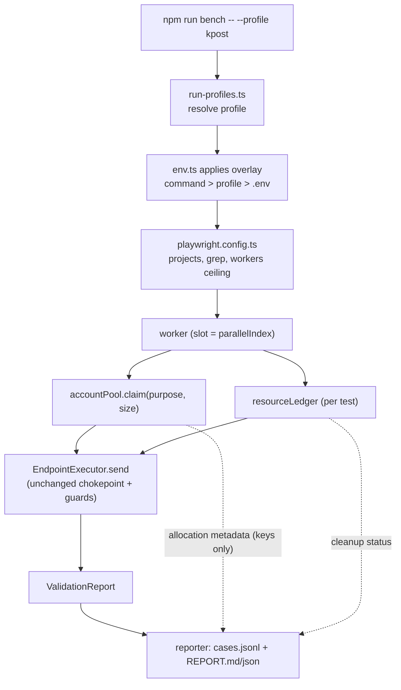
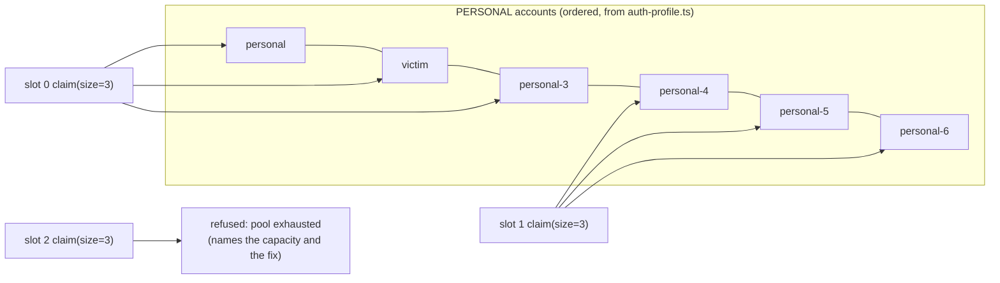
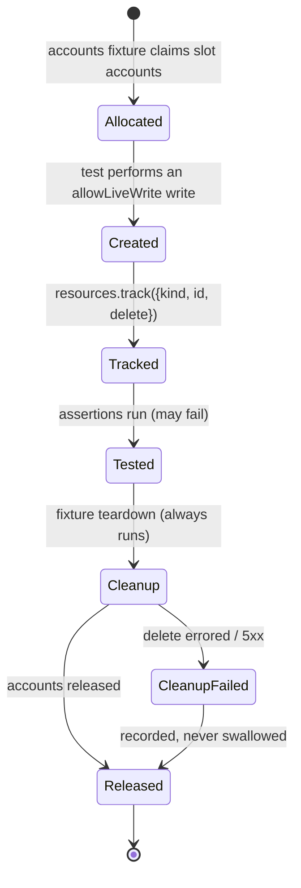
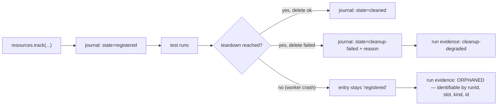
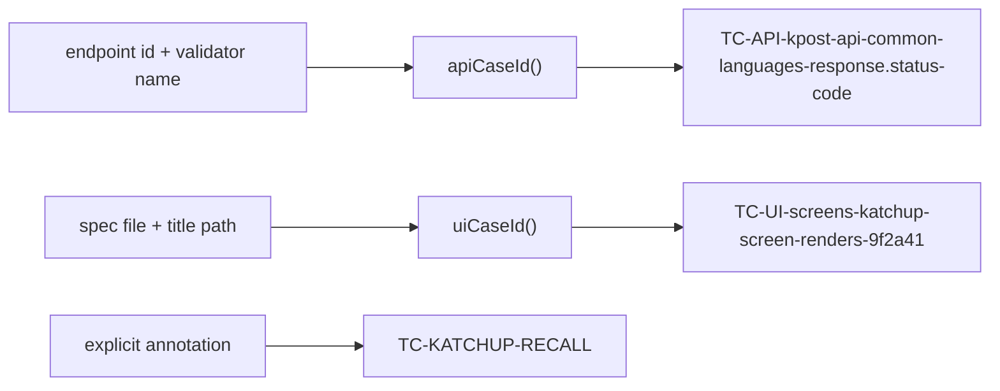

# Phase 2 — Design: Execution model, account isolation, cleanup, stable IDs

**Status:** design only. No Phase 2 code exists in the repository; the earlier experimental work was
dropped so this starts from the reviewed Phase 1 baseline (`9ea023c`).

**Inputs:** `docs/TEST-BENCH-CONTEXT.md` (architecture as built), `docs/PRODUCTION-READINESS-AUDIT.md`
(scores and roadmap), and the repository itself. Every constraint below is cited to a file.

---

## 1. Current-state problem

| #   | Problem                                                                                                                                                                                                                | Evidence                                                                                                                                                                   |
| --- | ---------------------------------------------------------------------------------------------------------------------------------------------------------------------------------------------------------------------- | -------------------------------------------------------------------------------------------------------------------------------------------------------------------------- |
| 1   | **Accounts are shared and session-exclusive.** A KPost account allows one active session; a second login displaces the first. Nothing in the bench is worker-aware.                                                    | `tests/e2e/support/session.ts` exists solely to skip displaced UI sessions; `.env.example` records that four concurrent logins answer HTTP 500 and probes trip rate limits |
| 2   | **Accounts are chosen inside tests.** Two lifecycle specs each define a private `principal(key)` helper and hard-code four/three accounts.                                                                             | `tests/api/kpost/katchup/feature.spec.ts:26-36`, `tests/api/kpost/kall/feature.spec.ts:43-45`                                                                              |
| 3   | **Parallelism is disabled by convention, not by design.** The config says `fullyParallel: true`; all 17 test-running scripts pass `--workers=1`.                                                                       | `playwright.config.ts:27`, `package.json`                                                                                                                                  |
| 4   | **Cleanup is not guaranteed.** 2 of 12 lifecycle specs tear down in `finally`; the rest clean up after assertions that can fail. Every cleanup error is swallowed (`.catch(() => undefined)`); no report field exists. | `tests/api/kpost/kall/feature.spec.ts:60-75`, `tests/api/admin/feature.spec.ts:373-385`, Katchup 13 tests / 2 `finally`, Profile 6 / 0, AWS 0                              |
| 5   | **No stable test-case id.** Titles are deterministic but `validationId` is a random UUID per result; nothing correlates a case across runs.                                                                            | `src/validation-engine/validator.ts`                                                                                                                                       |
| 6   | **A run mode is a command line.** 38 npm scripts, up to 14 `cross-env` flags each; nothing states what a mode _is_.                                                                                                    | `package.json`                                                                                                                                                             |
| 7   | **Test records are not run-scoped.** Names are stamped with `Date.now()` per spec; an orphan cannot be attributed to a run.                                                                                            | `tests/api/kpost/katchup/feature.spec.ts:105`, `tests/api/admin/feature.spec.ts:44`                                                                                        |

---

## 2. Goals

1. One entry point that runs the bench by **named profile**, with the profile as typed configuration.
2. A **central account model** that makes "who may this test log in as" a framework decision.
3. A **deterministic cleanup lifecycle** — `allocate → create → track → test → cleanup → release` —
   whose failures are visible and whose resources stay **identifiable even if the worker dies**.
4. **Stable test-case ids** for every case, generated or hand-written, that coexist with the existing
   Bugzilla fingerprints without touching them.
5. Parallel execution that is **proven where it is enabled** and refused where it is not.
6. The minimum reporting needed to expose id, profile, worker, accounts, cleanup status and reason.

## 3. Non-goals (explicitly out of Phase 2)

- Phase 3 RBAC/authorization wiring, business-rule expansion, PII-masking work.
- Database adapters or DB assertions (Phase 6).
- New API/UI coverage, load or security-scanning expansion.
- Rewriting the reporting system, run history or trends (Phase 8).
- Migrating all 12 lifecycle specs onto the pool/ledger. Phase 2 starts the migration; finishing it
  is Phase 4, because each spec needs its own approved live verification (§11.1, §11.2).
- **Raising the live worker ceiling above 1.** Phase 2 builds the mechanism and proves it offline;
  raising the ceiling needs more accounts and a measured live trial (§15, §16).

### 3.1 Coverage governance — a later requirement, recorded here

Phase 2 adds **no** product coverage. It is recorded, though, that a production-grade bench must
eventually govern coverage centrally rather than discover it per module: a single taxonomy, applied
per module/endpoint/screen, showing what is covered, what is deliberately not, and why.

The taxonomy the roadmap must eventually measure, where applicable to the surface:

|                               |                     |                           |
| ----------------------------- | ------------------- | ------------------------- |
| functional positive           | functional negative | validation / boundary     |
| authentication                | authorization       | business rules            |
| lifecycle / state transitions | data integrity      | contract / schema         |
| error handling                | rate limiting       | security (injection, XSS) |
| file upload / download        | concurrency         | browser compatibility     |
| visual regression             | regression coverage |                           |

This belongs to the coverage-governance work in later phases (the audit's Phases 3–8), and would be
measured the way the bench already measures endpoint coverage — a generated ledger plus a guard that
fails when a category is unclassified, never a hand-maintained claim. **It is not a Phase 2
deliverable and no Phase 2 acceptance criterion depends on it.**

---

## 4. Proposed architecture

Seven new modules, two changed files, no change to the engine, validators, guards or bug pipeline.

```
src/config/run-profiles.ts     NEW  typed profiles; pure resolution function
src/config/env.ts              EDIT applies the profile overlay before parsing (one place)
src/test-data/account-pool.ts  NEW  slot-based account allocation + claim registry
src/test-data/resource-ledger.ts NEW track/teardown/report of everything a test creates
src/test-data/resource-journal.ts NEW durable, append-only ownership record (survives a crash)
src/test-data/run-scope.ts     NEW  run-scoped naming (runId + slot + sequence)
src/reporting/test-case-id.ts  NEW  deterministic id derivation (pure)
src/reporting/case-records.ts  NEW  per-case record assembly → reports/cases.jsonl
src/fixtures/index.ts          EDIT adds `accounts` and `resources` fixtures
scripts/bench.cjs              NEW  the single CLI; legacy npm names delegate to it
```



---

## 5. Account allocation model

### 5.1 The real constraint is the SESSION, not mutation

The usual read-only/read-write split does not apply here. Because a second login displaces the first,
**logging in is itself an exclusive operation**. Two workers can safely _name_ the same account in a
payload; they cannot both _authenticate_ as it.

| Class                 | Definition                                                                                          | Sharing rule                                       |
| --------------------- | --------------------------------------------------------------------------------------------------- | -------------------------------------------------- |
| **Session account**   | the bench logs in as it (any principal a test or validator authenticates with)                      | **Exclusive to one worker slot for the whole run** |
| **Reference account** | named only inside a payload as a target (recipient id, directory lookup, cross-tenant probe target) | Shareable across workers — no session, no mutation |
| **Mutable account**   | a session account whose own state a test changes (profile fields, settings, contacts, groups)       | Exclusive **and** must be restored by the ledger   |

A reference account may be another slot's session account: being named in a payload does not create a
session. The QA-identifier guard still requires it to be a configured QA account
(`src/validation-engine/qa-identifier-guard.ts`).

### 5.2 Which tests need what (from the repository)

| Test group                              |                                                           Accounts needed | Class                                        |
| --------------------------------------- | ------------------------------------------------------------------------: | -------------------------------------------- |
| Engine cases on read endpoints          | 1 session (role `USER`) + `victim` as a reference for cross-tenant probes | session + reference                          |
| `katchup/feature.spec.ts`               |                           4 (sender, TO, visible Copy, confidential Copy) | all session (each read back)                 |
| `kall/feature.spec.ts`                  |                                          3 (caller, callee, added member) | all session                                  |
| `group`, `contacts`, `kmail` lifecycles |                                                                         2 | session                                      |
| `profile`, `settings` lifecycles        |                                                                         1 | session + **mutable**                        |
| `admin` lifecycle                       |                                                              `business-m` | session (tier-specific, not interchangeable) |
| UI suites                               |                           1 per browser context; `katchup-copies` needs 3 | session (via `storageState`)                 |

Configured PERSONAL accounts: **6** (`personal`, `victim`, `personal-3..6` — `src/config/auth-profile.ts`).

### 5.3 Capacity — the honest arithmetic

Capacity is **computed, never compiled in**:

`capacity = floor(configuredAccounts / accountsPerWorker)`

Both inputs come from configuration, not from the framework:

- `configuredAccounts` — however many QA accounts `.env` supplies, read through the existing
  explicitly-set-only filter (`src/config/auth-profile.ts`). Six today; ten or fifty later changes
  nothing but the number.
- `accountsPerWorker` — what the claiming test asks for (`claim(purpose, size)`).

**No account count, and no worker ceiling derived from one, may be hardcoded anywhere in the
framework.** Adding `QA_PERSONAL_7_KPOST_ID…` to `.env` (plus its principal entry) must raise capacity
with no change to the pool algorithm, no new branch, and no edit to any profile. The numbers in the
table below are _this environment's capacity today_, not an architectural limit:

| Workload               | Accounts/worker | Capacity today (6 configured) |
| ---------------------- | --------------: | ----------------------------: |
| Katchup lifecycle      |               4 |                         **1** |
| Kall lifecycle         |               3 |                             2 |
| Group/Contacts/KMail   |               2 |                             3 |
| Read-only engine cases |               1 |                6 (but see §9) |

**Conclusion:** the KPost API profile cannot exceed one worker _with today's inventory_, because the
Katchup lifecycle alone consumes four of the six configured accounts. This is an account-supply
problem, not a design problem (§15).

Worked example of the same formula at other inventories — no code change between rows:

| Configured PERSONAL accounts | Katchup (4/worker) | Kall (3/worker) | Group/KMail (2/worker) |
| ---------------------------: | -----------------: | --------------: | ---------------------: |
|                    6 (today) |                  1 |               2 |                      3 |
|                           10 |                  2 |               3 |                      5 |
|                           20 |                  5 |               6 |                     10 |

The profile's `maxWorkers` is therefore a _safety_ ceiling (what has been proven for that mode), and
the pool's capacity is an _inventory_ ceiling. A run may use the lower of the two, and the reason for
the refusal names which ceiling it hit.

### 5.4 Allocation mechanism: slot partition, not leasing

Two candidates were considered.

| Model                                    | How                                                                                  | Verdict                                                                                                                                                                                                                                                                                |
| ---------------------------------------- | ------------------------------------------------------------------------------------ | -------------------------------------------------------------------------------------------------------------------------------------------------------------------------------------------------------------------------------------------------------------------------------------- |
| **Slot partition (chosen)**              | each worker slot owns a fixed, disjoint slice: slot _i_ gets accounts `[i·n, i·n+n)` | No coordination, no IPC, no lock to leak. Disjointness is provable in a unit test. Release-on-crash is a non-problem because ownership is positional, not stateful.                                                                                                                    |
| Runtime leasing (lock files / directory) | workers claim and release accounts dynamically                                       | Adds stale-lock TTLs, crash recovery and cross-process IO. It would **not add capacity** here — with 6 accounts and a 4-account lifecycle there is nothing to time-share — so it buys failure modes and no throughput. Recorded as a future extension if the account pool grows large. |

**Slot identity = Playwright's `parallelIndex`, not `workerIndex`.** `parallelIndex` is the slot
number bounded by `--workers`; `workerIndex` increases when a worker is replaced after a crash. Keying
on the slot means a restarted worker inherits the same accounts — no cross-talk with a live worker,
and no "leaked" account. Exposed to module scope through `TEST_PARALLEL_INDEX`, which Playwright sets
per worker process, with `testInfo.parallelIndex` available inside tests.

**Ordering is part of the contract.** Slot 0 must receive exactly the accounts the specs use today
(`personal`, `victim`, `personal-3`, `personal-4`), so a single-worker live run is byte-for-byte the
run we have now. That is what makes the pool adoptable without a live verification pass.



> **Implementation note (Phase 2.3, delivered).** Built as designed. What the repository changed
> about the plan:
>
> 1. **The session inventory derives itself.** It is every configured principal with
>    `role === 'USER'` and tier `PERSONAL`, in `auth-profile.ts` declaration order — which already
>    yields `personal, victim, personal-3..6`. So slot 0 keeps today's accounts with **no account
>    name or count written into the pool**; adding a principal raises capacity by itself.
> 2. **The per-slot size comes from the run profile** (`accounts.sessionPerWorker`, declared in
>    Phase 2.1), falling back to the whole inventory for a single-slot legacy run.
> 3. **The API is `slot(index, size?)`** returning `SlotAccounts` (`sessions`, `session(i)`,
>    `principals(n)`, `keys()`), plus `named(key)` for business tiers, `capacityFor`/`assertCapacity`.
>    No claim/release call exists: with a positional partition there is nothing to release, which was
>    the reason for choosing it.
> 4. **Credentials cannot leak by accident:** `principal` is a non-enumerable property and every
>    pooled object has a redacting `toJSON`, so `JSON.stringify` of an account or a slot yields keys,
>    role and tier only.
> 5. **Failures are `AccountPoolError`**, a distinct type, so a capacity or configuration problem is
>    never mistaken for an application assertion failure.
>
> Files: `src/test-data/account-pool.ts`, `src/test-data/index.ts` (configured singleton +
> `currentSlot()`), `accounts` fixture in `src/fixtures/index.ts`,
> `tests/framework/account-pool.spec.ts` (23 guards). Migrated: the Katchup and Kall lifecycles.
> **Still on the old lookup (documented, Phase 4):** the kmail, group, profile, contacts, kdiary,
> kos, aws and admin lifecycle specs. Parallelism is **not** enabled: every live profile stays at one
> worker.

### 5.5 API sketch

```ts
accountPool.claim(purpose: string, size: number, use?: 'exclusive' | 'reference'): AccountClaim
accountPool.claimBusiness(purpose: string, key: 'business-m' | …): AccountClaim
accountPool.release(claim): void
accountPool.allocation(): { slot, account, purpose }[]   // report-safe: keys only
```

Rules:

- A claim that cannot be satisfied **throws**, naming the capacity and the remedy — never wraps around.
- Claiming the same exclusive account twice in one worker throws (catches a spec bug immediately).
- `allocation()` returns account **keys** (`personal-3`), never ids, mobile numbers or passwords.
- Business principals are per tier and not interchangeable, so they are claimed by key, not partitioned.

### 5.6 Release after failure

With positional ownership there is nothing to reclaim between processes. Within a worker:

- the `accounts` fixture releases the claim in teardown, which Playwright runs even when the test
  fails or times out;
- a crashed worker's slot is re-used by its replacement, which by construction gets the same accounts;
- therefore **no leaked-account state can survive a run** — the only cross-run residue is _data_, which
  is the ledger's job (§6).

### 5.7 Session/auth isolation

| State                      | Today                                                | Phase 2                                                                                                                                                                                                           |
| -------------------------- | ---------------------------------------------------- | ----------------------------------------------------------------------------------------------------------------------------------------------------------------------------------------------------------------- |
| API token cache            | per worker process (`token-provider.ts`)             | unchanged — already slot-isolated                                                                                                                                                                                 |
| UI `storageState`          | one shared `.auth/user.json`                         | **path becomes slot-aware** (`.auth/slot-<n>/user.json`) so a future multi-worker UI run cannot share a session file. With one worker the path is `slot-0` — a rename, not a behaviour change                     |
| Cross-surface displacement | API run logs in as the UI's account and signs it out | Phase 2 keeps API and UI **sequential** (as `npm run all` already does) and records the rule in the profile (`surface: 'api' \| 'ui'`); concurrent surfaces need disjoint account sets, which needs more accounts |

---

## 6. Cleanup lifecycle

### 6.1 The contract



### 6.2 Ledger API

```ts
const handle = resources.track({
  kind: 'katchup-message',
  id: String(msgID),
  describe: 'subject QA-<runId>-0-7',
  delete: () =>
    endpoints.sendTo(
      'katchup-delete-message',
      { body: { messageIds: [msgID] } },
      { label: 'cleanup', allowLiveWrite: true, auth: { principal: A } },
    ),
});
handle.done(); // optional: the test already deleted it (e.g. recall IS the cleanup)
```

Properties:

- **Deterministic:** teardown runs tracked resources in **reverse order** (LIFO), which matches
  dependency order (member before group, employee before tier) — the pattern the Admin lifecycle
  already uses by hand.
- **Test-data scoped:** the ledger deletes only ids it was given. There is no query-based or
  prefix-based deletion anywhere in Phase 2. A future sweeper (Phase 4/10) may use the run-scoped
  prefix, and that is a separate, explicitly-scoped decision.
- **Safe:** every delete goes through `EndpointExecutor.send`, so the production guard, OTP
  kill-switch and QA-identifier guard all still apply. The ledger adds no new path to the network.
- **Failure-visible:** a failed delete is recorded with kind, id, reason and the response status,
  attached to the test and aggregated in the report (§10). It is never swallowed.
- **Retry-compatible:** fixtures are per attempt, so attempt _n_ tears down what attempt _n_ created;
  run-scoped names include the attempt so a retry cannot collide with its own leftovers.
- **Parallel-compatible:** ids are per test; names are scoped by slot; nothing is global.

### 6.3 Two independent result dimensions

A case has **two results, recorded separately**, because they answer different questions: "does the
product work?" and "did the bench tidy up?".

| Dimension       | Values                            | Owned by                  | Meaning                                  |
| --------------- | --------------------------------- | ------------------------- | ---------------------------------------- |
| `testStatus`    | `passed` \| `failed` \| `skipped` | the test's own assertions | did the product behave as specified      |
| `cleanupStatus` | `clean` \| `degraded` \| `n-a`    | the ledger + journal      | was everything this case created removed |

They never overwrite each other. A passing feature whose delete returns 500 stays
`testStatus: passed, cleanupStatus: degraded` — reporting it as a functional failure would say the
feature is broken, which is false, and would put a false defect in front of a developer. `n-a` means
the case tracked nothing (every read-only case, which is most of them).

An optional **run-level** state `cleanup-degraded` summarises "all tests passed, but something was
left behind" — a run-level signal, never a per-case verdict change.

A cleanup failure is therefore:

1. recorded against the case (`cleanupStatus: degraded`) and in the journal (§6.4);
2. listed in the report's Cleanup section with kind, id and reason (§10);
3. **and, if the delete returned 5xx, still routed through the existing `flow.server-error`
   mechanism** (`src/validation-engine/flow-finding.ts`) so it reaches the developer as a product
   defect — unchanged from today, no new filing path.

A strict mode (`--fail-on-cleanup-error`) is offered as a flag for CI once Phase 9 exists; it raises
the _run's_ exit code, still without rewriting any case's `testStatus`.

### 6.4 Durable resource journal — no resource becomes unknown

In-memory tracking dies with the process. If a worker is killed (OOM, crash, `Ctrl-C`, CI timeout),
the ledger's teardown never runs and everything it held would become an **unknown** record on the
test environment: it exists, nothing knows who made it, and nobody can tell it from real data.

**Phase 2 architectural requirement:** every tracked resource is written to a durable, append-only
**journal** at the moment it is registered — before the test continues — and updated when it is
cleaned. The journal is written by `resource-journal.ts` to `reports/resources.jsonl` (one JSON
object per line; append-only so a half-written line can never corrupt earlier entries).

| Field           | Meaning                                                     |
| --------------- | ----------------------------------------------------------- |
| `runId`         | the run that created it (`TEST_RUN_ID`)                     |
| `testCaseId`    | the case that created it (§7)                               |
| `slot`          | worker/parallel slot that owned it                          |
| `kind`          | resource type (`katchup-message`, `group`, `admin-tier`, …) |
| `id`            | the resource identifier used to delete it                   |
| `describe`      | run-scoped human label (`QA-<runId8>-<slot>-<seq>`)         |
| `registeredAt`  | when it became the bench's responsibility                   |
| `state`         | `registered` → `cleaned` \| `cleanup-failed`                |
| `cleanupResult` | status code / error reason, or `null` while `registered`    |
| `cleanedAt`     | when the state last changed                                 |

Lifecycle of an entry:

- **normal path** — `registered` at track time, rewritten as `cleaned` after the delete succeeds;
- **cleanup failure** — `cleanup-failed` with the reason and response status (also surfaced in the
  report, §10);
- **abnormal termination** — the entry simply stays `registered`. Any entry left in `registered`
  state when the run ends is reported as **orphaned/degraded** run evidence.



The requirement this satisfies: **no resource becomes unknown just because a worker crashed.** The
journal is _evidence_, not an actor — Phase 2 writes and reports it. The controlled sweeper that
consumes it to delete leftovers stays Phase 4/10, deliberately: automated deletion driven by a file
needs its own safety review, and this design does not smuggle it in early.

> **Implementation note (Phase 2.4, delivered — TRACK only).** The ledger and the journal are built;
> **cleanup is not**, by design. What the implementation settled:
>
> 1. **Four explicit states**, not the two the sketch above used:
>    `REGISTERED → CLEANUP_PENDING → CLEANED | CLEANUP_FAILED`, with `CLEANUP_FAILED → CLEANUP_PENDING`
>    for a retry and `CLEANED` terminal. `CLEANUP_PENDING` is written _before_ an attempt, so an
>    interrupted cleanup is distinguishable from one that never started. The transition table is the
>    single authority; illegal moves throw `InvalidResourceTransitionError`.
> 2. **Identity is ownership + kind + id** (`runId | slot | testCaseId | kind | id`). That is what
>    stops two runs, two test cases or two slots from overwriting each other when a target reuses
>    small ids. Registering one identity twice throws `DuplicateResourceError` naming the existing
>    record; it never overwrites.
> 3. **The journal is one JSON object per line, whole-record per event** — not a delta — so a line is
>    readable on its own and a crash damages at most the final line. A truncated tail is reported as
>    `truncatedFinalLine`, not as corruption; malformed lines, unknown states, duplicate
>    registrations and illegal transitions are each reported with their line number.
> 4. **Redaction reuses `maskString`** plus a journal-scoped `key=value` rule (the shared masker does
>    not cover `password=…` in free text). Tested against password, JWT, Bearer, cookie, refresh
>    token and API-key shapes, in descriptions, cleanup reasons, the file on disk, and in the reader's
>    own error output.
> 5. **Concurrency is stated, not claimed:** appends are single-process; when parallel slots arrive,
>    each slot should write `resources.<slot>.jsonl` and the reader merges them — it already accepts
>    events from several sources in any order.
> 6. **Nothing is wired into a lifecycle spec or a fixture yet**, and the ledger has no method that
>    deletes, sweeps or calls anything (a guard asserts that). Bugzilla is untouched: a leftover
>    resource is an infrastructure observation, never a defect.
>
> Files: `src/test-data/resource-record.ts` (record + state machine + redaction),
> `resource-journal.ts` (append-only sink, pure reader, orphan report), `resource-ledger.ts` (the API
> and typed errors), `tests/framework/resource-ledger.spec.ts` (33 guards).

### 6.5 Run-scoped naming

`QA-<runId8>-<slot>-<seq>` (e.g. `QA-7f3a9c21-0-4`), applied by `run-scope.ts` to subjects, group
names, titles. Reasons: an orphan becomes attributable to a run and slot; two slots cannot generate
the same name; it replaces ad-hoc `Date.now()` stamps, which collide at equal timestamps and say
nothing about origin.

---

## 7. Stable test-case id strategy

> **Implementation note (Phase 2.2, delivered).** Built as designed, with three clarifications the
> repository forced:
>
> 1. **The surface token comes from the spec PATH, not the Playwright project** (`tests/e2e/` → `UI`,
>    `tests/e2e-admin/` → `ADMINUI`, `tests/api/` → `API`, `tests/framework/` → `FW`, …). Using the
>    project would have made the same test three different cases on Chromium/Firefox/WebKit, which
>    contradicts §10 and the bench's own `uiFingerprint`, where the browser is deliberately excluded.
> 2. **Generated API cases carry their id as a Playwright annotation** (`test-case-id`), so the id is
>    present even when the case is skipped and no result exists. The same id is set on every
>    `ValidationResult` by `buildResult`, so both sides agree by construction.
> 3. **The case registry is identity-only for now** (`reports/cases.jsonl`: id, project, spec, title,
>    status, duration, and — for generated cases — the matching `validationId`, endpoint and
>    validator). Accounts and cleanup status join it in their own phases.
>
> Files: `src/reporting/test-case-id.ts` (pure derivation + collision detection),
> `src/reporting/case-registry.ts` (per-run rows), `tests/framework/test-case-id.spec.ts` (21 guards).
> **Not** wired into Bugzilla: no ticket description, summary or fingerprint changed in this phase.

### 7.1 Derivation

| Case type                                   | Id                                                                      | Stable while…                                    |
| ------------------------------------------- | ----------------------------------------------------------------------- | ------------------------------------------------ |
| Engine-generated (6 110 of 6 292 API cases) | `TC-API-<suiteId>-<endpointId>-<validatorName>`                         | the endpoint id and validator name are unchanged |
| Hand-written API/UI spec                    | `TC-<PROJECT>-<specBasename>-<slug(titlePath)>-<sha1(titlePath)[0..5]>` | the spec path and test title are unchanged       |
| Explicit override (opt-in)                  | `TC-KATCHUP-RECALL` declared in the spec via an annotation              | forever, by decision                             |

All inputs are **identity**, never order, time, random values or array position. The 6-character hash
of the full title path guarantees uniqueness when two specs share a slug while keeping the id readable.



Renaming a test or an endpoint changes its id. That is correct — it is a traceability event — and the
report will show the old id disappearing, which is more honest than a hash that hides the rename.

### 7.2 Coexistence with Bugzilla fingerprints (`[KP-XXXXXX]`)

They answer different questions and must stay separate:

|              | Test-case id                                 | Bug fingerprint                                                                  |
| ------------ | -------------------------------------------- | -------------------------------------------------------------------------------- |
| Identifies   | a **check we run**                           | a **defect we found**                                                            |
| Derived from | endpoint + validator, or spec + title        | endpoint + validator + normalized message (`src/bug-tracker/bug-fingerprint.ts`) |
| Lives in     | report rows, `cases.jsonl`, test annotations | the **bug summary** — the dedup key                                              |
| Cardinality  | one per case                                 | one per distinct fault (a systemic fault spans many endpoints)                   |

**Hard rule for Phase 2: nothing about the id may touch a bug summary, a fingerprint input, or the
`(endpoint, validator)` fault index.** Dedup, adoption and auto-resolve all key off those
(`src/bug-tracker/bugzilla-filer.ts`), so a summary change would orphan every open ticket and re-file
it as new — the exact duplication the bench was built to avoid.

The id therefore appears only in: the ticket **description body** (an evidence line), the report, and
`cases.jsonl`. A guard test will assert that a candidate's summary and fingerprint are byte-identical
with and without the id present.

---

## 8. Execution profile design

Only modes that exist in `package.json` today are proposed. A `smoke` profile is **deliberately not
defined**: `@smoke` is applied to exactly one endpoint (`src/api/definitions/kpost/common/platform.api.ts`),
so it would be a mode that runs almost nothing. Tagging is a prerequisite (§15), not a Phase 2
deliverable.

| Profile      | Purpose                                     | Projects / grep                                    | Environment                                                               |              Workers | Accounts                | Cleanup                                           | Filing             |
| ------------ | ------------------------------------------- | -------------------------------------------------- | ------------------------------------------------------------------------- | -------------------: | ----------------------- | ------------------------------------------------- | ------------------ |
| `framework`  | the bench's own guards                      | `framework`                                        | none (no network)                                                         | **up to 8** (proven) | none                    | n/a                                               | never              |
| `mock`       | full run against the bundled mock           | all projects                                       | `MOCK_API=true`                                                           |     up to 4 (proven) | mock seed               | ledger active                                     | never              |
| `kpost`      | KPost API, all types + write lifecycles     | `api`, `@kpost-api`                                | test hosts, `TEST_DB_MODE`, `OTP_TEST_GATEWAY`, `VALIDATION_PROFILE=FULL` |                    1 | 4 session (slot 0)      | ledger + spec teardown                            | only with `--file` |
| `kpost-deep` | adds write-fuzzing on data writes           | as above + `WRITE_FUZZ`, `ALLOW_DESTRUCTIVE_TESTS` | disposable DB only                                                        |                    1 | 4 session               | ledger; **fuzz junk is not tracked** (documented) | only with `--file` |
| `kmail`      | KMail API + compose/draft lifecycle         | `api`, `@kmail-api`                                | test host + prefix, `TEST_DB_MODE`, FULL                                  |                    1 | 2 session               | ledger + spec teardown                            | only with `--file` |
| `kmail-deep` | adds write-fuzzing                          | as above + fuzz flags                              | disposable DB only                                                        |                    1 | 2 session               | as above                                          | only with `--file` |
| `admin`      | Admin API + org-build lifecycle             | `api`, `@admin-api`                                | admin host, `TEST_DB_MODE`, FULL                                          |                    1 | `business-m`            | ledger + reverse-order teardown                   | only with `--file` |
| `admin-deep` | adds write-fuzzing                          | as above + fuzz flags                              | disposable DB only                                                        |                    1 | `business-m`            | as above                                          | only with `--file` |
| `ui`         | whole UI e2e, 3 browsers                    | `setup`,`chromium`,`firefox`,`webkit`              | test SPA                                                                  |                    1 | 1–3 session per context | ledger where specs adopt it                       | only with `--file` |
| `visual`     | pixel baselines only                        | browsers, `visual.spec.ts`                         | test SPA, `VISUAL_REGRESSION`                                             |                    1 | 1 session               | none                                              | never              |
| `resolve`    | close bugs verified fixed, file nothing new | `api`, `@kpost-api`                                | test hosts, `BUGZILLA_RESOLVE_ONLY`                                       |                    1 | as `kpost`              | as `kpost`                                        | resolve-only       |

Each profile is a typed record: `{ projects, grep?, validationProfile?, flags, lifecycles, maxWorkers, surface, live, filingAllowed }`.

**Precedence:** `command environment > profile > .env file`. The command is this run's explicit
intent; the profile is what the mode means; `.env` is the machine's standing configuration. This
mirrors the Phase 1 rule that only a command may arm filing (`resolveDryRun` in `src/config/env.ts`),
and is implemented the same way — by capturing the command environment before dotenv loads.

---

## 9. Parallel execution strategy

### 9.1 Ceilings, and why they are refused rather than clamped

Each profile declares `maxWorkers`. A request above it **throws** with the capacity arithmetic and the
remedy. Silently clamping would leave the operator believing something false about isolation.

| Profile group                       | Ceiling now | What would raise it                                                                |
| ----------------------------------- | ----------: | ---------------------------------------------------------------------------------- |
| `framework`                         |           8 | nothing — no network, no accounts, no shared files                                 |
| `mock`                              |           4 | mock server throughput                                                             |
| `kpost` / `kmail` / `admin` (+deep) |       **1** | more PERSONAL accounts (§5.3) **and** a measured live trial of concurrent logins   |
| `ui`                                |       **1** | slot-scoped `storageState` (designed here) + more accounts + no concurrent API run |

### 9.2 Evidence that the live ceiling must stay at 1 for now

- Four concurrent logins already answer HTTP 500 (`.env.example`).
- Probes trip rate limits (same source; `runProbes` already treats 429 as inconclusive).
- The Katchup lifecycle needs 4 of the 6 PERSONAL accounts, so slot 1 cannot be formed.
- An API login displaces a UI session, so API and UI must not run concurrently.

**Phase 2 therefore does not increase live parallelism.** It makes parallelism _possible and
provable_, and states exactly what is missing.

### 9.3 How parallel safety will be proven without live parallel runs

| Claim                                                   | Proof in Phase 2                                                          |
| ------------------------------------------------------- | ------------------------------------------------------------------------- |
| Two slots never receive the same exclusive account      | unit test over slots 0..N — disjointness assertion                        |
| A claim beyond capacity is refused                      | unit test asserting the throw and its message                             |
| Double-claim inside one worker is refused               | unit test                                                                 |
| Slot identity survives a worker restart                 | unit test on the `parallelIndex` mapping                                  |
| The framework/mock profiles are genuinely parallel-safe | run them at `--workers=4` in validation                                   |
| Nothing else shares mutable state                       | the audit table in `docs/TEST-BENCH-CONTEXT.md` §8, re-checked and linked |

Live parallelism remains **blocked-with-reason**, in the same tradition as the bench's other honest
boundaries.

---

## 10. Reporting changes (minimum for Phase 2)

Additions only; no redesign, no history/trends (Phase 8).

1. **`reports/cases.jsonl`** — one JSON line per executed case:
   `{ testCaseId, runId, profile, project, slot, suite, module, endpoint|spec, validator|title,
testStatus: "passed|failed|skipped", cleanupStatus: "clean|degraded|n-a", durationMs, startedAt,
accounts: ["personal","victim"], failureReason }`. The two statuses are separate fields, never
   collapsed into one (§6.3).
2. **`reports/resources.jsonl`** — the durable journal (§6.4), written as resources are registered
   and updated as they are cleaned. Survives a crashed worker, which is the point.
3. **`REPORT.json`** gains `meta.profile`, `meta.workers`, `meta.slots`, and a `cleanup` summary
   `{ tracked, cleaned, failed, orphaned, failures:[{kind,id,reason}], orphans:[{kind,id,slot,testCaseId}] }`.
   `orphaned` counts journal entries still in `registered` state at the end of the run.
4. **`REPORT.md`** gains a short **Cleanup** section (only when something was tracked) listing
   failures and orphans, shows the profile in the header line, and marks the run `cleanup-degraded`
   when either is non-zero — without changing any case's `testStatus`.
5. **Bug description** gains one evidence line: `Test case: TC-…`. **No change to summary, tag or
   fingerprint** (§7.2).

Secrets: account **keys** only (`personal-3`), never ids, mobiles or passwords; everything printed
continues to pass through `src/utils/masking.ts`.

---

## 11. Migration strategy

Incremental; each step leaves the bench green and is independently revertible.

| Step | Change                                                                              | Risk                 | Verification                                                                      |
| ---- | ----------------------------------------------------------------------------------- | -------------------- | --------------------------------------------------------------------------------- |
| 1    | `run-profiles.ts` + `env.ts` overlay + `bench.cjs`; legacy npm names delegate       | flag drift           | guard test asserting each legacy command's flag set equals its profile resolution |
| 2    | `test-case-id.ts` + ids in reports and `cases.jsonl`                                | none (additive)      | guard: fingerprint/summary unchanged with ids present                             |
| 3    | `account-pool.ts` + `accounts` fixture; **only** the two hard-coding specs adopt it | changes who logs in  | slot 0 must resolve to today's exact accounts — asserted in a guard               |
| 4    | `resource-ledger.ts` + `resources` fixture + cleanup reporting                      | none until adopted   | adopted by `tests/integration/user-lifecycle.spec.ts` (mock) and verified locally |
| 5    | Slot-aware `storageState` paths                                                     | UI setup path rename | path derivation unit-tested; setup executed against the bundled mock only         |
| 6    | Docs: COMMANDS, PARALLEL-SAFETY, CLAUDE.md §5/§8/§9                                 | none                 | `npm run check`                                                                   |

### 11.1 Two validation stages, deliberately separated

The configured URLs are a **controlled TEST environment / live-copy**, carrying real-shaped accounts
and data. Reaching them is never incidental.

| Stage                                     | When                                         | May contact a KPost host?                               | How it is validated                                                                                                            |
| ----------------------------------------- | -------------------------------------------- | ------------------------------------------------------- | ------------------------------------------------------------------------------------------------------------------------------ |
| **Phase 2 implementation**                | while the code is being written and reviewed | **No — never, not once**                                | framework guards (no network), the bundled mock, and pure unit tests over the pool, ledger, journal, id and profile resolution |
| **Post-implementation live verification** | after Phase 2 is complete and reviewed       | **Only with explicit, per-run approval from the owner** | one deliberate, named command against the configured test environment, results reviewed before anything else                   |

Rules that make the separation real:

- Nothing in `npm install`, `npm test`, `npm run check`, the framework project, or any Phase 2 unit
  test may open a connection to a KPost host. The mock (`MOCK_API`) or pure functions serve every
  Phase 2 assertion.
- Live verification is a **separate, deliberate step** — never a side effect of implementing,
  formatting, linting, or running the guards.
- The existing safety controls remain the last line regardless: the production guard, OTP
  kill-switch, QA-identifier guard and command-only filing all still apply to any live step.

### 11.2 Lifecycle migration is started, not finished, by Phase 2

Phase 2 is the **foundation and the starting point**, not the end state. It builds the mechanism and
adopts it in a small, verifiable set (the mock integration spec, and the two specs that hard-code
accounts).

The production-grade end state — tracked in the roadmap as **Phase 4** — requires that **every
applicable lifecycle spec** is migrated to the full contract:

> account allocation **+** resource tracking **+** guaranteed cleanup **+** cleanup reporting

Until a spec is migrated it keeps its existing `finally` teardown; the ledger and the existing
teardown are additive, not exclusive. Each migration needs its own approved live verification
(§11.1), which is exactly why they are not batched into Phase 2.

---

## 12. Backward compatibility

- **Every existing npm script keeps its name and behaviour.** `npm run kpost` becomes a thin delegate
  to `bench.cjs --profile kpost`; a guard test pins that the resolved environment equals today's flag
  set.
- **Environment variables keep working** and still win over the profile.
- **No spec must change to keep working**: the pool is adopted by two specs; everything else keeps
  using `principalForRole`.
- **Bugzilla is untouched**: same summaries, same tags, same dedup keys, same auto-resolve inputs.
- **Report file names are unchanged**; `cases.jsonl` is new alongside them.
- `--workers` continues to be accepted; only values above a profile's proven ceiling are refused.

---

## 13. Failure and retry behaviour

| Situation                      | Behaviour                                                                                                                                                                                                                                                                                                                                  |
| ------------------------------ | ------------------------------------------------------------------------------------------------------------------------------------------------------------------------------------------------------------------------------------------------------------------------------------------------------------------------------------------ |
| Test fails mid-lifecycle       | fixture teardown still runs → tracked resources deleted, accounts released                                                                                                                                                                                                                                                                 |
| Test times out                 | Playwright still runs fixture teardown within its grace period; a teardown that itself times out is recorded as a cleanup failure                                                                                                                                                                                                          |
| Worker crashes                 | teardown never runs, so the resources stay on the environment — but they stay **known**: their journal entries remain `registered` and are reported as orphans with runId, slot, testCaseId, kind and id (§6.4). The slot's accounts are inherited by the replacement worker. Deleting them is the Phase 4/10 sweeper's job, not Phase 2's |
| Retry                          | new fixtures, new ledger, new sequence numbers; attempt _n_ never sees attempt _n−1_'s handles                                                                                                                                                                                                                                             |
| Cleanup delete returns 5xx     | cleanup marked failed; the existing `flow.server-error` path files it as a product defect                                                                                                                                                                                                                                                  |
| Account claim fails (capacity) | the test fails fast with the capacity message — never silently shares an account                                                                                                                                                                                                                                                           |

---

## 14. Safety controls (reused and added)

**Reused unchanged:** production guard and OTP/SMS kill-switch, `productionSafe` allowlist, validator
allowlist, QA-identifier guard (every ledger delete goes through the same chokepoint),
`allowLiveWrite` per call, filing armed only by the command, validity gate and dedup.

**Added by Phase 2:**

| Control                                                       | Where                       | Protects against                                                     |
| ------------------------------------------------------------- | --------------------------- | -------------------------------------------------------------------- |
| Capacity refusal                                              | `account-pool.ts`           | two workers sharing a session account                                |
| Double-claim refusal                                          | `account-pool.ts`           | a spec claiming an account twice                                     |
| Slot-scoped session files                                     | setup projects              | two contexts sharing `storageState`                                  |
| Ledger deletes tracked ids only                               | `resource-ledger.ts`        | broad/destructive cleanup                                            |
| Durable journal written at track time                         | `resource-journal.ts`       | a crash turning tracked data into unknown data                       |
| Cleanup failure surfaced                                      | ledger + reporter           | silent orphan accumulation                                           |
| Separate `testStatus` / `cleanupStatus`                       | `case-records.ts`           | a tidy-up problem being reported as a product defect (or hiding one) |
| Profile ceiling                                               | `run-profiles.ts` + config  | "just raise the workers"                                             |
| Offline-only implementation; live verification approval-gated | §11.1 + profile `live` flag | reaching the test environment by accident                            |
| Account keys only in reports                                  | `case-records.ts`           | credential/PII leakage                                               |

---

## 15. Required inputs (from you / the application team)

| #   | Needed                                                                                                                                                                               | Why                                                                            | Blocks                             |
| --- | ------------------------------------------------------------------------------------------------------------------------------------------------------------------------------------ | ------------------------------------------------------------------------------ | ---------------------------------- |
| 1   | **More PERSONAL QA accounts** — how many can be created? (4 per extra worker for the Katchup lifecycle; 2 extra would let Kall/KMail/Group run at 2 workers)                         | capacity is the only thing preventing live parallelism                         | raising any live ceiling above 1   |
| 2   | **Confirmation that `personal-3..6` are free for reallocation** by the pool                                                                                                          | slot 0 must keep today's four; the rest become slot 1                          | pool adoption beyond slot 0        |
| 3   | **Account-role mapping confirmation** — which accounts are business members vs admins (the `.env` has `QA_BUSINESS_M_USER_3/4_*` and four `..._MOBILE` values the bench never reads) | to decide whether they are reference or session accounts                       | business-tier parallelism          |
| 4   | **A documented way to reset/reseed the disposable test DB** (script, snapshot, or owner action)                                                                                      | orphans from crashes and `WRITE_FUZZ` are not recoverable by the ledger        | Phase 4 sweeper; deep-tier hygiene |
| 5   | **Whether any cleanup/delete API exists for signup-created accounts**                                                                                                                | signup cannot be undone today, so registration tests are one-shot per DB reset | OTP/signup coverage beyond one run |
| 6   | **Confirmation that API and UI runs must stay sequential** (or that a second account set may be reserved for UI)                                                                     | session displacement across surfaces                                           | concurrent API+UI execution        |
| 7   | **Tagging decision** — should the engine auto-tag `@smoke`/`@sanity` tiers?                                                                                                          | a `smoke` profile is meaningless until tags exist (1 endpoint today)           | a smoke/sanity profile             |
| 8   | **Live trial window** — permission to run one measured concurrency trial (e.g. 2 workers, read-only profile) on the test host                                                        | the 500-on-concurrent-login evidence is old and indirect                       | evidence-based ceiling above 1     |

No application behaviour is invented here: where the product has no mechanism (account deletion, DB
reset), the design records it as a limitation rather than assuming one exists.

---

## 16. Risks

| Risk                                                   | Likelihood | Impact                                         | Mitigation                                                                                    |
| ------------------------------------------------------ | ---------- | ---------------------------------------------- | --------------------------------------------------------------------------------------------- |
| Profile resolution silently differs from today's flags | Medium     | High — a mode changes meaning                  | Guard test comparing every legacy command to its profile; `npm run kpost` diffed flag-by-flag |
| Pool changes which account a live lifecycle uses       | Low        | High — unverifiable without a live run         | Slot 0 pinned to today's accounts by test                                                     |
| Test-case id leaks into a bug summary                  | Low        | **Very high** — would orphan every open ticket | Hard rule + guard asserting summary/fingerprint unchanged                                     |
| Ledger teardown masks a real product failure           | Low        | Medium                                         | Cleanup never changes the test verdict; 5xx deletes still file via the existing path          |
| Orphans after a worker crash                           | Medium     | Low                                            | Run-scoped names + documented limitation + sweeper deferred to Phase 4                        |
| Operator raises `--workers` on a live profile          | Medium     | High                                           | Refusal with arithmetic, not clamping                                                         |
| Scope creep into Phase 3/4                             | Medium     | Medium                                         | Non-goals in §3; lifecycle migration explicitly deferred                                      |

---

## 17. Implementation order

1. **Profiles + runner** (`run-profiles.ts`, `env.ts` overlay, `bench.cjs`, npm delegates) — plus the
   equivalence guard. _No behaviour change._
2. **Stable ids** (`test-case-id.ts`, reporter wiring, `cases.jsonl`) — plus the fingerprint-unchanged
   guard. _Additive._
3. **Account pool** (`account-pool.ts`, `accounts` fixture, adopt in the Katchup and Kall specs) —
   plus disjointness/capacity/double-claim/slot-0 guards.
4. **Resource ledger + durable journal** (`resource-ledger.ts`, `resource-journal.ts`, `resources`
   fixture, cleanup + orphan reporting) — adopted by the mock integration spec, verified offline,
   including a simulated abnormal termination that leaves a `registered` entry behind.
5. **Slot-aware session files** + `docs/PARALLEL-SAFETY.md`.
6. **Docs** (COMMANDS, CLAUDE.md §5/§8/§9) and a full offline validation pass.
7. **(Separate, approval-gated)** post-implementation live verification against the configured test
   environment — not part of the implementation steps above (§11.1).

Steps 1–6 end with `npm run check`, the framework suite, mock-only runs, and a diff review. **None of
steps 1–6 contacts a KPost host.**

---

## 18. Acceptance criteria

| #   | Criterion                                                                                                                                                          | How it is verified                                             |
| --- | ------------------------------------------------------------------------------------------------------------------------------------------------------------------ | -------------------------------------------------------------- |
| 1   | `npm run bench -- --profile <name>` runs every documented mode; `--list-profiles` prints them                                                                      | manual + guard                                                 |
| 2   | Every legacy npm script resolves to exactly today's environment                                                                                                    | guard test, flag-by-flag                                       |
| 3   | Every case in every report carries a stable id; ids are unchanged across two consecutive runs                                                                      | guard + two `--list`-backed runs                               |
| 4   | Bug summaries, tags and fingerprints are byte-identical to Phase 1                                                                                                 | guard test                                                     |
| 5   | Slot 0 receives exactly `personal`, `victim`, `personal-3`, `personal-4`                                                                                           | guard test                                                     |
| 6   | Two slots never share an exclusive account; over-capacity claims throw with the remedy                                                                             | guard tests                                                    |
| 7   | A test that fails mid-flow still deletes what it tracked and releases its accounts                                                                                 | ledger test with an injected failure                           |
| 8   | A failed cleanup appears in `REPORT.md`, `REPORT.json` and the test's annotations                                                                                  | ledger test with an injected delete failure                    |
| 9   | `testStatus` and `cleanupStatus` are separate fields; a cleanup failure never changes a passing case's `testStatus`                                                | ledger test asserting `passed` + `degraded` on one case        |
| 10  | Every tracked resource is journalled as `registered` **before** the test proceeds, and updated to `cleaned` / `cleanup-failed`                                     | journal unit test                                              |
| 11  | After a simulated abnormal termination, every resource is still identifiable (runId, slot, testCaseId, kind, id) and reported as orphaned                          | journal test that skips teardown, then reads `resources.jsonl` |
| 12  | Capacity is derived from the configured inventory: with 6, 10 and 20 simulated accounts the same algorithm yields 1, 2 and 5 Katchup workers, with no code change  | pool unit test over three inventories                          |
| 13  | No account count or inventory-derived ceiling is hardcoded in the framework                                                                                        | review + the §12 test above                                    |
| 14  | `framework` and `mock` profiles pass at `--workers=4`; live profiles refuse `--workers=2` with a message naming the ceiling it hit                                 | validation runs                                                |
| 15  | No secret or account identifier appears in any report field added by Phase 2                                                                                       | guard test over the record builder                             |
| 16  | `npm run check` clean; framework guards green (120 + new)                                                                                                          | validation                                                     |
| 17  | **No KPost host is contacted during Phase 2 implementation** — every step is validated by framework guards, the bundled mock, or pure unit tests                   | review of the diff and of every command run                    |
| 18  | Live verification, if performed at all, is a separate approved step and is never triggered by `npm install`, `npm test`, `npm run check`, or the framework project | review + the profiles' declared `live` flag                    |

---

`docs/PHASE-2-DESIGN.md` — design for the repository at commit `9ea023c` on branch `19-09-2026`.
Companion documents: `docs/TEST-BENCH-CONTEXT.md` (as-built architecture),
`docs/PRODUCTION-READINESS-AUDIT.md` (scores, gaps, 10-phase roadmap).
