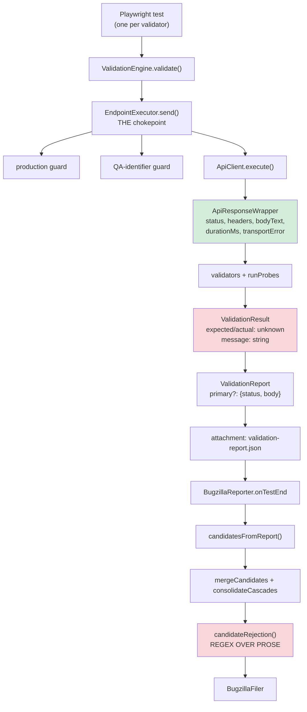
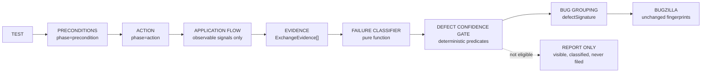
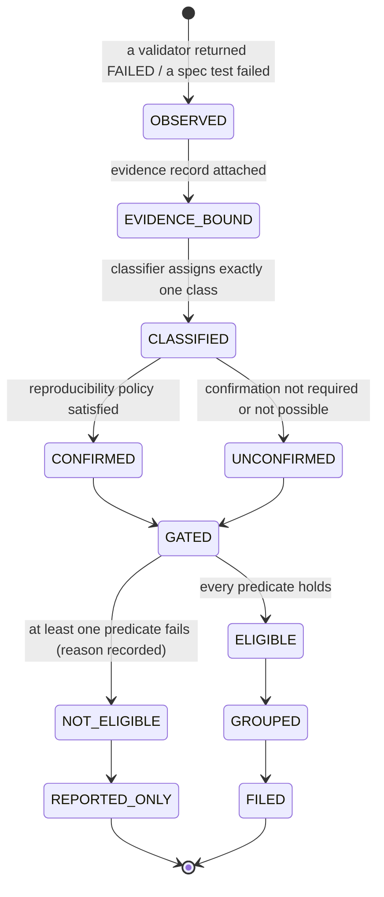
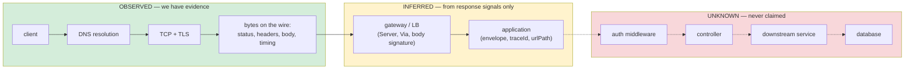
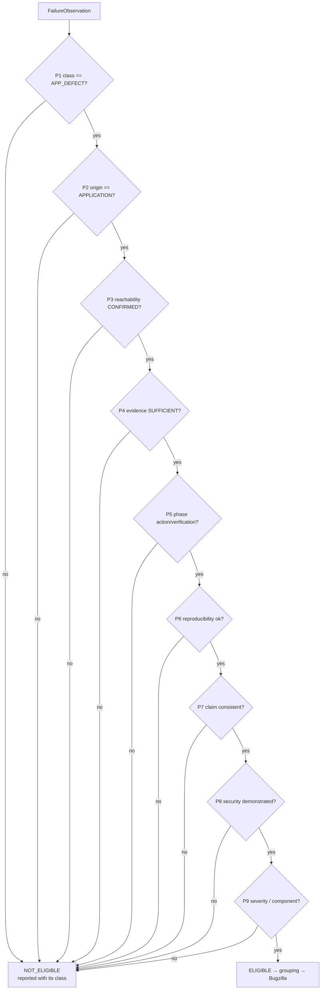
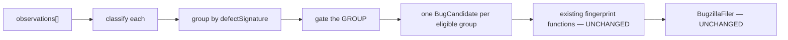

# Phase 3 — Design: Failure analysis, evidence, and the defect-confidence gate

**Status: DESIGN ONLY. Nothing in this document is implemented.** No source file, test, validator,
reporter, run profile or Bugzilla integration was modified to produce it. Every claim about current
behaviour below is quoted from the repository at commit `c55adcd`, with file and line references, so
the design rests on measurement rather than assumption.

---

## 1. Executive summary

The bench today answers one question well — _did this check fail?_ — and then uses the **rendered text
of that failure** to answer a second, much harder question: _is this the application's fault?_ That
second inference happens at the very end of the pipeline, in `candidateRejection`
([validity-gate.ts:99](../src/bug-tracker/validity-gate.ts#L99)), by regular expressions over prose
that was assembled for humans.

That is the root cause of the problem you reported, and it is demonstrable rather than theoretical:

> **An `expected 401 / observed 502` from a negative auth probe passes today's gate and is filed as an
> authentication defect.**

Proof, from the code:

1. The gate's gateway rule keys off `candidate.responseStatus`, which is assigned from
   `report.primary?.status` ([bug-candidate.ts:240](../src/bug-tracker/bug-candidate.ts#L240)) — the
   **primary** exchange. An auth-token validator sends its own probe requests
   ([probe.ts:31-74](../src/validation-engine/probe.ts#L31)); a gateway blip on the probe leaves
   `responseStatus` at the primary's 200/401.
2. The text fallback requires the literal `got 502` (`/\bgot 50[234]\b/i`,
   [validity-gate.ts:123](../src/bug-tracker/validity-gate.ts#L123)), but a multi-case validator
   renders its evidence as aligned `case → code` rows via `renderExpectedActual`, e.g.
   `missing token  →  502`. The regex cannot match.
3. So the candidate survives the gate, is fingerprinted as
   `api|<endpointId>|authentication.missing-token|<normalised message>` and filed.

The structural reason is that **no evidence survives the probe**. `runProbes` records exactly
`{name, status, expected, actual, message, correlationId}` plus the request on failure
([probe.ts:60-71](../src/validation-engine/probe.ts#L60)); the response's headers, body and origin are
discarded. Only the primary response body survives, truncated to 2 KB
([validation-engine.ts:141-155](../src/validation-engine/validation-engine.ts#L141)). By the time
anything tries to decide "gateway or application?", the information needed to decide has been thrown
away.

**Phase 3 moves the decision to where the evidence is.** It adds four things and changes no existing
contract:

| Addition                   | What it does                                                                                                  |
| -------------------------- | ------------------------------------------------------------------------------------------------------------- |
| **Evidence capture**       | at the single send chokepoint, record a compact, redacted `ExchangeEvidence` for every exchange that matters  |
| **Origin attribution**     | decide, from observable signals only, whether a response came from the application or from something in front |
| **Failure classification** | assign every failure one of seven classes, always, never silently                                             |
| **Defect confidence gate** | a deterministic conjunction of evidence predicates that must all hold before `APP_DEFECT` may be filed        |

The invariant the whole design enforces:

> **FAILED VALIDATION ≠ APPLICATION DEFECT.**
> A failure is an _observation_. A defect is a _conclusion_. The conclusion requires evidence, and the
> evidence is recorded, replayable and auditable.

And the invariant it must not violate:

> **Suppression is not a solution.** Coverage does not shrink, validators are not removed, assertions
> are not weakened, and nothing is hidden. A failure that cannot be attributed is reported as
> `INSUFFICIENT_EVIDENCE` — loudly, with its evidence — and simply does not reach Bugzilla.

---

## 2. Current architecture analysis (measured)

### 2.1 The pipeline as it exists



Green = evidence exists. Red = evidence has been lost, or a decision is made without it.

### 2.2 What is already right, and must be preserved

These are load-bearing and the design builds on them rather than replacing them.

| Existing property                                                                                                                                  | Where                                                                              |
| -------------------------------------------------------------------------------------------------------------------------------------------------- | ---------------------------------------------------------------------------------- |
| **One send chokepoint.** Every primary call, probe, setup chain and lifecycle write passes through `EndpointExecutor.send`                         | [endpoint-executor.ts:132](../src/validation-engine/endpoint-executor.ts#L132)     |
| **Transport failure is already data, not an exception.** DNS/TCP/TLS/timeout → `status 0` + `transportError {kind, message}`; nothing throws       | [api-client.ts:53-62](../src/api/client/api-client.ts#L53)                         |
| **Nothing is silently dropped.** Out-of-profile, policy-excluded and dependency-blocked validators are all recorded as `SKIPPED` **with a reason** | [validation-engine.ts:118-191](../src/validation-engine/validation-engine.ts#L118) |
| **A 429 the bench caused is inconclusive, not a failure** — already SKIPPED with that reason                                                       | [probe.ts:47-58](../src/validation-engine/probe.ts#L47)                            |
| **Only 5xx from a gated write becomes a flow finding**; a 4xx never does, because it might be our payload                                          | [flow-finding.ts:8-34](../src/validation-engine/flow-finding.ts#L8)                |
| **A validator that throws cannot crash a run** — it becomes `FAILED` with `validator error: …`                                                     | [validator.ts:120-129](../src/validation-engine/validator.ts#L120)                 |
| **Two gates already exist**: a RUN gate and a CANDIDATE gate, and both report every suppression                                                    | [validity-gate.ts](../src/bug-tracker/validity-gate.ts)                            |
| **Redaction is centralised** (`maskSensitive` / `maskString`) and applied at report assembly                                                       | [masking.ts](../src/utils/masking.ts)                                              |
| **Four identities are deliberately separate**: `validationId`, `testCaseId`, correlation id, `[KP-…]`                                              | [test-case-id.ts:5-38](../src/reporting/test-case-id.ts#L5)                        |

### 2.3 The seven concrete gaps Phase 3 must close

| #      | Gap                                                                                                                                                                                                                                          | Evidence                                                                                                                                    |
| ------ | -------------------------------------------------------------------------------------------------------------------------------------------------------------------------------------------------------------------------------------------- | ------------------------------------------------------------------------------------------------------------------------------------------- |
| **G1** | **Probe evidence is discarded.** A probe retains only `status`; headers, body and timing are gone. The 502 cannot be attributed because nothing about it was kept.                                                                           | [probe.ts:60-71](../src/validation-engine/probe.ts#L60)                                                                                     |
| **G2** | **Classification is regex over rendered prose,** applied once at the end, on merged candidates.                                                                                                                                              | [validity-gate.ts:99-156](../src/bug-tracker/validity-gate.ts#L99)                                                                          |
| **G3** | **The gateway rule reads the wrong exchange** (`report.primary.status`), so a probe-level 502 escapes it — your reported scenario.                                                                                                           | [bug-candidate.ts:240](../src/bug-tracker/bug-candidate.ts#L240)                                                                            |
| **G4** | **The gate is binary.** A candidate is filed or rejected; there is no classification, no evidence status and no confidence, so "not filed" and "not a defect" are indistinguishable in the report.                                           | [validity-gate.ts:158-172](../src/bug-tracker/validity-gate.ts#L158)                                                                        |
| **G5** | **Cleanup failures can become product defects.** Cleanup deletes run with `allowLiveWrite: true`; the `endpoints` fixture teardown drains `flowFindings` into candidates, so a failed teardown delete files as `flow.server-error` CRITICAL. | [endpoint-executor.ts:192-205](../src/validation-engine/endpoint-executor.ts#L192), [fixtures/index.ts:73-84](../src/fixtures/index.ts#L73) |
| **G6** | **No lifecycle phase is recorded.** `SendOptions` has no notion of precondition vs action vs verification vs cleanup, so a setup failure and a real assertion failure are indistinguishable downstream.                                      | [endpoint-executor.ts:29-48](../src/validation-engine/endpoint-executor.ts#L29)                                                             |
| **G7** | **`testCaseId` never reaches the bug-tracker.** It exists on `ValidationResult` but `grep -rn testCaseId src/bug-tracker/` returns nothing, so grouping and occurrence history have no stable key today.                                     | [validation-result.ts:67](../src/validation-engine/validation-result.ts#L67)                                                                |

### 2.4 The hard compatibility boundary

This constrains every decision that follows, so it is stated before the design rather than after.

```ts
// bug-fingerprint.ts:49, :66, :81 — the exact hashed keys
`api|${endpointId}|${validatorName}|${normalizeForFingerprint(message)}`;
`platform|${validatorName}|${normalizeForFingerprint(message)}`;
`ui|${file}|${title}|${normalizeForFingerprint(message)}`;
```

**`ValidationResult.message` is a fingerprint input.** Appending a classification, a confidence or an
evidence note to a validator's message would change the `[KP-…]` tag of every affected open ticket,
orphaning it and re-filing it as new — precisely the duplication disaster recorded in CLAUDE.md for
the 2026-09-17 product-scoped-dedup attempt.

> **Phase 3 rule R1: no Phase 3 field may ever enter `message`, `expected`, `actual`, the UI first
> error line, `endpointId`, `validatorName`, `file` or `title`.** Classification lives in new,
> additive, optional fields that the fingerprint functions never read.

---

## 3. The failure lifecycle

The architecture you sketched, mapped onto concrete artefacts:



A single failure travels these states:



**No state is terminal-and-invisible.** `REPORTED_ONLY` appears in `REPORT.md`, in `REPORT.json` and in
`observations.jsonl` with its classification and the exact predicate that refused it.

---

## 4. Failure classification model

### 4.1 The seven classes

```ts
export const FAILURE_CLASSES = [
  'APP_DEFECT',
  'TEST_ISSUE',
  'ENVIRONMENT',
  'INFRASTRUCTURE',
  'INSUFFICIENT_EVIDENCE',
  'BLOCKED',
  'NOT_IMPLEMENTED',
] as const;
export type FailureClass = (typeof FAILURE_CLASSES)[number];
```

| Class                   | Means                                                                                                                              | Owner                  | May file? |
| ----------------------- | ---------------------------------------------------------------------------------------------------------------------------------- | ---------------------- | --------- |
| `APP_DEFECT`            | the **application**, attributed by evidence, behaved contrary to its contract                                                      | the module's developer | **yes**   |
| `TEST_ISSUE`            | the bench caused it: wrong payload, missing fixture, unconfigured principal, selector miss                                         | us                     | never     |
| `ENVIRONMENT`           | the deployment's state or configuration, not its code: route not deployed, seed data absent, session displaced, our own throttling | the environment owner  | never     |
| `INFRASTRUCTURE`        | transport or edge: DNS, TCP, TLS, timeout, gateway 502/503/504, proxy                                                              | ops                    | never     |
| `INSUFFICIENT_EVIDENCE` | a genuine contract mismatch whose **origin cannot be attributed** from what we can observe                                         | triage                 | never     |
| `BLOCKED`               | the check could not execute: safety guard refused it, prerequisite failed, no principal                                            | us / policy            | never     |
| `NOT_IMPLEMENTED`       | the endpoint or behaviour is documented but not deployed/implemented on this target                                                | product                | never     |

Two deliberate design choices:

- **`INSUFFICIENT_EVIDENCE` is a first-class outcome, not a failure of the classifier.** It is the
  honest answer whenever the bench cannot see the layer that produced the response. Inventing a cause
  is worse than admitting we do not have one.
- **Only `APP_DEFECT` is ever filable.** Every other class is reported and owned, but never becomes a
  Bugzilla ticket automatically. That single rule removes six of the seven false-positive families.

### 4.2 Relationship to existing SKIPPED reasons

`BLOCKED` and `NOT_IMPLEMENTED` are not new concepts — they formalise buckets the report already
computes by regex in `SKIP_BUCKETS` ([bug-report.ts:88-107](../src/reporting/bug-report.ts#L88)). The
design replaces that inference with a recorded field, and keeps the existing bucket labels as the
human-readable rendering so the report looks familiar.

---

## 5. Evidence model

### 5.1 What "a failure observation" is (Q1)

> A **failure observation** is one `FAILED` or `WARNING` `ValidationResult`, or one failing
> Playwright spec test, together with (a) the exchanges that produced it, (b) the lifecycle phase it
> occurred in, and (c) the run context needed to correlate it. It is immutable and is never merged;
> merging happens later, at the group level, and always retains the individual observations.

Two boundary notes, so the scope is unambiguous:

- **`WARNING` is observed and classified but stays unfilable**, exactly as today —
  `candidatesFromReport` only ever reads `status === 'FAILED'`
  ([bug-candidate.ts:176-184](../src/bug-tracker/bug-candidate.ts#L176)). Phase 3 gives a warning a
  classification and a row in the report; it does not promote it.
- **`SKIPPED` is not a failure observation.** Skips already carry a reason and are already reported;
  `BLOCKED` and `NOT_IMPLEMENTED` classify the subset of skips that represent _unexecuted coverage_,
  so the report can separate "we chose not to run this" from "we could not".

### 5.2 `ExchangeEvidence` — one request/response pair

Captured at the chokepoint. Redacted at capture, not at render.

```ts
export type ExchangePhase = 'precondition' | 'action' | 'probe' | 'verification' | 'cleanup';

export type ResponseOrigin =
  | 'NO_RESPONSE' // nothing answered: DNS, TCP, TLS, timeout
  | 'EDGE' // a gateway / proxy / load balancer answered, not the app
  | 'APPLICATION' // the application answered (an application marker is present)
  | 'UNKNOWN'; // something answered; we cannot attribute it

export type TransportFailureKind =
  'dns' | 'connection-refused' | 'connection-reset' | 'tls' | 'timeout' | 'network-other';

export interface ExchangeEvidence {
  /** `primary`, or the probe label, e.g. `authentication.missing-token`. */
  label: string;
  phase: ExchangePhase;
  method: HttpMethod;
  /** Absolute URL, redacted: query values masked, path params kept (they are QA-owned by guard). */
  url: string;
  requestedAt: string; // ISO
  durationMs: number;
  correlationId: string;

  /** 0 when nothing answered. */
  status: number;
  transport?: { kind: TransportFailureKind; message: string };

  /**
   * ALLOWLISTED response headers only — never the whole header bag, so no `set-cookie`,
   * no `authorization`, no bearer echo can ever reach evidence. See §17.
   */
  responseHeaders: Partial<Record<EvidenceHeader, string>>;

  body: {
    bytes: number;
    contentType?: string;
    /** Parsed shape only — never the values. */
    isJson: boolean;
    /** The suite's documented envelope keys were all present (see `response-contract.ts`). */
    hasAppEnvelope: boolean;
    /** An application-minted identifier, if the body exposes one (traceId, urlPath, errorCode). */
    appMarkers: { traceId?: string; urlPath?: string; errorCode?: string };
    /** First N chars, masked. Capped; absent when the body is binary. */
    snippet?: string;
  };

  origin: ResponseOrigin;
  /** Why `origin` was chosen — every attribution is explainable. */
  originReason: string;
}
```

### 5.3 `FailureObservation` — the unit the classifier consumes

```ts
export interface FailureObservation {
  // ---- identity / correlation (Q12) ----
  runId: string; // env.TEST_RUN_ID
  testCaseId?: string; // stable TC-…, Phase 2.2
  validationId: string; // this execution
  correlationId: string;
  observedAt: string;
  slot: number | null; // Phase 2.3 parallelIndex; null when account-less
  project?: string; // Playwright project (browser) where relevant
  profileName: string; // active run profile (Phase 2.1)
  environment: string; // env.TEST_ENV
  targetKind: 'mock' | 'test' | 'production';

  // ---- what failed ----
  surface: 'api' | 'ui' | 'admin-ui' | 'kmail';
  suite: SuiteId;
  endpointId?: string;
  endpoint?: string; // `POST /v2/...`
  method?: HttpMethod;
  validatorName: string; // or `spec:<file>:<title>` for hand-written tests
  category: ValidationCategory;
  severity: Severity;

  // ---- phases (Q14) ----
  preconditionStatus: 'OK' | 'FAILED' | 'NOT_APPLICABLE';
  actionStatus: 'OK' | 'FAILED' | 'NOT_REACHED';
  cleanupStatus?: CleanupStatus; // Phase 2.5, carried but NEVER an input to APP_DEFECT

  // ---- evidence ----
  /** The exchange whose response the failing assertion actually judged. */
  decidingExchange?: ExchangeEvidence;
  /** Every exchange for this endpoint in this test, in order. */
  exchanges: readonly ExchangeEvidence[];
  /** Did any exchange to this endpoint in this run reach the application? (§6.3) */
  reachability: 'CONFIRMED' | 'REFUTED' | 'UNKNOWN';
  /** Resource identities involved, where ownership permits (Phase 2.4 ledger). */
  resources?: readonly { kind: string; id: string; state: ResourceState }[];

  // ---- reproduction ----
  confirmation?: ConfirmationOutcome; // §8

  // ---- derived (filled by the classifier, never by a validator) ----
  classification?: FailureClass;
  classificationReason?: string;
  evidenceStatus?: EvidenceStatus;
  defectConfidence?: DefectConfidence;
}
```

### 5.4 Evidence completeness (Q11, Q20)

```ts
export type EvidenceStatus =
  | 'SUFFICIENT' // every predicate the class needs is present
  | 'PARTIAL' // some evidence, not enough to attribute
  | 'ABSENT' // nothing usable (the exchange was never recorded)
  | 'REDACTED'; // present but withheld for safety, so it cannot support a claim
```

`EvidenceStatus` is computed, never declared:

| Predicate                                                    | Required for `SUFFICIENT` |
| ------------------------------------------------------------ | ------------------------- |
| a `decidingExchange` exists                                  | yes                       |
| its `origin !== 'UNKNOWN'`                                   | yes                       |
| request method + URL + phase recorded                        | yes                       |
| response status recorded (or an explicit `transport`)        | yes                       |
| `body.hasAppEnvelope` / `appMarkers` evaluated (not skipped) | yes                       |
| `reachability !== 'UNKNOWN'`                                 | yes for `APP_DEFECT`      |

**When evidence is insufficient (Q20):** the test still reports `FAIL`, the observation is written to
`observations.jsonl`, the report shows `classification=INSUFFICIENT_EVIDENCE`,
`evidenceStatus=PARTIAL|ABSENT`, `defectConfidence=NOT_ELIGIBLE`, `bugzillaStatus=NOT_FILED`, and the
REPORT.md "Needs triage" section lists it with the missing predicate named. Nothing is hidden and
nothing is filed.

---

## 6. Flow-aware analysis model

### 6.1 What the bench can and cannot see

This is the section where honesty matters most. The bench is an HTTP client. It observes:



> **Phase 3 rule R2: the framework never claims a layer it did not observe.** There is no field named
> `failedAtAuthMiddleware`. Internal layer attribution is represented as `UNKNOWN`, and a failure that
> depends on it is `INSUFFICIENT_EVIDENCE`.

### 6.2 Origin attribution (Q5) — deterministic, signal-driven

`attributeOrigin(exchange, contract): { origin, reason }` applies these rules **in order**; the first
match wins, and the matched rule's text becomes `originReason`.

| #   | Condition                                                                                                                             | Origin        |
| --- | ------------------------------------------------------------------------------------------------------------------------------------- | ------------- |
| 1   | `transport` is set (status 0)                                                                                                         | `NO_RESPONSE` |
| 2   | body carries the suite's documented **envelope keys** (`response-contract.ts` for that suite) — the app answered                      | `APPLICATION` |
| 3   | body carries an **app marker**: `traceId`, `urlPath`, or the suite's `errorCodeField`                                                 | `APPLICATION` |
| 4   | status ∈ {502, 503, 504} **and** rule 2/3 did not match                                                                               | `EDGE`        |
| 5   | `content-type` is `text/html` **and** the body matches a known edge signature (nginx / Apache / CloudFront / ELB / Spring whitelabel) | `EDGE`        |
| 6   | `server` / `via` / `x-amz-*` / `cf-ray` header present **and** no app marker, on a ≥400 status                                        | `EDGE`        |
| 7   | 2xx/3xx with a parseable JSON body but no envelope (a legitimate non-envelope endpoint, e.g. `msStatus`)                              | `APPLICATION` |
| 8   | anything else                                                                                                                         | `UNKNOWN`     |

Rules 2, 3 and 7 are the only ways to reach `APPLICATION`. Everything doubtful lands in `UNKNOWN`, and
`UNKNOWN` cannot support `APP_DEFECT`.

> **Note on rule 5/6:** CLAUDE.md records a real, filed finding that KPost responses carry a
> "versioned Server header" on every response (the consolidated information-disclosure ticket). That
> means a `server` header alone does **not** distinguish edge from app on this platform, which is why
> rule 6 requires _both_ an edge-ish header _and_ the absence of an app marker, and sits below the
> positive app rules. The exact header values must be measured before implementation (§30, Q1).

### 6.3 Did the request reach the application? (Q4) — the reachability witness

Attribution of one response is not enough; we also need to know whether the **application was
reachable at all** during the failing test. That is what separates "the gateway blipped on one probe"
from "the endpoint is broken".

```ts
export type Reachability = 'CONFIRMED' | 'REFUTED' | 'UNKNOWN';
```

- **`CONFIRMED`** — at least one exchange to the **same endpoint, in the same test**, was attributed
  `APPLICATION`. The cheapest and strongest witness is the **primary exchange**, which the engine
  already sends before any probe.
- **`REFUTED`** — every exchange to that endpoint in the test was `NO_RESPONSE` or `EDGE`. The
  endpoint was not reachable; nothing about the application can be concluded.
- **`UNKNOWN`** — mixed or unattributable.

This single derived field resolves the reported scenario deterministically, because the auth probes
always run **after** a primary exchange to the same endpoint.

### 6.4 Layer model as recorded

```ts
export interface FlowAttribution {
  transportReached: boolean; // OBSERVED
  responseReceived: boolean; // OBSERVED
  origin: ResponseOrigin; // INFERRED from signals, with a reason
  applicationReached: Reachability; // INFERRED, endpoint-scoped, run-scoped
  authLayer: 'UNKNOWN'; // never claimed — literal type, by design
  controllerLayer: 'UNKNOWN'; // never claimed
  downstreamLayer: 'UNKNOWN'; // never claimed
}
```

The three `'UNKNOWN'` literal types are deliberate: they make it a **compile error** for a later
change to start asserting a layer the bench cannot observe.

---

## 7. Defect confidence gate

### 7.1 Design choice: deterministic predicates, no score

You asked for deterministic evidence-based gates over opaque scoring, and this domain supports that
cleanly. A score would have to be tuned, and a tuned threshold is exactly the kind of opaque decision
that erodes trust in a bug queue. **No numeric score is proposed.**

```ts
export type DefectConfidence = 'ELIGIBLE' | 'NOT_ELIGIBLE';

export interface GateDecision {
  confidence: DefectConfidence;
  /** Every predicate, with its outcome — so the decision is always explainable. */
  predicates: readonly { id: PredicateId; passed: boolean; detail: string }[];
  /** The first failing predicate; the human-readable reason in reports. */
  refusedBy?: PredicateId;
}
```

### 7.2 The predicates — all must hold

| Id     | Predicate                                          | Rule                                                                                                                                     |
| ------ | -------------------------------------------------- | ---------------------------------------------------------------------------------------------------------------------------------------- |
| **P1** | `classification === 'APP_DEFECT'`                  | the only filable class                                                                                                                   |
| **P2** | `decidingExchange.origin === 'APPLICATION'`        | the response we judged came from the application                                                                                         |
| **P3** | `reachability === 'CONFIRMED'`                     | the application was demonstrably reachable for this endpoint in this test                                                                |
| **P4** | `evidenceStatus === 'SUFFICIENT'`                  | every field the class needs is recorded and not redacted away                                                                            |
| **P5** | phase discipline: `phase ∈ {action, verification}` | a failure in `precondition` or `cleanup` is never an app defect (§12, §11)                                                               |
| **P6** | reproducibility satisfied for the class (§8)       | transience-prone classes need a confirmation observation                                                                                 |
| **P7** | claim consistency                                  | the **existing** contradiction rules, re-expressed structurally: an exposure claim needs a 2xx, an enumeration claim needs a resolved id |
| **P8** | security demonstration (security categories only)  | the asserted condition was actually demonstrated, not merely "the server did not refuse" (§16)                                           |
| **P9** | administrative                                     | severity ≥ `BUGZILLA_MIN_SEVERITY`, a component resolves, expected/actual non-empty — today's rules, unchanged                           |



### 7.3 Why a conjunction and not a majority

Each predicate removes a distinct, observed false-positive family: P2/P3 remove gateway blips (your
502 case), P5 removes cleanup and setup noise (G5), P6 removes transient 5xx, P7/P8 remove
security-claim inversions that were already filed and marked INVALID in the past. A majority vote
would let any one of those through, and the cost asymmetry is severe: Bugzilla has no delete, so a
false ticket costs a developer's trust permanently, while a suppressed-but-reported finding costs one
triage read.

---

## 8. Reproducibility strategy (Q8)

### 8.1 Three independent signals

| Signal                   | What it is                                                                                | Cost      |
| ------------------------ | ----------------------------------------------------------------------------------------- | --------- |
| **Multi-case agreement** | a probe validator already sends several cases; all failing the same way is corroboration  | free      |
| **Confirmation probe**   | one bounded re-send of the _deciding_ request, class-gated and idempotency-gated (§9)     | 1 request |
| **Cross-run occurrence** | the same `testCaseId` + `defectSignature` failed in a previous run (`observations.jsonl`) | free      |

### 8.2 When confirmation is REQUIRED (P6)

| Deciding evidence                                          | Confirmation required? | Why                                                            |
| ---------------------------------------------------------- | ---------------------- | -------------------------------------------------------------- |
| application 5xx (`origin=APPLICATION`, status ≥ 500)       | **yes**                | a crash may be load- or state-dependent                        |
| `NO_RESPONSE` / `EDGE`                                     | n/a — never filable    | already `INFRASTRUCTURE`                                       |
| application 4xx where a different 4xx/2xx was expected     | no                     | deterministic contract mismatch; re-sending proves nothing new |
| schema / envelope / header / `common.*` violation on a 2xx | no                     | deterministic, structural                                      |
| performance / timing                                       | never filable          | environmental by existing policy — unchanged                   |
| security categories                                        | **yes**                | see §16                                                        |

Cross-run occurrence is **recorded and reported** but is deliberately **not** a filing requirement: a
genuinely new crash on the first run should still reach the developer.

---

## 9. Retry policy (Q9)

**Answer: no blind retries; one bounded confirmation probe.**

- **Playwright retries stay exactly as they are.** `api`/`integration`/`framework` projects keep
  0 locally / 2 in CI ([playwright.config.ts:56](../playwright.config.ts#L56)); browser projects keep
  2 ([:45](../playwright.config.ts#L45)). No change is proposed, because a Playwright retry re-runs
  the whole test with fresh fixtures and a new ledger, which is flake absorption, not evidence.
- **A new `ConfirmationProbe`** is added inside the engine, and it is not a retry because its result is
  **recorded either way**, never used to turn a red test green.

```ts
export interface ConfirmationOutcome {
  attempted: boolean;
  /** Why it was not attempted, when it was not. */
  skippedReason?: string;
  /** Deterministic: same status + same origin as the deciding exchange. */
  reproduced?: boolean;
  evidence?: ExchangeEvidence;
  delayMs?: number;
}
```

Preconditions — **all** must hold, or `attempted: false`:

1. the class is transience-prone (application 5xx, or a security category);
2. the deciding request is **safe to repeat**: `endpoint.destructive === false` **and**
   `sideEffect !== 'external' && !== 'global'` **and** `phase !== 'cleanup'`;
3. the run profile permits it (`confirmation: "enabled"` on the profile — default enabled for `test`
   targets, **disabled** for `targetKind: "production"`);
4. a per-run budget is not exhausted (`maxConfirmationProbes`, default 50) — so a systemic outage
   cannot double the run's traffic;
5. it goes through `EndpointExecutor.send`, so the production guard, OTP kill-switch and
   QA-identifier guard all apply unchanged.

Exactly **one** attempt, after a fixed short delay (default 1500 ms). No loops, no backoff ladder, no
"retry until pass".

> **What this explicitly is not:** it never re-runs assertions, never changes `testStatus`, and never
> suppresses a failure. If the confirmation succeeds, the test is still `FAIL`; the observation is
> classified `INFRASTRUCTURE` or `ENVIRONMENT` and reported as such.

---

## 10. Test issue vs application defect (Q3, decision rules)

### 10.1 The classifier, in order

`classify(observation): { class, reason }` — first match wins, every branch names its evidence.

| #   | Condition (all read from recorded evidence)                                                                                           | Class                                                                                 |
| --- | ------------------------------------------------------------------------------------------------------------------------------------- | ------------------------------------------------------------------------------------- |
| 1   | a safety guard refused the send (`ProductionSafetyError`), or a prerequisite validator failed, or no principal configured             | `BLOCKED`                                                                             |
| 2   | `validatorName`'s message begins `validator error:` ([validator.ts:120](../src/validation-engine/validator.ts#L120))                  | `TEST_ISSUE`                                                                          |
| 3   | `preconditionStatus === 'FAILED'` (setup/login/fixture, phase=precondition)                                                           | `TEST_ISSUE` _or_ `ENVIRONMENT` — see 3a/3b                                           |
| 3a  | …and the precondition failure was a transport/edge error                                                                              | `ENVIRONMENT`                                                                         |
| 3b  | …otherwise (bad payload, missing fixture, unconfigured id)                                                                            | `TEST_ISSUE`                                                                          |
| 4   | `phase === 'cleanup'`                                                                                                                 | never `APP_DEFECT` — §12                                                              |
| 5   | `decidingExchange.transport` set                                                                                                      | `INFRASTRUCTURE`                                                                      |
| 6   | `decidingExchange.origin === 'EDGE'`                                                                                                  | `INFRASTRUCTURE`                                                                      |
| 7   | status 429 and the validator is not `security.rate-limit`                                                                             | `ENVIRONMENT` (we caused it — today's rule, now classified rather than only rejected) |
| 8   | 404 on a documented route with no app envelope, or an app "no matching endpoint" marker                                               | `NOT_IMPLEMENTED`                                                                     |
| 9   | 405 where the workbook documents the verb                                                                                             | `NOT_IMPLEMENTED`                                                                     |
| 10  | `reachability === 'REFUTED'`                                                                                                          | `INFRASTRUCTURE`                                                                      |
| 11  | `decidingExchange.origin === 'UNKNOWN'`                                                                                               | `INSUFFICIENT_EVIDENCE`                                                               |
| 12  | session/auth precondition invalid (the UI `skipIfSignedOut` condition, or a 401 on a call whose token the run minted seconds earlier) | `ENVIRONMENT` — §13                                                                   |
| 13  | `origin === 'APPLICATION'` and the contract was violated                                                                              | **`APP_DEFECT`**                                                                      |
| 14  | anything else                                                                                                                         | `INSUFFICIENT_EVIDENCE`                                                               |

Rule 14 is the safety net and it defaults to the honest answer, not to the convenient one.

### 10.2 Surface differences (Q10)

| Surface      | Deciding evidence                                                                           | Confirmation                                                                                      | Filing specs                            |
| ------------ | ------------------------------------------------------------------------------------------- | ------------------------------------------------------------------------------------------------- | --------------------------------------- |
| **API**      | `ExchangeEvidence` from the chokepoint                                                      | engine confirmation probe                                                                         | all engine cases + flow findings        |
| **UI**       | `UiHealthReport` (page errors, broken assets, failed API calls, console) + screenshot/video | Playwright retries already provide it: `outcome() === 'unexpected'` means it failed every attempt | `UI_FILING_SPECS` allowlist — unchanged |
| **admin-ui** | same as UI                                                                                  | same                                                                                              | currently never files — unchanged       |
| **KMail**    | same as API, different suite/envelope in `response-contract.ts`                             | same                                                                                              | same                                    |

The important UI-specific rule, which already exists implicitly and becomes explicit: a **failed API
call observed by the UI monitor is context, never a UI defect** ([ui-health.ts:29-38](../src/ui/ui-health.ts#L29))
— it is classified against the API surface or dropped, never filed against `kpost-ui`.

---

## 11. Environment / infrastructure detection (Q7 decision table)

| Situation               | Observable signal                                           | Origin        | Class                                               | Filable       |
| ----------------------- | ----------------------------------------------------------- | ------------- | --------------------------------------------------- | ------------- |
| DNS failure             | `transport.kind='dns'` (`EAI_AGAIN`, `ENOTFOUND`)           | `NO_RESPONSE` | `INFRASTRUCTURE`                                    | no            |
| Connection refused      | `ECONNREFUSED`                                              | `NO_RESPONSE` | `INFRASTRUCTURE`                                    | no            |
| Connection reset        | `ECONNRESET`, `socket hang up`                              | `NO_RESPONSE` | `INFRASTRUCTURE`                                    | no            |
| TLS failure             | cert/handshake message                                      | `NO_RESPONSE` | `INFRASTRUCTURE`                                    | no            |
| Timeout                 | `transport.kind='timeout'`                                  | `NO_RESPONSE` | `INFRASTRUCTURE`                                    | no            |
| Proxy error             | edge signature body / header, 4xx–5xx                       | `EDGE`        | `INFRASTRUCTURE`                                    | no            |
| Gateway 502/503/504     | status ∈ {502,503,504}, no app marker                       | `EDGE`        | `INFRASTRUCTURE`                                    | no            |
| **Application 4xx**     | app envelope present, status 4xx ≠ expected                 | `APPLICATION` | `APP_DEFECT`                                        | **yes**       |
| **Application 5xx**     | app envelope/traceId present, status ≥ 500                  | `APPLICATION` | `APP_DEFECT` (needs P6)                             | **yes**       |
| Malformed response      | `isJson=false` where JSON is contracted, app marker present | `APPLICATION` | `APP_DEFECT`                                        | **yes**       |
| Malformed response      | `isJson=false`, no app marker, HTML edge signature          | `EDGE`        | `INFRASTRUCTURE`                                    | no            |
| Schema mismatch         | envelope present, schema validation failed                  | `APPLICATION` | `APP_DEFECT`                                        | **yes**       |
| Wrong response body     | envelope present, value contradicts contract                | `APPLICATION` | `APP_DEFECT`                                        | **yes**       |
| Authorization failure   | 403 with app envelope where access should be granted        | `APPLICATION` | `APP_DEFECT`                                        | **yes**       |
| Authentication failure  | 401 on a token the run minted < token-lifetime ago          | `APPLICATION` | `ENVIRONMENT` (session displaced) unless reproduced | no by default |
| Test-data/setup failure | `preconditionStatus=FAILED`, phase=precondition             | varies        | `TEST_ISSUE`/`ENVIRONMENT`                          | no            |

Note the two rows that are currently conflated and become distinguishable only with evidence:
**"malformed response"** splits by origin, and **"authentication failure"** splits by whether our own
session was displaced — the exact false-bug family CLAUDE.md records for the UI specs on 2026-09-17.

---

## 12. Cleanup interaction (Q13)

### 12.1 The rule

> **A cleanup failure is never, under any circumstance, an `APP_DEFECT` by itself.**
> `cleanupStatus` is carried on the observation for correlation and is **not an input** to any gate
> predicate except P5, which excludes it.

### 12.2 The structural fix — `phase` on `SendOptions`

Today the executor cannot tell a cleanup delete from a functional one, which is why G5 exists. The
design adds one optional field:

```ts
// endpoint-executor.ts — SendOptions gains:
/** Which part of the test lifecycle this call belongs to. Defaults to 'action'. */
phase?: ExchangePhase;
```

- `CleanupCoordinator` sets `phase: 'cleanup'` for every operation it runs (Phase 2.5 already owns the
  single place cleanup operations are invoked).
- The flow-finding capture at
  [endpoint-executor.ts:192](../src/validation-engine/endpoint-executor.ts#L192) gains one condition:
  a 5xx in `phase: 'cleanup'` produces a **`CleanupObservation`**, not a `FlowFinding`.
- The cleanup observation appears in the `cleanup-summary` attachment, in the journal
  (`resources.jsonl` already records `cleanupResult`) and in REPORT.md's cleanup section — classified
  `INSUFFICIENT_EVIDENCE` or `INFRASTRUCTURE`, `bugzillaStatus=NOT_FILED`.

If the product's delete endpoint really is broken, that must be proven by a test that exercises it as
its **action**, not as a teardown side effect. That is a coverage question, not a filing question, and
it is listed in §28 as a migration follow-up.

### 12.3 What does not change

`testStatus` and `cleanupStatus` remain fully independent dimensions, exactly as Phase 2.5
established and the live verification demonstrated (18 PASS+cleanup-FAILED, 1 FAIL+FAILED,
2 PASS+SUCCESS in the same run).

---

## 13. Authentication / session failures (Q15)

Three distinguishable situations that today all look like "401 where 200 expected":

| Situation                                                                      | Evidence                                                                                                 | Class         |
| ------------------------------------------------------------------------------ | -------------------------------------------------------------------------------------------------------- | ------------- |
| The bench never obtained a token (login failed, principal unconfigured)        | `preconditionStatus=FAILED` in `phase=precondition`                                                      | `TEST_ISSUE`  |
| The token was obtained, then displaced (KPost allows one session per account)  | a _successful_ authenticated exchange exists earlier in the same run for the same slot, then 401s follow | `ENVIRONMENT` |
| The endpoint rejects a valid token that other endpoints accept in the same run | other endpoints' exchanges with the same principal are `APPLICATION` 2xx                                 | `APP_DEFECT`  |

The second row is exactly the false-bug family recorded in CLAUDE.md (2026-09-17, 8 false UI bugs from
a bounced session). Phase 2.3's account pool makes it detectable, because the slot is now recorded.

---

## 14. Bug grouping strategy (Q17)

### 14.1 Grouping happens after classification, before the gate



Grouping the group (not each observation) is what lets a systemic fault be judged on the _aggregate_
evidence: a header fault seen with `origin=APPLICATION` on 60 endpoints is far stronger evidence than
one occurrence, and a 502 seen on 60 endpoints is clearly infrastructure.

### 14.2 The signature

```ts
export interface DefectSignature {
  scope: 'endpoint' | 'platform' | 'ui';
  suite: SuiteId;
  endpointId?: string; // omitted for `platform`
  method?: HttpMethod;
  validatorName: string;
  category: BugCategory; // Functional | Security | Performance | Compatibility
  detailCategory: DetailCategory; // §14.3
  /** `normalizeForFingerprint(message)` — REUSED, not reinvented. */
  normalizedSignature: string;
  /** Present only when the application exposed one; a strong merge signal when it exists. */
  appErrorSignature?: string;
}
```

`scope` is decided by the existing `isSystemicFinding` predicate
([bug-candidate.ts:33-35](../src/bug-tracker/bug-candidate.ts#L33)) — unchanged, so the
endpoint-excluded/included split that the existing tags depend on is preserved exactly.

**Merge rule:** two observations join one group iff every field of `DefectSignature` is equal.
**Non-merge rule:** differing `detailCategory` or differing `normalizedSignature` never merge, so
"2 of 5 headers missing" and "5 of 5 headers missing" stay two defects — the property the current
fingerprint comment explicitly protects.

### 14.3 Detail categories

Mapped onto the Bugzilla vocabulary you already have, as a **closed enum** so nothing lands in
`Unclassified` by accident:

```
Security/XSS · Security/SQL Injection · Security/Access Control ·
Security/Information Disclosure · Security/Rate Limiting ·
Business Logic Flaw · Input Validation Gap · Incorrect HTTP Status ·
Status Code Misreporting · Schema Violation · Unhandled NPE / Server Error ·
Idempotency / Concurrency · Transport/Header Contract · Assertion Failure
```

A framework guard fails the build if a registered validator maps to no detail category — the same
"measured, not claimed" discipline as the coverage ledger.

### 14.4 Relationship to the two existing collapse mechanisms

Grouping does **not** replace either of them; it sits in front of both, and both keep working.

| Mechanism               | Key                                       | Kept because                                                                                         |
| ----------------------- | ----------------------------------------- | ---------------------------------------------------------------------------------------------------- |
| `mergeCandidates`       | `candidate.id` (the fingerprint tag) only | it is the final safety net, and it is what unions `browsers`, `proof` and `affectedEndpoints`        |
| `consolidateCascades`   | endpoint + 5xx/timeout anchor             | it encodes evidence _dependence_ — a symptom of a 5xx is not independent evidence                    |
| **`groupObservations`** | `DefectSignature`                         | it is what the **gate** judges, so aggregate evidence (60 endpoints, all `APPLICATION`) is available |

Two traps the implementation must respect, both found in the current code:

- **`mergeCandidates` keeps the FIRST candidate's fields** (severity, narrative, `responseStatus`,
  evidence) and discards later ones. A group's representative must therefore be chosen
  deterministically _before_ merge, not left to arrival order.
- **There are two validator vocabularies.** `SYSTEMIC_VALIDATORS` and `developerGuidance` use the raw
  `authentication.*` names; `normalizeValidator` (shared by the filer's fault index and
  `verify-resolve`) emits `auth.*`. The `DetailCategory` map must declare which namespace it keys on —
  the design specifies the **raw `validatorName`**, so it never collides with the dedup vocabulary.

### 14.5 Individual evidence is never lost

A group carries `observations: FailureObservation[]`. The Bugzilla description renders the
representative plus a compact occurrence table (`testCaseId`, endpoint, status, origin, runId), which
is additive description text and therefore fingerprint-safe.

---

## 15. Bugzilla integration boundary (Q18, Q19)

### 15.1 The boundary

```
Test Bench                                          | Bugzilla
evidence → classification → confidence → grouping   | system of record
```

Bugzilla decides nothing. It receives only groups that already passed the gate. **No Bugzilla code is
designed to change in Phase 3**: not the client, not the filer, not the fingerprints, not dedup, not
auto-resolve, not the UI project.

### 15.2 Fingerprint compatibility — the mechanism

The gate and grouping run **before** candidate construction, and candidate construction is unchanged.
Concretely:

- `apiFingerprint` / `systemicFingerprint` / `uiFingerprint` keep their exact inputs (§2.4).
- Because a group's representative observation carries the same `endpointId`, `validatorName` and
  `message` as today's candidate, **the tag of any defect that is still filed is byte-identical**.
- Phase 3 can only ever _reduce_ the set of filed candidates (it adds predicates, it removes none).
  So existing open tickets keep matching; nothing is orphaned; nothing is re-filed as new.
- A **pinned guard test** asserts the three functions still produce `KP-183BBD`, `KP-1FCD09`,
  `KP-3D6538` for their fixed inputs — the same guard Phase 2.2 already uses.

### 15.3 `testCaseId` in evidence without touching fingerprints (Q19)

`testCaseId` is currently absent from `src/bug-tracker/` entirely (G7). The design adds it in exactly
two fingerprint-free places:

1. `BugCandidate.evidence` — which is already a free-form `Record<string, unknown>` rendered into the
   description body, never hashed.
2. The occurrence table in the description (§14.4).

It never enters the summary, the tag, the whiteboard or the `(endpoint, validator)` fault index that
dedup and auto-resolve key on. This is precisely what PHASE-2-DESIGN.md §7 anticipated and what was
deliberately deferred.

### 15.4 The auto-resolve invariant — a regression the gate could otherwise cause

This is subtle and load-bearing. Today the auto-resolve pass computes

```ts
const reproduced = new Set(candidates.map((c) => c.id.replace(/^\[|\]$/g, '')));
// bugzilla-reporter.ts:293 — `candidates` here is merged + consolidated, but PRE-GATE
```

and `classifyResolve` rule 1 keeps any ticket whose tag is in that set. So **a finding the validity
gate rejects still prevents its ticket from being auto-closed** — exactly right, because "we refused
to file this" is not "the defect is fixed".

If Phase 3 built the `reproduced` set from _eligible groups only_, every finding newly classified
`INFRASTRUCTURE` or `INSUFFICIENT_EVIDENCE` would stop blocking auto-resolution, and the next run
would **auto-close real open tickets** on the strength of a gateway blip. That would be a serious
regression introduced by a change intended to be conservative.

> **Phase 3 rule R3: the auto-resolve `reproduced` set is built from ALL observations, before
> classification and before the gate.** Suppression governs _filing_, never _resolution_. A guard test
> asserts that a finding classified `INFRASTRUCTURE` still appears in `reproduced` and therefore still
> keeps its ticket open.

Likewise `buildRunIndex` keeps its current semantics unchanged: `SKIPPED` proves nothing, `PASSED`
and `WARNING` count as "ran and did not fail", and resolution still requires the exact
`(endpoint, validator)` pair to have run.

---

## 16. Security failure handling (Q — security special cases)

Security assertions are the highest-risk filing class, because a security ticket that is wrong is
both embarrassing and expensive. The existing gate already encodes two hard-won rules (an exposure
claim contradicted by a 401/403; an enumeration claim contradicted by a 404). Phase 3 generalises
them into a **demonstration predicate** (P8).

| Category                            | `APP_DEFECT` requires                                                                                                                                                          |
| ----------------------------------- | ------------------------------------------------------------------------------------------------------------------------------------------------------------------------------ |
| **Security/XSS**                    | the injected marker is **reflected or stored** and served back with a content-type that would execute it. A 200 alone is not evidence.                                         |
| **Security/SQL Injection**          | a differential: the injected payload changed the response in a way a rejected payload did not (row count, error, timing ≥ threshold). A 200 alone is not evidence.             |
| **Security/Access Control**         | a 2xx with `origin=APPLICATION` **and** a body containing a resource the principal must not see. A 401/403 refutes the claim (existing rule, now structural).                  |
| **Security/Information Disclosure** | the disclosed token is present in a recorded, redacted evidence field (header name or body path) — never the secret value itself.                                              |
| **Security/Rate Limiting**          | N requests demonstrably accepted above the documented limit, with timings recorded. Absence of 429 alone is not evidence unless a limit is documented.                         |
| **Authentication bypass**           | a 2xx with `origin=APPLICATION` on a protected endpoint **with** a deliberately invalid credential, **and** `reachability=CONFIRMED`, **and** confirmation reproduced it (P6). |

Additionally: security observations are **never** filed when `origin !== 'APPLICATION'`. A gateway that
answers 200 to a no-token probe (an edge cache, for instance) would otherwise be reported as an
authentication bypass.

**Safety:** evidence for a disclosure finding records _where_ the secret appeared (`header:server`,
`body.$.data.password`), never _what_ it was. The redaction rules in §17 apply to evidence before it is
written to disk, so a secret cannot exist in `observations.jsonl` even transiently.

---

## 17. Data redaction strategy

**Reuse, do not reinvent.** `maskSensitive` / `maskString` ([masking.ts](../src/utils/masking.ts))
remain the single implementation, and the journal-scoped `SECRET_ASSIGNMENT` rule added in Phase 2.4
([resource-record.ts](../src/test-data/resource-record.ts)) is reused verbatim for evidence.

Three additions, all restrictive:

1. **Response headers are allowlisted, not masked.** Evidence stores only:
   `content-type, content-length, server, via, x-cache, x-amzn-requestid, x-amz-cf-id, cf-ray,
retry-after, x-request-id, x-correlation-id, date, www-authenticate (scheme only), location (path only)`.
   Any header not on the list is never copied, so `set-cookie` and `authorization` cannot leak by
   omission of a mask rule.
2. **Request headers are never stored verbatim** — only `{ hadAuthorization: boolean, scheme?: 'Bearer'|'Basic'|'none', contentType?: string }`.
3. **Bodies are stored as shape plus a capped, masked snippet** (default 512 chars for evidence, vs
   the 2 KB primary body the report already keeps). Binary bodies store no snippet at all.

A framework guard asserts, over a synthetic evidence record containing a password, JWT, bearer header,
cookie, API key and a QA account id, that none survives into the serialised evidence — the same shape
of guard Phase 2.4 uses for the journal.

---

## 18. Proposed folder / file structure

```
src/failure-analysis/                 ← NEW, self-contained, pure where possible
  observation.ts        FailureObservation, phases, statuses
  evidence.ts           ExchangeEvidence, EvidenceStatus, completeness predicates
  evidence-capture.ts   builds ExchangeEvidence from ApiResponseWrapper (+ redaction)
  origin.ts             attributeOrigin(), edge signatures, app markers
  reachability.ts       endpoint-scoped reachability witness
  classification.ts     FailureClass, decision table (pure)
  classifier.ts         classify(observation) → { class, reason }
  confidence.ts         PredicateId, GateDecision, evaluateGate() (pure)
  reproducibility.ts    confirmation policy + ConfirmationOutcome
  grouping.ts           DefectSignature, groupObservations()
  detail-category.ts    validator → DetailCategory map + completeness guard
  index.ts

src/reporting/
  observation-registry.ts   ← NEW: reports/observations.jsonl (mirrors case-registry.ts)

CHANGED (all additive):
  src/validation-engine/endpoint-executor.ts   + SendOptions.phase, + evidence capture hook
  src/validation-engine/probe.ts               + evidence on failing probe cases
  src/validation-engine/validation-result.ts   + ValidationResult.evidence?  (optional)
  src/validation-engine/validation-engine.ts   + attach evidence to the report
  src/test-data/cleanup.ts                     + phase: 'cleanup' on cleanup sends
  src/reporting/bugzilla-reporter.ts           + build observations, classify, gate, group
  src/reporting/bug-report.ts                  + the six-dimension table + triage section
  config/run-profiles.json                     + per-profile `confirmation` + `gate` policy
  src/bug-tracker/bug-candidate.ts             + testCaseId into `evidence` ONLY (no fingerprint input)

tests/framework/
  failure-classification.spec.ts    decision-table coverage, every branch
  origin-attribution.spec.ts        every rule + the 502 scenario
  defect-confidence.spec.ts         each predicate refuses alone; conjunction holds
  evidence-redaction.spec.ts        no secret survives serialisation
  fingerprint-stability.spec.ts     extend the existing pinned-tag guard
  grouping.spec.ts                  merge/non-merge rules
```

**Nothing under `src/bug-tracker/` changes except one additive `evidence` key.** No validator is
touched. No run profile behaviour changes until the gate is enforced (§28).

---

## 19. Interfaces and types (consolidated)

```ts
// ---------- evidence ----------
export type ExchangePhase = 'precondition' | 'action' | 'probe' | 'verification' | 'cleanup';
export type ResponseOrigin = 'NO_RESPONSE' | 'EDGE' | 'APPLICATION' | 'UNKNOWN';
export type Reachability = 'CONFIRMED' | 'REFUTED' | 'UNKNOWN';
export type EvidenceStatus = 'SUFFICIENT' | 'PARTIAL' | 'ABSENT' | 'REDACTED';

export interface ExchangeEvidence { /* §5.2 */ }

// ---------- observation ----------
export interface FailureObservation { /* §5.3 */ }

// ---------- classification ----------
export type FailureClass = /* §4.1 */;
export interface Classification { class: FailureClass; reason: string; ruleId: string; }
export function classify(o: FailureObservation): Classification;   // pure

// ---------- gate ----------
export type PredicateId = 'P1'|'P2'|'P3'|'P4'|'P5'|'P6'|'P7'|'P8'|'P9';
export type DefectConfidence = 'ELIGIBLE' | 'NOT_ELIGIBLE';
export interface GateDecision { /* §7.1 */ }
export function evaluateGate(group: DefectGroup, policy: GatePolicy): GateDecision;   // pure

// ---------- grouping ----------
export interface DefectSignature { /* §14.2 */ }
export interface DefectGroup {
  signature: DefectSignature;
  representative: FailureObservation;
  observations: readonly FailureObservation[];
  affectedEndpoints: readonly string[];
  testCaseIds: readonly string[];
  browsers?: readonly string[];
}

// ---------- the six reported dimensions ----------
export interface CaseOutcome {
  testStatus: 'PASS' | 'FAIL' | 'SKIP' | 'WARN';
  cleanupStatus: CleanupStatus | 'NOT_APPLICABLE';
  classification: FailureClass | 'NONE';
  evidenceStatus: EvidenceStatus | 'NOT_APPLICABLE';
  defectConfidence: DefectConfidence | 'NOT_APPLICABLE';
  bugzillaStatus: 'FILED' | 'COMMENTED' | 'ADOPTED' | 'NOT_FILED' | 'SUPPRESSED_DRY_RUN';
}
```

**Gate policy is data, in the run profile** — so a `production` target can demand strictly more than a
`test` target without a code change:

```jsonc
"gate": {
  "requireConfirmationFor": ["APPLICATION_5XX", "SECURITY"],
  "requireReachabilityWitness": true,
  "allowFilingWhenOriginUnknown": false,     // never true; present so the guard can assert it
  "maxConfirmationProbes": 50
}
```

---

## 20. State transitions

```mermaid
stateDiagram-v2
  direction LR
  state "testStatus" as T { PASS --> FAIL: assertion failed }
  state "classification" as C {
    [*] --> UNCLASSIFIED
    UNCLASSIFIED --> BLOCKED
    UNCLASSIFIED --> TEST_ISSUE
    UNCLASSIFIED --> ENVIRONMENT
    UNCLASSIFIED --> INFRASTRUCTURE
    UNCLASSIFIED --> NOT_IMPLEMENTED
    UNCLASSIFIED --> INSUFFICIENT_EVIDENCE
    UNCLASSIFIED --> APP_DEFECT
  }
  state "defectConfidence" as D {
    [*] --> NOT_ELIGIBLE
    NOT_ELIGIBLE --> ELIGIBLE: all predicates pass
  }
  state "bugzillaStatus" as B {
    [*] --> NOT_FILED
    NOT_FILED --> FILED
    NOT_FILED --> COMMENTED
    NOT_FILED --> ADOPTED
    NOT_FILED --> SUPPRESSED_DRY_RUN
  }
```

Invariants (each becomes a guard test):

- `classification !== 'APP_DEFECT'` ⟹ `defectConfidence === 'NOT_ELIGIBLE'`
- `defectConfidence === 'NOT_ELIGIBLE'` ⟹ `bugzillaStatus ∈ {NOT_FILED, SUPPRESSED_DRY_RUN}`
- `testStatus === 'FAIL'` ⟹ `classification !== 'NONE'` (**no unclassified failure may exist**)
- `cleanupStatus` never constrains `classification` except via P5

---

## 21. Decision tables

§10.1 (classifier), §11 (transport/edge/app), §7.2 (gate predicates) and §8.2 (confirmation) are the
four normative tables. Each will be implemented as a literal, exhaustively-tested table rather than
as nested conditionals, so the guard test can assert **every row is reachable and every branch is
covered** — the same technique `production-validators.ts` uses to guarantee no validator is
unclassified.

---

## 22. Example scenarios

| #   | Situation                                                                       | Origin        | Reach.    | Class                             | Gate     | Bugzilla                          |
| --- | ------------------------------------------------------------------------------- | ------------- | --------- | --------------------------------- | -------- | --------------------------------- |
| 1   | Expected 401, observed 502 on the auth probe; primary 200                       | `EDGE`        | CONFIRMED | `INFRASTRUCTURE`                  | P1 fails | NOT_FILED                         |
| 2   | Expected 200, observed 500 with app envelope + traceId; confirmation reproduces | `APPLICATION` | CONFIRMED | `APP_DEFECT`                      | all pass | **FILED**                         |
| 3   | Expected 200, observed 500 with nginx HTML body                                 | `EDGE`        | REFUTED   | `INFRASTRUCTURE`                  | P1 fails | NOT_FILED                         |
| 4   | Cleanup delete returns 500                                                      | `APPLICATION` | CONFIRMED | (cleanup)                         | P5 fails | NOT_FILED                         |
| 5   | Login failed, so every endpoint 401s                                            | n/a           | UNKNOWN   | `TEST_ISSUE`                      | P1 fails | NOT_FILED                         |
| 6   | QA-identifier guard refused the send                                            | n/a           | n/a       | `BLOCKED`                         | P1 fails | NOT_FILED                         |
| 7   | 404 "No matching endpoint" on a documented route                                | `APPLICATION` | CONFIRMED | `NOT_IMPLEMENTED`                 | P1 fails | NOT_FILED                         |
| 8   | Input-validation probe: null accepted with app-envelope 200                     | `APPLICATION` | CONFIRMED | `APP_DEFECT`                      | all pass | **FILED**                         |
| 9   | Timeout on a translation endpoint proxying an external service                  | `NO_RESPONSE` | UNKNOWN   | `INFRASTRUCTURE`                  | P1 fails | NOT_FILED                         |
| 10  | XSS marker returns 200 but is not reflected                                     | `APPLICATION` | CONFIRMED | `INSUFFICIENT_EVIDENCE`           | P8 fails | NOT_FILED                         |
| 11  | Security headers missing on 60 endpoints, app envelope present                  | `APPLICATION` | CONFIRMED | `APP_DEFECT` (platform)           | all pass | **1 ticket, 60 endpoints listed** |
| 12  | 401s after an earlier successful authenticated call on the same slot            | `APPLICATION` | CONFIRMED | `ENVIRONMENT` (session displaced) | P1 fails | NOT_FILED                         |

---

## 23. The expected-401 / observed-502 scenario in detail

### 23.1 What happens today

```
authentication.missing-token
  probe "missing token"  → send without Authorization
  gateway returns 502 (app never reached)
  runProbes records: { name:'missing token', status:'FAILED', expected:[401], actual:502 }
                     ...and discards headers, body, timing
  fromChecks → FAILED "1/4 auth probes failed: missing token (expected 401, got 502)"
  ValidationResult{ message, expected:{...}, actual:{...} }
  candidatesFromReport → responseStatus = report.primary.status  (200 — NOT 502)
  candidateRejection   → 502 rule needs responseStatus==502 or /got 502/ in the rendered text
                       → renderExpectedActual produced "missing token  →  502"
                       → NO MATCH
  ⇒ FILED as an authentication defect against KPost API
```

### 23.2 What happens under Phase 3

```
probe "missing token" → ExchangeEvidence {
    label: 'authentication.missing-token', phase: 'probe',
    status: 502, durationMs: 41,
    responseHeaders: { server: 'nginx', 'content-type': 'text/html' },
    body: { bytes: 552, isJson: false, hasAppEnvelope: false, appMarkers: {}, snippet: '<html>…502 Bad Gateway…' },
    origin: 'EDGE',
    originReason: 'status 502 with no application envelope or marker (rule 4)'
  }

primary exchange (same endpoint, earlier in the same test) → origin: 'APPLICATION'
  ⇒ reachability = CONFIRMED

classify → rule 6: decidingExchange.origin === 'EDGE'  ⇒  INFRASTRUCTURE
gate     → P1 fails (classification !== APP_DEFECT)    ⇒  NOT_ELIGIBLE

REPORTED AS:
  testStatus        = FAIL
  cleanupStatus     = SUCCESS
  classification    = INFRASTRUCTURE
  evidenceStatus    = SUFFICIENT
  defectConfidence  = NOT_ELIGIBLE
  bugzillaStatus    = NOT_FILED
  reason            = "the 502 came from the gateway (no application envelope); the application
                       answered the primary call on this endpoint in the same test"
```

The test still fails. The finding is still visible. The developer's queue stays clean.

### 23.3 The inverse case, which must still file

If the **application itself** returns 502 — body carries the KPost envelope
(`{status:"FAILURE", statusCode:502, urlPath:"/v2/…", traceId:"…"}`) — then rule 2 fires **before**
rule 4, `origin = APPLICATION`, the classifier reaches rule 13, the confirmation probe runs (P6), and
if it reproduces, the defect **is filed**. A blanket "ignore all 502s" would lose that; the design does
not, which is why attribution is by evidence rather than by status code.

---

## 24. Acceptance criteria

| #   | Criterion                                                               | How it is verified                                                                                                                         |
| --- | ----------------------------------------------------------------------- | ------------------------------------------------------------------------------------------------------------------------------------------ |
| A1  | A failed validation is never automatically `APP_DEFECT`                 | classifier unit tests: every non-app branch, plus a property test that a bare `FAILED` with no evidence classifies `INSUFFICIENT_EVIDENCE` |
| A2  | No filing without the gate                                              | reporter test: candidates are constructed only from `ELIGIBLE` groups                                                                      |
| A3  | `INSUFFICIENT_EVIDENCE` stays visible                                   | report test: the triage section lists it with the refusing predicate                                                                       |
| A4  | Coverage is not reduced                                                 | case-count guard: collected Playwright cases before == after                                                                               |
| A5  | Environment/infrastructure never becomes an app defect without evidence | decision-table test over all rows of §11                                                                                                   |
| A6  | Cleanup failures stay independent                                       | a cleanup 5xx produces a `CleanupObservation`, never a `FlowFinding`                                                                       |
| A7  | Setup failures distinguishable from app failures                        | phase-tagging test: precondition failure ⇒ `TEST_ISSUE`/`ENVIRONMENT`                                                                      |
| A8  | `testCaseId` stays independent of `validationId`                        | the existing Phase 2.2 guard, unchanged                                                                                                    |
| A9  | **Existing fingerprints unchanged**                                     | pinned-tag guard (`KP-183BBD`, `KP-1FCD09`, `KP-3D6538`) + a diff test that any candidate still produced yields a byte-identical tag       |
| A10 | No secret in evidence, reports or Bugzilla                              | redaction guard over a synthetic secret-bearing record                                                                                     |
| A11 | Groups retain individual evidence                                       | grouping test asserts `observations.length` preserved and rendered                                                                         |
| A12 | Every decision explainable                                              | every classification carries `ruleId` + `reason`; every gate decision carries all nine predicate outcomes                                  |
| A13 | Unknown internal flow is explicit                                       | `authLayer`/`controllerLayer`/`downstreamLayer` are the literal type `'UNKNOWN'` — a compile error to change                               |
| A14 | Bugzilla integration unchanged in this phase                            | `git diff --stat src/bug-tracker/` shows only the additive `evidence` key                                                                  |
| A15 | **Suppression never causes an auto-close** (rule R3)                    | guard: a finding classified `INFRASTRUCTURE` still appears in `reproduced` and its ticket is kept open                                     |
| A16 | A group's representative is deterministic, not arrival-ordered          | grouping test runs the same observations in shuffled order and asserts an identical representative                                         |

---

## 25. Verification strategy

**Unit (offline, pure).** `classify`, `attributeOrigin`, `evaluateGate`, `groupObservations` and the
completeness predicates are pure functions over recorded structures. Every table row gets a test;
a coverage guard fails the build if a table row is unreachable.

**Integration (bundled mock).** `mock-server/` gains fixtures that reproduce each origin class: an
nginx-style 502 HTML page, an app-envelope 502, a transport reset, a plain-text 401, an app 500 with
`traceId`. These run in the `framework`/`integration` projects and contact no real host.

**Shadow mode (the critical step).** Before the gate is enforced, the reporter computes the Phase 3
decision **alongside** the current one and reports only the divergence:

```
Phase 3 shadow: 41 candidates today → 12 ELIGIBLE, 29 suppressed
  INFRASTRUCTURE 14 · INSUFFICIENT_EVIDENCE 9 · ENVIRONMENT 4 · TEST_ISSUE 2
  (no filing behaviour changed)
```

That report is the evidence for approving enforcement — and it is also how we discover whether
attribution rules are right against the real gateway, which no offline test can prove.

**Live verification (gated, owner-approved, exactly as Phase 2.5).** One `--workers=1`, dry-run pass
against the test deployment, then a review of `observations.jsonl`: are the 502s attributed `EDGE`? do
app 500s carry an envelope? is any `APP_DEFECT` wrongly suppressed? Sign-off gates enforcement.

---

## 26. Risks and failure modes

| Risk                                                                                 | Likelihood | Impact | Mitigation                                                                                                                                                                   |
| ------------------------------------------------------------------------------------ | ---------- | ------ | ---------------------------------------------------------------------------------------------------------------------------------------------------------------------------- |
| **Over-suppression**: a real defect classified `INSUFFICIENT_EVIDENCE`               | medium     | high   | shadow mode quantifies it before enforcement; every suppression is listed with its refusing predicate; a `strict=false` profile can report-but-file-anyway during transition |
| **Attribution rules wrong for this gateway** (KPost sets `Server` on every response) | medium     | high   | rules 2/3 (positive app markers) are tried before any header heuristic; real captures required before implementation (§30)                                                   |
| Evidence volume inflates reports/artifacts                                           | medium     | low    | evidence on **failing** exchanges only (mirrors the existing `CheckDetail.request` policy); 512-char snippets; JSONL                                                         |
| Confirmation probes add traffic / side effects                                       | low        | high   | one attempt, non-destructive only, per-run budget, guard-enforced, disabled for `production` targets                                                                         |
| Fingerprint drift via an accidental message change                                   | low        | severe | R1 + the pinned-tag guard + a code-review checklist item                                                                                                                     |
| Classifier becomes a dumping ground of special cases                                 | medium     | medium | tables are closed enums with exhaustiveness guards; new rules need a test row                                                                                                |
| Two sources of truth for "is this a defect" during migration                         | high       | medium | shadow mode is explicitly temporary; the old `candidateRejection` rules are **absorbed** as predicates, not duplicated                                                       |
| **Suppression silently auto-closes real tickets** (the `reproduced` set narrows)     | medium     | severe | rule R3 + acceptance criterion A15: `reproduced` is built pre-gate, from all observations                                                                                    |
| `BUGZILLA_MAX_FILE` truncates by module order, not by confidence or severity         | low        | medium | out of scope here, but recorded: once confidence exists, `orderedForFiling` should rank by severity within a module so a cap drops the weakest, not the last alphabetically  |

---

## 27. Explicit non-goals

- **No Bugzilla redesign.** No client, filer, fingerprint, dedup, auto-resolve or BUGZILLA-UI change.
- **No APM / tracing integration.** The bench will not gain server-side visibility in Phase 3; the
  design is explicit that internal layers stay `UNKNOWN`.
- **No scoring model.** Deterministic predicates only.
- **No coverage reduction.** No validator removed, no assertion weakened, no test skipped to avoid a
  false positive.
- **No orphan sweeper, no mass cleanup.** The Katchup ids **811422–811443** predate the ledger and are
  explicitly out of scope; nothing in Phase 3 touches them.
- **No `secretMessageExpireTime` fix.** Recorded separately as safety-hardening item **SH-1** (§30).
- **No parallelism change**, no run-profile semantics change beyond additive gate policy.
- **No auto-filing of security findings that were not demonstrated.**

---

## 28. Migration strategy

Strictly incremental; each step is independently valuable, reversible, and ends with `npm run check`
clean plus a green framework suite.

| Step    | Content                                                                                                              | Behaviour change                      |
| ------- | -------------------------------------------------------------------------------------------------------------------- | ------------------------------------- |
| **3.1** | `ExchangePhase` on `SendOptions`; `CleanupCoordinator` tags `cleanup`; cleanup 5xx no longer becomes a `FlowFinding` | **fixes G5** — one real defect        |
| **3.2** | Evidence capture + origin attribution + reachability; evidence attached to reports                                   | none (additive data only)             |
| **3.3** | Classifier + observation registry (`observations.jsonl`); six dimensions in REPORT.md/json                           | reporting only                        |
| **3.4** | Gate implemented in **shadow mode**; divergence report                                                               | none — filing still uses today's gate |
| **3.5** | **Enforce** the gate after owner review of shadow output; absorb the old `candidateRejection` rules as predicates    | filing narrows                        |
| **3.6** | Grouping by `DefectSignature`; occurrence tables in descriptions                                                     | fewer, richer tickets                 |
| **3.7** | Confirmation probes (behind profile policy)                                                                          | +≤50 requests/run on test targets     |

Step 3.1 is separable and could ship alone; steps 3.4→3.5 are the only ones that change what reaches
Bugzilla, and 3.5 requires explicit approval with the shadow report in hand.

---

## 29. Backward compatibility

- **Every new field is optional.** A `ValidationReport` written before Phase 3 still parses, exactly as
  `testCaseId?` was made optional in Phase 2.2.
- **Fingerprints, dedup, adoption and auto-resolve are untouched** (§15.2), so open tickets keep
  matching and nothing re-files.
- **Legacy commands are unaffected.** No `package.json` script changes; run-profile additions are
  additive keys with safe defaults.
- **Filing can only narrow, never widen** — so no previously-suppressed finding suddenly floods a queue.
- **An escape hatch exists for one release**: a profile flag reports the gate decision without
  enforcing it, so a wrongly-suppressed defect can still be filed while attribution rules are tuned.

---

## 30. Open questions requiring real KPost environment evidence

These cannot be answered from the repository and must be measured before implementation of 3.2.

| #      | Question                                                                                                                                   | Why it matters                                       | How to get it                                              |
| ------ | ------------------------------------------------------------------------------------------------------------------------------------------ | ---------------------------------------------------- | ---------------------------------------------------------- |
| **Q1** | What do a real gateway 502/503/504 from `testingapi` actually look like — status line, `server`/`via` headers, body?                       | rules 4–6 of origin attribution depend on it         | capture during the next gated run; store as a mock fixture |
| **Q2** | Does the application emit a stable marker on **every** response (`traceId`, `urlPath`)? The error envelope has both; do 2xx responses?     | rule 3 is the strongest positive app signal          | inspect `REPORT.json` primaries from the last run          |
| **Q3** | Does the `Server` header differ between the gateway and the application, or is it uniform (the known disclosure finding suggests uniform)? | decides whether rule 6 is usable at all              | one authenticated + one unrouted request, headers compared |
| **Q4** | Is `/v2/common/msStatus` a safe, cheap liveness witness on every target, and is it behind the same gateway as the module endpoints?        | a cheaper reachability witness than the primary call | owner confirmation + one probe                             |
| **Q5** | What is the token/session lifetime, so "401 after a successful call" can be bounded as session displacement rather than an app defect?     | §13 row 2                                            | owner / auth team                                          |
| **Q6** | Are the admin (`192.168.0.38:9595`) and KMail hosts behind the same edge as KPost, or direct?                                              | per-suite edge signatures                            | header capture per suite                                   |
| **Q7** | Is one extra confirmation request per failing endpoint acceptable on the test deployment?                                                  | §9 precondition 3                                    | owner decision                                             |
| **Q8** | Should `ENVIRONMENT`-class findings reach anyone (a digest, a separate Bugzilla component), or stay in the report only?                    | routing policy, not code                             | owner decision                                             |

### Separately recorded safety-hardening items (NOT Phase 3)

- **SH-1** — `secretMessageExpireTime` is matched by the QA-identifier guard's `IDENTIFIER_KEY`
  (it contains `message`) although it is an epoch timestamp, so the disappearing-message send is
  refused on a real host. Same class as the already-exempt `messagetime` / `kallstarttime`. **Not to
  be mixed into Phase 3.**
- **SH-2** — the 18 pre-existing Katchup resources **811422–811443** predate the resource ledger.
  **No automatic sweep, no mass delete.** They remain reported only.

---

## Appendix — mapping of your 20 design questions to this document

| Q   | Answered in | Q   | Answered in           |
| --- | ----------- | --- | --------------------- |
| 1   | §5.1        | 11  | §5.2, §5.3            |
| 2   | §5.2, §5.4  | 12  | §5.3 (identity block) |
| 3   | §4.1, §10.1 | 13  | §12                   |
| 4   | §6.3        | 14  | §10.1 rows 3/3a/3b    |
| 5   | §6.2        | 15  | §13                   |
| 6   | §23         | 16  | §11, §10.1 rows 5–7   |
| 7   | §11         | 17  | §14                   |
| 8   | §8          | 18  | §15.2                 |
| 9   | §9          | 19  | §15.3                 |
| 10  | §10.2       | 20  | §5.4                  |
