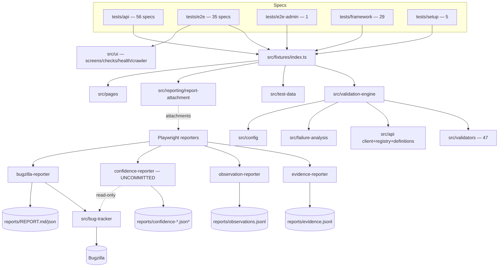
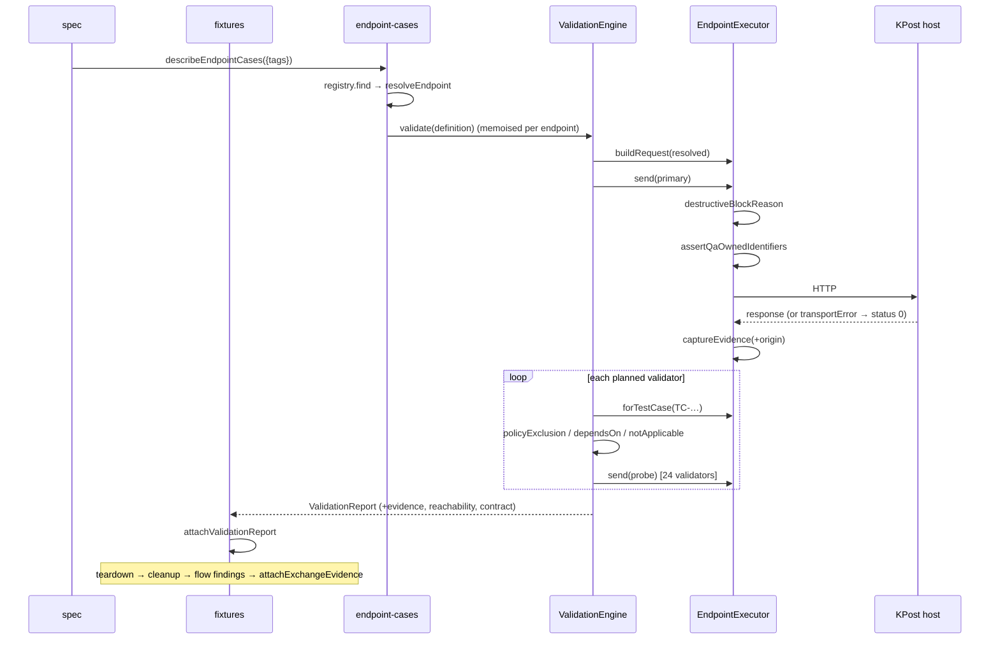
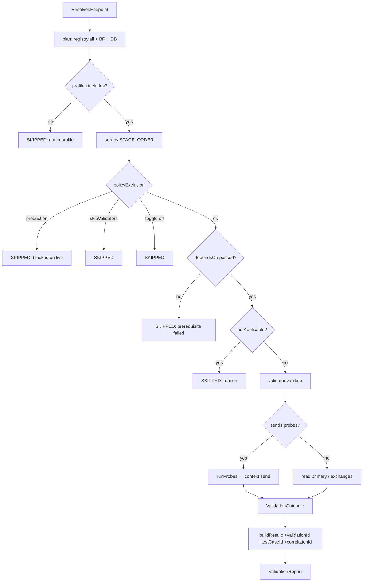
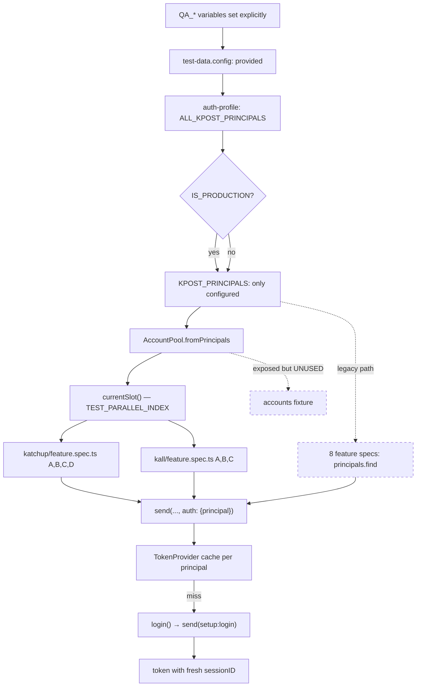
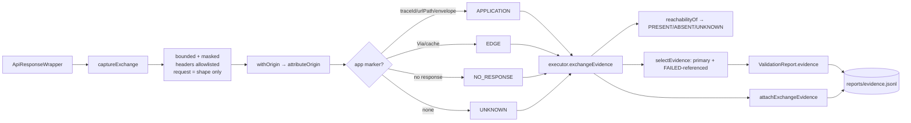
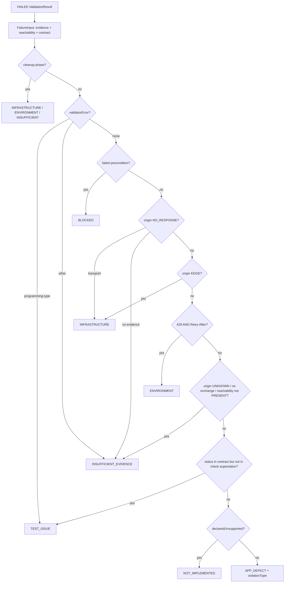
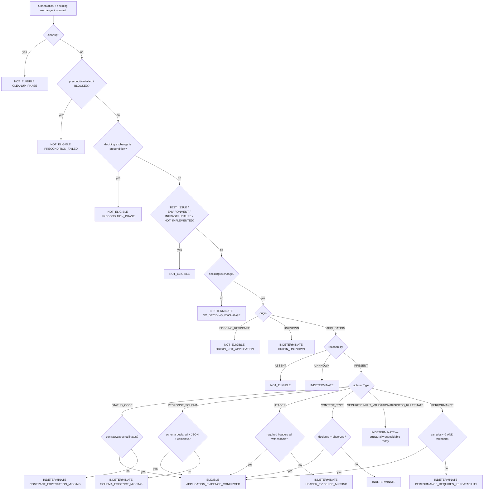
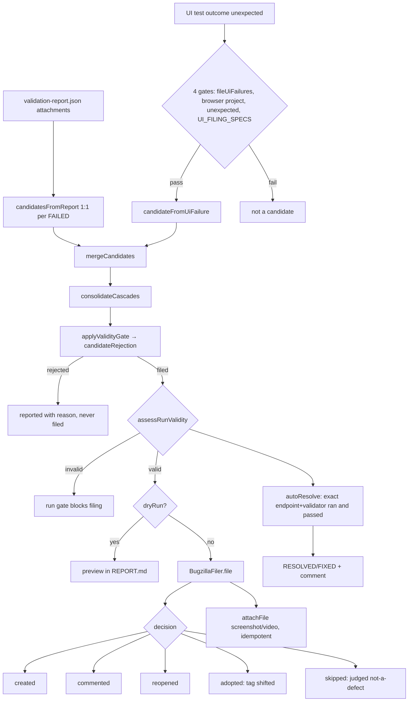
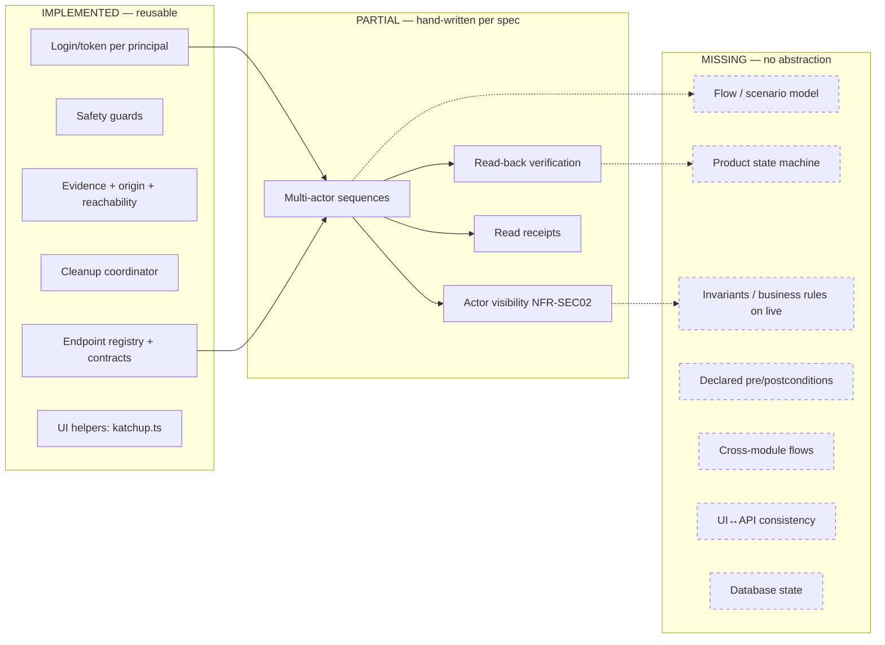

# KPOST TEST BENCH — COMPLETE CURRENT CONTEXT

**Repository:** `D:\TEST-BENCH-AUTOMATIONS\kpost-testbench_v2`
**Branch:** `19-09-2026`
**HEAD:** `1c0d86b41d7b9c97e6bf6a9512a12deae24de891` — `fix(bench): add shadow failure classification`
**Generated:** 2026-09-20T14:29Z
**Analysis scope:** Whole repository excluding `node_modules/`, `reports/`, `test-results/`, `playwright-report/`, and generated `contracts/` + `openapi/` artifacts. Read-only inspection: no source file was modified, no branch created, no commit, no push, no package installed, no destructive test executed against KPOST.

> **Working-tree note (important for the reviewer).** HEAD is the Phase 3.3 commit. The working tree additionally contains **uncommitted Phase 3.4** work (6 modified files, 7 new files — the shadow defect-confidence gate). This document describes the working tree **as it stands**, and marks every Phase 3.4 element as `UNCOMMITTED`. Nothing in Phase 3.4 changes Bugzilla behaviour.

> **Secret handling.** No credential, password, token, cookie, API key, phone number, account id, company id or e-mail address appears anywhere in this document. Configuration is described by **variable name only**.

---

## Table of contents

1. [Executive Summary](#1-executive-summary)
2. [Repository Structure](#2-repository-structure)
3. [Complete File Map](#3-complete-file-map)
4. [Execution Architecture](#4-execution-architecture)
5. [Validation Architecture](#5-validation-architecture)
6. [Account / Actor Model](#6-account--actor-model)
7. [Test Data](#7-test-data)
8. [Resource Lifecycle](#8-resource-lifecycle)
9. [Evidence](#9-evidence)
10. [Classification](#10-classification)
11. [Confidence Gate](#11-confidence-gate)
12. [Bugzilla](#12-bugzilla)
13. [Application Flow Capability](#13-application-flow-capability)
14. [State / Business Rule Capability](#14-state--business-rule-capability)
15. [Parallel Execution](#15-parallel-execution)
16. [Coverage](#16-coverage)
17. [Gaps](#17-gaps)
18. [Risks](#18-risks)
19. [Mermaid Architecture](#19-mermaid-architecture)
20. [Current-State Conclusion](#20-current-state-conclusion)

---

## 1. Executive Summary

### What this bench is

A Playwright + TypeScript (strict) test bench for **KPOST**, a unified communications platform (messaging "Katchup", calling "Kall", email "KMail", directory, admin). The bench targets a disposable TEST deployment and files defects into a real Bugzilla instance.

**Scale (measured, not estimated):**

| Metric                                 | Count                                                                                                  | Source                                 |
| -------------------------------------- | ------------------------------------------------------------------------------------------------------ | -------------------------------------- |
| `src/**/*.ts`                          | 235 files, 27,505 LOC                                                                                  | `find`/`wc`                            |
| `tests/**/*.ts`                        | 129 files, 18,228 LOC                                                                                  | `find`/`wc`                            |
| Spec files                             | 122 (`tests/api` 56, `tests/e2e` 35, `tests/framework` 29, `tests/e2e-admin` 1, `tests/integration` 1) | `find -name '*.spec.ts'`               |
| Setup files                            | 5 (`tests/setup/*.setup.ts`)                                                                           | `find`                                 |
| Registered API endpoints (non-fixture) | **341**                                                                                                | generated `docs/BLOCKED-ENDPOINTS.md`  |
| Bench mock-fixture endpoints           | ~9                                                                                                     | `src/api/definitions/*.api.ts`         |
| Registered validators                  | **47**                                                                                                 | `src/validators/index.ts`              |
| Collected tests — `api` project        | **6,292**                                                                                              | `playwright test --project=api --list` |
| Collected tests — `framework`          | **464**                                                                                                | `--list`                               |
| Collected tests — `chromium`           | **153**                                                                                                | `--list`                               |
| Collected tests — `admin-ui`           | **13**                                                                                                 | `--list`                               |
| Collected tests — `integration`        | **0** (grep-inverted, see §16)                                                                         | `--list`                               |
| Run profiles                           | 11 + a `default`                                                                                       | `config/run-profiles.json`             |
| npm scripts                            | 39                                                                                                     | `package.json`                         |

### The central architectural idea

**Common validation exists once.** An endpoint definition states only what is specific to it; a central engine applies every applicable validator automatically. `describeEndpointCases()` emits **one Playwright test per validator per endpoint** while performing **one HTTP run per endpoint** (memoised). Adding an endpoint is one definition; adding a validator is one line in `src/validators/index.ts` and it applies to all ~341 endpoints. This is genuinely implemented and is the bench's strongest property.

### Defence in depth (all IMPLEMENTED and verified)

Every outgoing request passes one chokepoint — `EndpointExecutor.send()` in `src/validation-engine/endpoint-executor.ts` — which applies, in order:

1. **`destructiveBlockReason()`** (`production-guard.ts`) — SMS/OTP kill-switch first (never unlockable except by the `OTP_TEST_GATEWAY` + `TEST_DB_MODE` pair, and never for session destroyers), then a default-deny `productionSafe` allowlist, then an OTP gate, then a side-effect gate.
2. **`assertQaOwnedIdentifiers()`** (`qa-identifier-guard.ts`) — refuses any request naming an identifier the run does not own, element-by-element for arrays, including multipart and raw JSON bodies. Independent of every production-guard flag.
3. **Routing guard** — `mockFixture` endpoints are structurally forced onto the mock base URL.

### The Phase 3.2 → 3.4 analysis pipeline

A three-stage, **shadow-only** pipeline added on top of the existing Bugzilla path:

```
exchange → ExchangeEvidence (3.2) → Observation/classification (3.3) → ConfidenceDecision (3.4, UNCOMMITTED)
```

It is observational end-to-end: **nothing reads its output back into filing**. The existing Bugzilla pipeline (candidate → validity gate → merge/cascade → fingerprint → file → auto-resolve) is untouched by all three phases.

### The five findings an architect should read first

1. **Business rules and database validations are demo-scoped.** 4 business rules + 4 DB validations are registered, and **every one is wired exclusively to `mockFixture: true` endpoints** (`users.api.ts`, `companies.api.ts`). Zero real KPost/KMail/Admin endpoint declares `businessRules` or `database`. The rules assert UPPER_SNAKE error codes read from body path `code`, which `response-contract.ts` states **none** of the real contracts has — so they are structurally incapable of passing on live. The `BUSINESS_RULE` and `DATABASE` validator stages therefore never execute against the product.

2. **There is no real database adapter.** `DatabaseClientKind = 'mock' | 'none'`. `MockDatabaseClient` issues HTTP GETs to the mock server's `/__test/db/<table>`. `DB_CONNECTION_STRING` is read into config and never consumed. No DB driver exists in `package.json`. Consequence: no data-integrity, persistence or state-transition claim can be verified against real storage.

3. **The UI and API halves share almost nothing.** No UI spec uses the `endpoints` fixture, `EndpointExecutor`, evidence capture, the resource ledger or the account pool. `src/ui/ui-checks.ts` is an independent parallel catalogue (9 checks) sharing exactly one _type_ with the API side. **UI tests produce zero ExchangeEvidence, zero observations and zero confidence decisions** — the entire Phase 3.2–3.4 pipeline is API-only. UI defects reach Bugzilla by a separate, much simpler route (test outcome → filename allowlist → `candidateFromUiFailure`).

4. **Application _flow_ is hand-written, not modelled.** There is no flow/scenario abstraction, no state machine, no actor-visibility model. A multi-actor flow is expressed by passing `auth: { principal }` per call inside a hand-written lifecycle spec. Read receipts, group administration and message lifecycle are covered _only_ where a developer wrote the sequence by hand in one of ~12 `feature.spec.ts` files.

5. **Broad parallel execution is not safe today.** Every live profile is pinned to `workers: 1`. The account pool that would make parallelism safe exists and is correct, but the `accounts` fixture that exposes it is **dead code** — the two migrated specs call `currentSlot()` at module scope instead. Resource journals are single-process append-only files.

### Maturity summary

| Layer                                  | State                                                                                          |
| -------------------------------------- | ---------------------------------------------------------------------------------------------- |
| Contract-driven API validation         | **Strong** — 47 validators × 341 endpoints, centralised, profile-gated, production-gated       |
| Safety controls                        | **Strong** — layered, default-deny, independently tested (`live-safety.spec.ts`)               |
| Evidence / classification / confidence | **Strong but shadow-only, API-only**                                                           |
| Bugzilla pipeline                      | **Mature** — fingerprints, 4-layer dedup, cascade consolidation, validity gate, auto-resolve   |
| Resource lifecycle                     | **Built, barely adopted** — 2 of ~12 lifecycle specs migrated                                  |
| Account pool                           | **Built, bypassed** — fixture unused; 2 specs use the module-level helper; 8 use legacy lookup |
| Business rules / state / DB            | **Demo-only against mock fixtures**                                                            |
| UI                                     | **Broad but shallow and structurally separate**                                                |
| Application-flow modelling             | **Absent** — hand-written sequences only                                                       |
| Parallel execution                     | **Not enabled** — workers=1 on every live profile                                              |

---

## 2. Repository Structure

### Top level

| Path                                                                         | Purpose                                                                                 |
| ---------------------------------------------------------------------------- | --------------------------------------------------------------------------------------- |
| `src/`                                                                       | All framework and application-specific source (235 `.ts`)                               |
| `tests/`                                                                     | All specs, setup and framework self-tests (129 `.ts`)                                   |
| `config/run-profiles.json`                                                   | The authoritative run-profile registry, read by both TS and the CJS runner              |
| `scripts/`                                                                   | 8 CJS scripts: the runner, the multi-suite runner, and 6 contract tools                 |
| `mock-server/`                                                               | Local stand-in for the KPost API (5 files) — lets the framework run with no environment |
| `contracts/`, `openapi/`                                                     | **GENERATED** from the Excel workbook / live springdoc. Never hand-edited               |
| `docs/`                                                                      | 28 documents; several are **generated** by framework tests (see below)                  |
| `playwright.config.ts`, `merge.config.ts`                                    | Project + reporter configuration                                                        |
| `tsconfig.json`, `eslint.config.mjs`                                         | strict TS, path aliases, lint                                                           |
| `KPOST API (6).xlsx`, `Admin_module.xlsx`, `Admin_module - API Services.pdf` | Owner-supplied contract sources                                                         |
| `CLAUDE.md`                                                                  | The living decision log — the bench's own history and conventions                       |

**Generated docs (written by framework tests, must not be hand-edited):** `COVERAGE.md`, `LIVE-ENDPOINTS.md`, `BLOCKED-ENDPOINTS.md`, `COMPONENT-ROUTING.md`, `UI-COVERAGE.md`, `KATCHUP-UI-COVERAGE.md`, `PAYLOAD-AUDIT.md`, `OTP-ENDPOINTS.md`.

### `src/` directory census

| Directory                           | Files | Purpose                                                                                 |
| ----------------------------------- | ----: | --------------------------------------------------------------------------------------- |
| `src/api/client`                    |     5 | HTTP client, pool, request builder, response wrapper, token provider                    |
| `src/api/registry`                  |     3 | `ApiRegistry`, `EndpointDefinition`, OpenAPI loader                                     |
| `src/api/contract`                  |     1 | Workbook contract reader (throws at import on an undocumented endpoint)                 |
| `src/api/schema`, `src/api/schemas` |     5 | zod↔JSON-Schema bridge (Ajv), bench fixture schemas, generated KPost enums              |
| `src/api/definitions`               |    72 | Endpoint definitions: `kpost/` (13 modules), `kmail/`, `admin/`, + 5 mock-fixture files |
| `src/validation-engine`             |    14 | Engine, executor, policy, guards, probe helper, case generators, flow findings          |
| `src/validators`                    |  47+8 | 6 validator families + shared support/mutation/probe helpers                            |
| `src/failure-analysis`              |    11 | Evidence, origin, reachability, classifier, observation, **confidence (3.4)**           |
| `src/reporting`                     |    13 | Bugzilla reporter, 3 shadow reporters, journals, run summary, test-case ids             |
| `src/bug-tracker`                   |     9 | Bugzilla client, filer, candidate, fingerprint, validity gate, verify-resolve           |
| `src/test-data`                     |     7 | Account pool, resource ledger/journal/record, cleanup, owned resources                  |
| `src/config`                        |    13 | env (zod), auth, ownership, run profiles, thresholds, contracts, test data              |
| `src/ui`                            |     6 | Screen registries, check catalogue, health monitor, crawler, feature ledger             |
| `src/pages`                         |     2 | `BasePage`, `LoginPage` (used only by the `loginPage` fixture)                          |
| `src/business-rules`                |     6 | 4 rules + registry (mock-fixture scope only)                                            |
| `src/database`                      |     8 | Mock-only client, 4 validations, 2 repositories, assertions                             |
| `src/utils`                         |     6 | masking, logger, correlation, json, jwt, named registry                                 |
| `src/fixtures`                      |     1 | **`index.ts` — the single Playwright fixture surface**                                  |
| `src/data`                          |     1 | Static data                                                                             |

### `tests/` directory census

| Directory           |   Specs | Purpose                                                                                                                                       |
| ------------------- | ------: | --------------------------------------------------------------------------------------------------------------------------------------------- |
| `tests/api`         |      56 | Per-module: `read/send/manage/...spec.ts` (engine-driven), `coverage.spec.ts` (offline self-tests), `feature.spec.ts` (gated lifecycle flows) |
| `tests/e2e`         |      35 | Browser specs, 3 engines; 2 support helpers                                                                                                   |
| `tests/e2e-admin`   |       1 | Admin/HR SPA screen sweep                                                                                                                     |
| `tests/framework`   |      29 | The bench's own guards — 464 collected tests                                                                                                  |
| `tests/integration` |       1 | Mock-fixture workflow; collects **0** under the production config                                                                             |
| `tests/setup`       | 5 setup | Auth state seeding for 5 identities                                                                                                           |

### Per-directory detail (purpose / files / deps / callers / IO / side effects / invariants / limitations)

Rather than repeat ten bullets for all 40 directories, the ten dimensions are given below for the **twelve load-bearing directories**. The remainder are covered by the file map in §3.

---

#### `src/fixtures` — the single composition root

1. **Purpose.** Defines every Playwright fixture; the only place specs obtain the engine, executor, accounts, cleanup and page objects.
2. **Files.** `index.ts` (194 lines) — exports `test` and `expect`. Every spec imports from `@fixtures`, never from `@playwright/test`.
3. **Dependencies.** `ApiClientPool`, `apiRegistry`, `EndpointExecutor`, `ValidationEngine`, `validationRegistry`, `businessRuleRegistry`, `databaseValidationRegistry`, `createDatabaseClient`, `accountPool`, `createTestCleanup`, `deriveTestCaseId`, `attachValidationReport`, `attachExchangeEvidence`, `LoginPage`, `createLogger`.
4. **Who calls it.** Every spec in `tests/`.
5. **What it calls.** The engine and executor constructors; the cleanup coordinator; the attachment helpers.
6. **Inputs.** `testInfo` (file, titlePath, project, parallelIndex, annotations).
7. **Outputs.** Fixture instances; Playwright attachments (`validation-report.json`, `exchange-evidence.json`, `cleanup-summary`) and annotations (`cleanup-status`, `test-case-id`).
8. **Side effects.** HTTP contexts created/disposed; cleanup executed in teardown; flow findings drained into reports.
9. **Invariants.** (a) Cleanup runs in fixture teardown, so it cannot be skipped by the test body; (b) it runs _before_ account fixtures release, so principals are still valid; (c) evidence is attached **after** cleanup completes, so teardown exchanges are included; (d) every cleanup call is wrapped in `withPhase('cleanup')` at this boundary — not in each closure.
10. **Known limitations.** The **`accounts` fixture is never destructured by any spec — dead code**. `api` and `createValidationEngine` are used by 1 framework spec each. `loginPage` is used by 6 setup/e2e specs.

---

#### `src/validation-engine` — orchestration and safety

1. **Purpose.** Resolve an endpoint definition into a fully defaulted contract, send the primary request, run every applicable validator, aggregate one `ValidationReport`.
2. **Important files.** `endpoint-executor.ts` (486, the chokepoint), `qa-identifier-guard.ts` (431), `validation-engine.ts` (300), `validation-result.ts` (264), `production-guard.ts` (257), `flow-finding.ts` (226), `validation-policy.ts` (216), `endpoint-cases.ts` (201), `production-validators.ts` (191), `validator.ts` (133), `validation-context.ts` (130), `probe.ts` (74), `contract-suite.ts` (52), `validation-registry.ts` (37).
3. **Dependencies.** `src/api/*`, `src/config/*`, `src/failure-analysis` (evidence + reachability), `src/validators` (via the registry passed in).
4. **Who calls it.** The `endpoints` / `validationEngine` fixtures; `describeEndpointCases` / `describeEndpointContracts`.
5. **What it calls.** `ApiClientPool`, `RequestBuilder`, `TokenProvider`, `captureExchange`/`withOrigin`, `reachabilityOf`.
6. **Inputs.** `EndpointDefinition`, `RequestSpec`, `SendOptions`, `ValidationProfile`.
7. **Outputs.** `ApiResponseWrapper`, `ValidationReport`, `ExchangeEvidence[]`, `FlowFinding[]`, `CleanupServerError[]`, `BusinessRuleFinding[]`.
8. **Side effects.** Real HTTP requests; token minting (login); evidence accumulation (capped at 500 records per executor).
9. **Invariants.** Guards run before the request is built; evidence is captured for every exchange before anything judges it; a cleanup-phase 5xx can never become a `FlowFinding`; a validator that throws becomes a FAILED result with `validator error:` rather than crashing the run.
10. **Known limitations.** `endpoint-cases.ts` memoises one engine run per endpoint in a **module-level `Map`** — correct because `describe.configure({mode:'default'})` pins an endpoint's cases to one worker, but it is shared mutable state and the `ValidationReport` attaches only to the _first_ case that triggered the run.

---

#### `src/validators` — the 47 central checks

1. **Purpose.** Every reusable check, written once, applied to every endpoint.
2. **Files.** `index.ts` (registration), `support.ts`, plus `authentication/` (5), `authorization/` (5 + support), `common/` (6 + field-convention factory), `performance/` (3), `request/` (13 via a factory + 4 hand-written), `response/` (8), `security/` (7 + `leak-patterns.ts`, `payload-probes.ts`).
3. **Dependencies.** `ValidationContext`, `probe.ts`, `thresholds.config`, `api.config`, `auth.config`, `response-contract`.
4. **Who calls it.** `ValidationEngine.plan()` via `validationRegistry.all()`.
5. **Inputs.** `ValidationContext` (endpoint, primary response, recorded exchanges, helpers).
6. **Outputs.** `ValidationOutcome` → `ValidationResult` (with `CheckDetail[]` carrying per-probe `correlationId` and, on failure, the `request`).
7. **Side effects.** 24 validators send **extra HTTP requests** (probes).
8. **Invariants.** A probe's status comparison happens in exactly one place (`runProbes`); a probe throttled with 429 is SKIPPED, never PASSED or FAILED; request mutations are only sent when the endpoint's own schema rejects them.
9. **Known limitations.** Substantial hardcoded expectation surface (§5); 5 validators are effectively inert against real contracts; `security.jwt` and `security.rate-limit` bypass `runProbes` and send directly.
10. **Dead entry.** `'metadata.timestamp'` appears in `PRODUCTION_SAFE_VALIDATORS` but is a `CheckDetail` name, not a registered validator.

---

#### `src/failure-analysis` — evidence → classification → confidence

1. **Purpose.** Preserve what an exchange looked like, attribute who produced it, classify why a check failed, and (3.4) decide whether the evidence supports a defect candidate.
2. **Files.** `evidence.ts` (392), `origin.ts` (192), `reachability.ts` (108), `evidence-journal.ts` (82), `classification.ts` (161), `classifier.ts` (524), `observation.ts` (176), **`confidence.ts` (328, UNCOMMITTED)**, **`confidence-gate.ts` (~730, UNCOMMITTED)**, **`confidence-decision.ts` (171, UNCOMMITTED)**, `index.ts` (barrel).
3. **Dependencies.** `ApiResponseWrapper`, `ExchangePhase`, `maskString`, `ValidationReport`.
4. **Who calls it.** `EndpointExecutor.captureEvidence`, `ValidationEngine.validate`, the three shadow reporters.
5. **Outputs.** `ExchangeEvidence`, `ReachabilityWitness`, `Observation`, `ConfidenceDecisionRecord`.
6. **Side effects.** **None** — all pure; persistence lives in `src/reporting`.
7. **Invariants.** No rule reads prose; no rule maps a status code to a cause on its own; request headers/bodies are never stored verbatim (shape only); response headers are allowlisted, not masked-by-default.
8. **Known limitations.** Shadow-only; API-only; several classifier/gate branches unreachable from live traffic.

---

#### `src/bug-tracker` — defect pipeline (must not change)

1. **Purpose.** Turn failures into deduplicated, routed, gated Bugzilla tickets and close verified-fixed ones.
2. **Files.** `bugzilla-filer.ts` (479), `bug-candidate.ts` (496), `bugzilla-client.ts` (366), `verify-resolve.ts` (253), `bug-builder.ts` (225), `validity-gate.ts` (172), `guidance.ts` (118), `bug-fingerprint.ts` (83), `curl.ts` (79).
3. **Who calls it.** `src/reporting/bugzilla-reporter.ts` only (plus the Phase 3.4 reporter, read-only, for divergence).
4. **Side effects.** **Live HTTP writes to Bugzilla** when armed.
5. **Invariants.** Filing is armed only by the command, never by a `.env` value; dry run is the default; a run that collapsed files nothing.

---

#### `src/test-data` — accounts, ledger, cleanup

1. **Purpose.** Decide which accounts a worker owns; record what a test created; remove it afterwards.
2. **Files.** `cleanup.ts` (359), `resource-journal.ts` (284), `resource-ledger.ts` (276), `account-pool.ts` (248), `index.ts` (130), `resource-record.ts` (119), `owned-resources.ts` (83).
3. **Side effects.** Appends to `reports/resources.jsonl`; issues real DELETE calls through the executor during teardown.
4. **Invariants.** Identity is `runId | slot | testCaseId | kind | id`; a resource owned by another run/test/slot is **refused**, never deleted; `cleanupAll()` never throws; LIFO order.
5. **Known limitations.** Only 2 specs adopt it; journal appends are single-process.

---

#### `src/reporting` — attachments in, artifacts out

Four Playwright reporters run in this order (non-CI): `evidence-reporter` → `observation-reporter` → **`confidence-reporter` (UNCOMMITTED)** → `bugzilla-reporter`. The first three are shadow; only the last writes to Bugzilla. All read the same two attachments (`validation-report.json`, `exchange-evidence.json`).

---

#### `src/config` — the decision layer

13 files. `env.ts` validates everything with zod at import, captures `TEST_ENV`, `BUGZILLA_DRY_RUN` and a full `process.env` snapshot **before** dotenv, and applies the rule **command > profile > .env**. `run-profiles.ts` + `config/run-profiles.json` define 11 profiles read identically by TS and CJS. `assertTargetAllowed()` refuses production hosts with **no override flag** — but runs only when a named profile is active (see §18, HIGH-3).

---

#### `src/ui` — the browser half

6 files, **no runtime dependency on the API layer**. `screens.ts` (13 screens + 6 nav links), `admin-screens.ts` (8 screens), `ui-checks.ts` (9 checks), `ui-health.ts` (crash/asset/console/hang monitor), `ui-crawler.ts` (24 clicks/screen, 4 fuzz values), `katchup-features.ts` (35-feature ledger).

---

#### `src/business-rules` and `src/database` — demo scope

Both registries are populated (4 + 4) and both are wired **only** to `mockFixture: true` endpoints. See §14.

---

#### `src/utils` — cross-cutting

`masking.ts` is the single masking implementation used by the logger and all reporting. `correlation.ts` mints `tb-<uuid>`. `jwt.ts` decodes without verifying and produces tampering fixtures. `json.ts`, `logger.ts`, `named-registry.ts`.

---

#### `scripts/` — runner and contract toolchain

`bench.cjs` (profile-driven runner; refuses rather than clamps workers), `run-suites.cjs` (sequential multi-suite), and 6 contract tools (`excel-to-contract`, `contract-coverage` — which independently re-parses the workbook so it cannot agree with itself, `excel-gap-report`, `fetch-admin-contract`, `apply-admin-pdf-payloads`, `otp-dependency-report`).

---

## 3. Complete File Map

Legend — **Cls**: `F` framework/core · `A` application-specific · `G` generated-consumer.
Participation columns: **X** exec · **R** reporting · **B** Bugzilla · **C** cleanup · **E** evidence/classification.

### 3.1 Fixtures and execution engine

| Path                                             | Responsibility                                      | Key exports                                                                                                                                            | Depends on                                      | Consumers                           | Cls |  X  |  R  |  B  |  C  |  E  |
| ------------------------------------------------ | --------------------------------------------------- | ------------------------------------------------------------------------------------------------------------------------------------------------------ | ----------------------------------------------- | ----------------------------------- | --- | :-: | :-: | :-: | :-: | :-: |
| `src/fixtures/index.ts`                          | Composition root; all fixtures                      | `test`, `expect`                                                                                                                                       | engine, executor, pool, cleanup, attachments    | every spec                          | F   |  X  |  R  |  B  |  C  |  E  |
| `src/validation-engine/endpoint-executor.ts`     | **The send chokepoint**; guards, evidence, findings | `EndpointExecutor`, `AuthMode`, `ExchangePhase`, `SendOptions`, `targetsRealHost`, `EXCHANGE_PHASES`                                                   | guards, builder, pool, token provider, evidence | fixtures, engine, validators, specs | F   |  X  |  –  |  B  |  C  |  E  |
| `src/validation-engine/validation-engine.ts`     | Plan + run validators → one report                  | `ValidationEngine`, `ValidationEngineDeps`                                                                                                             | registry, policy, executor, reachability        | fixtures, case generators           | F   |  X  |  R  |  B  |  –  |  E  |
| `src/validation-engine/validation-policy.ts`     | Defaults an endpoint; profile sets; exclusions      | `resolveEndpoint`, `ResolvedEndpoint`, `policyExclusion`, `PROFILE_SETS`                                                                               | contracts, thresholds, auth/api config          | engine, executor, case generators   | F   |  X  |  –  |  –  |  –  |  –  |
| `src/validation-engine/validation-result.ts`     | Result/report types; outcome helpers                | `ValidationResult`, `ValidationReport`, `outcome`, `fromChecks`, `summarize`, `CheckDetail`, `Severity`                                                | –                                               | everything                          | F   |  X  |  R  |  B  |  –  |  E  |
| `src/validation-engine/validator.ts`             | Validator contract; result construction             | `defineValidator`, `Validator`, `buildResult`, `STAGE_ORDER`                                                                                           | test-case-id                                    | all validators                      | F   |  X  |  –  |  –  |  –  |  E  |
| `src/validation-engine/validation-registry.ts`   | Name→validator map                                  | `ValidationRegistry`                                                                                                                                   | –                                               | `src/validators/index.ts`           | F   |  X  |  –  |  –  |  –  |  –  |
| `src/validation-engine/validation-context.ts`    | What a validator may read/do                        | `ValidationContext`, `EngineValidationContext`, `RunInfo`                                                                                              | executor                                        | all validators                      | F   |  X  |  –  |  –  |  –  |  –  |
| `src/validation-engine/probe.ts`                 | **The only probe send/compare**                     | `runProbes`, `ProbeCase`, `statusMatches`                                                                                                              | context                                         | 22 validators                       | F   |  X  |  –  |  –  |  –  |  E  |
| `src/validation-engine/production-guard.ts`      | Destructive/OTP/side-effect gate                    | `destructiveBlockReason`, `ProductionSafetyError`, `SafetyFlags`, `SideEffect`                                                                         | env                                             | executor, case generators           | F   |  X  |  –  |  –  |  –  |  –  |
| `src/validation-engine/qa-identifier-guard.ts`   | Refuses foreign identifiers                         | `assertQaOwnedIdentifiers`, `foreignIdentifiers`                                                                                                       | test-data config, owned-resources               | executor (1 call site)              | F   |  X  |  –  |  –  |  C  |  –  |
| `src/validation-engine/production-validators.ts` | Live validator allowlist/blocklist                  | `productionExclusion`, `PRODUCTION_SAFE_VALIDATORS`, `PRODUCTION_BLOCKED_VALIDATORS`, `READ_SAFE_FUZZERS`                                              | env                                             | policy                              | F   |  X  |  –  |  –  |  –  |  –  |
| `src/validation-engine/endpoint-cases.ts`        | One test per validator per endpoint                 | `describeEndpointCases`                                                                                                                                | engine, registry, test-case-id                  | `tests/api/**/*.spec.ts`            | F   |  X  |  R  |  –  |  –  |  E  |
| `src/validation-engine/contract-suite.ts`        | One test per endpoint (contract)                    | `describeEndpointContracts`                                                                                                                            | engine, registry                                | a few specs                         | F   |  X  |  –  |  –  |  –  |  –  |
| `src/validation-engine/flow-finding.ts`          | Lifecycle 5xx / BR violation → report               | `FlowFinding`, `CleanupServerError`, `BusinessRuleFinding`, `flowFindingReports`, `businessRuleFindingReports`, `isServerError`, `describeCleanupBody` | env, masking                                    | executor, fixtures                  | F   |  X  |  R  |  B  |  C  |  E  |

### 3.2 API layer

| Path                                                                  | Responsibility                                                                                                                 | Key exports                                                                        | Cls |  X  |  R  |  B  |  C  |  E  |
| --------------------------------------------------------------------- | ------------------------------------------------------------------------------------------------------------------------------ | ---------------------------------------------------------------------------------- | --- | :-: | :-: | :-: | :-: | :-: |
| `src/api/client/api-client.ts`                                        | Executes a request; never throws                                                                                               | `ApiClient`, `RequestOptions`                                                      | F   |  X  |  –  |  –  |  –  |  –  |
| `src/api/client/api-client-pool.ts`                                   | One client per suite id                                                                                                        | `ApiClientPool`, `ClientTarget`                                                    | F   |  X  |  –  |  –  |  –  |  –  |
| `src/api/client/request-builder.ts`                                   | Spec → `ApiRequest`; correlation header                                                                                        | `RequestBuilder`, `RequestSpec`, `ApiRequest`, `HttpMethod`, `resolvePath`         | F   |  X  |  –  |  B  |  –  |  E  |
| `src/api/client/response-wrapper.ts`                                  | Immutable response view                                                                                                        | `ApiResponseWrapper`, `TransportError`, `ParsedJson`                               | F   |  X  |  –  |  –  |  –  |  E  |
| `src/api/client/token-provider.ts`                                    | Per-principal token cache                                                                                                      | `TokenProvider`                                                                    | F   |  X  |  –  |  –  |  –  |  –  |
| `src/api/registry/api-registry.ts`                                    | Endpoint registry + filters                                                                                                    | `ApiRegistry`, `EndpointFilter`                                                    | F   |  X  |  –  |  –  |  –  |  –  |
| `src/api/registry/endpoint-definition.ts`                             | **The endpoint contract type**                                                                                                 | `EndpointDefinition`, `RequestFactory`, `RequestFactoryHelpers`, `AuthFailureMode` | F   |  X  |  –  |  B  |  –  |  E  |
| `src/api/registry/endpoint-loader.ts`                                 | OpenAPI → definitions                                                                                                          | `loadOpenApiEndpoints`                                                             | F   |  X  |  –  |  –  |  –  |  –  |
| `src/api/contract/workbook-contract.ts`                               | Generated contract reader; throws at import                                                                                    | `workbookContract`, `contractPaths`, `WorkbookContract`                            | F   |  X  |  –  |  –  |  –  |  –  |
| `src/api/schema/contract-schema.ts`                                   | zod ↔ JSON Schema via Ajv                                                                                                      | `validateSchema`, `ContractSchema`, `toJsonSchema`, `formatIssues`                 | F   |  X  |  –  |  –  |  –  |  –  |
| `src/api/schemas/kpost-types.ts`                                      | Typed reader over generated enums                                                                                              | `KPOST_TYPES`, `KATCHUP_*`, `KALL_*`, `KMAIL_*`, `USER_TYPES`                      | A   |  X  |  –  |  –  |  –  |  –  |
| `src/api/definitions/endpoint-factory.ts`                             | **Single config→definition mapping**                                                                                           | `buildDefinition`, `SuiteScope`                                                    | F   |  X  |  –  |  –  |  –  |  –  |
| `src/api/definitions/kpost/kpost-endpoint.ts`                         | KPost factory + config type                                                                                                    | `defineKpostEndpoint`, `KpostEndpointConfig`, `body`, `pathParams`                 | A   |  X  |  –  |  –  |  –  |  –  |
| `src/api/definitions/kmail/kmail-endpoint.ts`                         | KMail factory (path prefix)                                                                                                    | `defineKmailEndpoint`                                                              | A   |  X  |  –  |  –  |  –  |  –  |
| `src/api/definitions/admin/admin-endpoint.ts`                         | Admin factory                                                                                                                  | `defineAdminEndpoint`, `COMPANY_SCOPED_READ`                                       | A   |  X  |  –  |  –  |  –  |  –  |
| `src/api/definitions/index.ts`                                        | **The single `apiRegistry`**                                                                                                   | `apiRegistry`                                                                      | A   |  X  |  –  |  –  |  –  |  –  |
| `src/api/definitions/kpost/**` (13 modules, ~50 files)                | Endpoint definitions per module                                                                                                | `*Apis` arrays                                                                     | A   |  X  |  –  |  B  |  –  |  –  |
| `src/api/definitions/kmail/**`, `admin/**`                            | KMail (45) / Admin (38) definitions                                                                                            | `kmailApis`, `adminApis`, `uncovered*Paths`                                        | A   |  X  |  –  |  B  |  –  |  –  |
| `src/api/definitions/{health,auth,users,companies,dictionary}.api.ts` | **Bench mock fixtures** (`mockFixture: true`) — framework self-test targets, the ONLY carriers of `businessRules` / `database` | `healthCheckApi`, `loginApi`, `userApis`, `companyApis`, `dictionaryApis`          | F   |  X  |  –  |  –  |  –  |  –  |

### 3.3 Validators (47 registered)

| Path                                                        | Responsibility                                                                                    | Cls |  X  |  E  |
| ----------------------------------------------------------- | ------------------------------------------------------------------------------------------------- | --- | :-: | :-: |
| `src/validators/index.ts`                                   | Registers all 47                                                                                  | F   |  X  |  –  |
| `src/validators/support.ts`                                 | `responseData`, `isJsonResponse`, `errorExchanges`, `hasNoContent`                                | F   |  X  |  –  |
| `src/validators/response/*.ts` (8)                          | status-code, content-type, headers, structure, schema, metadata, pagination, error-format         | F   |  X  |  E  |
| `src/validators/performance/*.ts` (3)                       | timeout, response-time, payload-size                                                              | F   |  X  |  E  |
| `src/validators/authentication/*.ts` (5)                    | valid/missing/invalid/expired/malformed token                                                     | F   |  X  |  E  |
| `src/validators/authorization/*.ts` (5 + support)           | role, permission, forbidden, cross-resource-access, privilege-escalation                          | F   |  X  |  E  |
| `src/validators/request/*.ts` (13)                          | 9 factory-built mutators + malformed-json, method-not-allowed, unsupported-media-type, empty-body | F   |  X  |  E  |
| `src/validators/request/request-mutation.ts`                | Mutation factory; `carriesRequestBody`                                                            | F   |  X  |  –  |
| `src/validators/security/*.ts` (7)                          | security-headers, jwt, injection, xss, rate-limit, information-disclosure, sensitive-data         | F   |  X  |  E  |
| `src/validators/security/{leak-patterns,payload-probes}.ts` | 8 leak regexes; payload probe runner                                                              | F   |  X  |  –  |
| `src/validators/common/*.ts` (6 + factory)                  | id, email, date, url, boolean (factory) + api-error                                               | F   |  X  |  E  |

### 3.4 Failure analysis

| Path                                          | Responsibility                                            | Key exports                                                                                                                  | Cls |  E  | Status          |
| --------------------------------------------- | --------------------------------------------------------- | ---------------------------------------------------------------------------------------------------------------------------- | --- | :-: | --------------- |
| `src/failure-analysis/evidence.ts`            | Bounded, redacted exchange record                         | `captureExchange`, `ExchangeEvidence`, `EVIDENCE_LIMITS`, `EVIDENCE_RESPONSE_HEADERS`, `serialiseEvidence`, `ResponseOrigin` | F   |  E  | committed       |
| `src/failure-analysis/origin.ts`              | Marker-driven origin attribution                          | `attributeOrigin`, `withOrigin`, `ORIGIN_RULE_IDS`                                                                           | F   |  E  | committed       |
| `src/failure-analysis/reachability.ts`        | Did the app answer for this endpoint?                     | `reachabilityOf`, `reachabilityByEndpoint`                                                                                   | F   |  E  | committed       |
| `src/failure-analysis/evidence-journal.ts`    | `reports/evidence.jsonl`                                  | `FileEvidenceJournal`, `MemoryEvidenceJournal`                                                                               | F   |  E  | committed       |
| `src/failure-analysis/classification.ts`      | 7 classes, 18 reason codes, 10 violation types            | `FAILURE_CLASSES`, `REASON_CODES`, `VIOLATION_TYPES`, `violationTypeOf`, `CLASSIFIER_VERSION`                                | F   |  E  | committed       |
| `src/failure-analysis/classifier.ts`          | 12-rule pure classifier                                   | `classifyFailure`, `decidingExchange`, `expectedStatuses`, `ContractExpectation`, `FailureInput`                             | F   |  E  | committed       |
| `src/failure-analysis/observation.ts`         | Durable classified record                                 | `observationsFromReport`, `Observation`, `decidingCorrelationIds`                                                            | F   |  E  | committed       |
| `src/failure-analysis/confidence.ts`          | Gate vocabulary: 3 decisions, 25 reason codes, 10 factors | `CONFIDENCE_DECISIONS`, `GATE_REASON_CODES`, `DECISION_BY_REASON`, `ConfidenceFactors`, `GATE_VERSION`                       | F   |  E  | **UNCOMMITTED** |
| `src/failure-analysis/confidence-gate.ts`     | 15-rule pure sufficiency gate                             | `assessConfidence`, `confidenceFactors`                                                                                      | F   |  E  | **UNCOMMITTED** |
| `src/failure-analysis/confidence-decision.ts` | Report → decisions bridge                                 | `decisionsFromReport`, `confidenceInputFor`, `decisionRecord`                                                                | F   |  E  | **UNCOMMITTED** |
| `src/failure-analysis/index.ts`               | Barrel                                                    | —                                                                                                                            | F   |  E  | modified        |

### 3.5 Reporting

| Path                                     | Responsibility                                     | Cls |  R  |  B  |  E  | Status          |
| ---------------------------------------- | -------------------------------------------------- | --- | :-: | :-: | :-: | --------------- |
| `src/reporting/report-attachment.ts`     | Attachment names + attach helpers                  | F   |  R  |  B  |  E  | committed       |
| `src/reporting/evidence-reporter.ts`     | Persists `reports/evidence.jsonl`                  | F   |  R  |  –  |  E  | committed       |
| `src/reporting/observation-reporter.ts`  | Classifies → `reports/observations.jsonl`          | F   |  R  |  –  |  E  | committed       |
| `src/reporting/observation-journal.ts`   | JSONL sink                                         | F   |  R  |  –  |  E  | committed       |
| `src/reporting/confidence-reporter.ts`   | Gate + divergence; reads bug-tracker **read-only** | F   |  R  |  –  |  E  | **UNCOMMITTED** |
| `src/reporting/confidence-journal.ts`    | JSONL + divergence file sinks                      | F   |  R  |  –  |  E  | **UNCOMMITTED** |
| `src/reporting/confidence-divergence.ts` | Pipeline-stage comparison                          | F   |  R  |  –  |  E  | **UNCOMMITTED** |
| `src/reporting/bugzilla-reporter.ts`     | **The filing orchestrator**                        | F   |  R  |  B  |  –  | committed       |
| `src/reporting/bug-report.ts`            | `reports/REPORT.md` bug half                       | F   |  R  |  B  |  –  | committed       |
| `src/reporting/run-summary.ts`           | Execution health (API + UI)                        | F   |  R  |  –  |  –  | committed       |
| `src/reporting/case-registry.ts`         | `reports/cases.jsonl`; `deriveTestCaseId`          | F   |  R  |  –  |  –  | committed       |
| `src/reporting/test-case-id.ts`          | Stable `TC-…` derivation + collisions              | F   |  R  |  –  |  E  | committed       |
| `src/reporting/report-formatter.ts`      | Human-readable report text                         | F   |  R  |  –  |  –  | committed       |

### 3.6 Bug tracker (unchanged by phases 3.2–3.4)

| Path                                 | Responsibility                            | Key exports                                                                                                |  B  |
| ------------------------------------ | ----------------------------------------- | ---------------------------------------------------------------------------------------------------------- | :-: |
| `src/bug-tracker/bug-candidate.ts`   | Failure → candidate; merge; cascade       | `candidatesFromReport`, `candidateFromUiFailure`, `mergeCandidates`, `consolidateCascades`, `BugCandidate` |  B  |
| `src/bug-tracker/bug-fingerprint.ts` | Dedupe tags                               | `apiFingerprint`, `systemicFingerprint`, `uiFingerprint`, `normalizeForFingerprint`                        |  B  |
| `src/bug-tracker/validity-gate.ts`   | Run gate + candidate gate                 | `assessRunValidity`, `candidateRejection`, `applyValidityGate`                                             |  B  |
| `src/bug-tracker/bugzilla-filer.ts`  | Create/comment/reopen/adopt; proof upload | `BugzillaFiler`, `FilingOutcome`, `FilingDecision`                                                         |  B  |
| `src/bug-tracker/bugzilla-client.ts` | REST client (api_key query param)         | `BugzillaClient`, `BugSummary`                                                                             |  B  |
| `src/bug-tracker/bug-builder.ts`     | Summary/description/whiteboard/comments   | `buildBugFields`, `buildDescription`, `buildWhiteboard`, …                                                 |  B  |
| `src/bug-tracker/verify-resolve.ts`  | Auto-close verified-fixed                 | `buildRunIndex`, `classifyResolve`, `parseAffectedEndpoints`                                               |  B  |
| `src/bug-tracker/guidance.ts`        | Developer guidance per validator          | `developerGuidance`                                                                                        |  B  |
| `src/bug-tracker/curl.ts`            | Runnable repro command                    | `buildCurl`                                                                                                |  B  |

### 3.7 Test data, config, UI, utils

| Path                                | Responsibility                                     | Key exports                                                                            |  C  |
| ----------------------------------- | -------------------------------------------------- | -------------------------------------------------------------------------------------- | :-: |
| `src/test-data/account-pool.ts`     | Positional slot partition                          | `AccountPool`, `SlotAccounts`, `PooledAccount`, `currentSlotIndex`, `AccountPoolError` |  –  |
| `src/test-data/resource-record.ts`  | State machine + identity                           | `RESOURCE_STATES`, `canTransition`, `resourceKey`, `ResourceRecord`                    |  C  |
| `src/test-data/resource-ledger.ts`  | Register/transition; typed errors                  | `ResourceLedger`, `DuplicateResourceError`, …                                          |  C  |
| `src/test-data/resource-journal.ts` | Append-only JSONL + reader                         | `FileResourceJournal`, `readJournalText`, `findOrphans`                                |  C  |
| `src/test-data/cleanup.ts`          | LIFO coordinator; never throws                     | `CleanupCoordinator`, `CleanupRegistry`, `CleanupSummary`, `CleanupFailure`            |  C  |
| `src/test-data/owned-resources.ts`  | Process-scoped ownership registry                  | `rememberOwnedResource`, `ownsResource`                                                |  C  |
| `src/test-data/index.ts`            | Public surface; `accountPool`; `createTestCleanup` | `currentSlot`, `ledgerOwner`, `createTestCleanup`                                      |  C  |
| `src/config/env.ts`                 | zod env; precedence; dry-run forcing               | `env`, `ENV_SCHEMA_KEYS`                                                               |  –  |
| `src/config/auth-profile.ts`        | Login shapes; principals                           | `AUTH_PROFILES`, `KPOST_PRINCIPALS`, `authProfileFor`, `principalForRole`              |  –  |
| `src/config/auth.config.ts`         | `Principal` schema; roles; failure statuses        | `PrincipalSchema`, `ROLES`, `authConfig`                                               |  –  |
| `src/config/ownership.config.ts`    | Suites → host + Bugzilla routing                   | `SUITES`, `suiteFor`, `componentFor`, `KNOWN_COMPONENTS`                               |  –  |
| `src/config/run-profiles.ts`        | Profile loader; target + worker guards             | `runProfile`, `assertTargetAllowed`, `resolveWorkers`, `applyProfile`                  |  –  |
| `src/config/response-contract.ts`   | 4 envelope profiles                                | `responseContract`, `ResponseContract`                                                 |  –  |
| `src/config/test-data.config.ts`    | QA data + `IDENTITY_FIELDS`                        | `testData`, `providedIdentityValues`, `PERSONAL_ACCOUNTS`                              |  C  |
| `src/config/thresholds.config.ts`   | All budgets and caps                               | `thresholds`                                                                           |  –  |
| `src/config/api.config.ts`          | Envelopes, headers, status conventions             | `apiConfig`                                                                            |  –  |
| `src/config/bugzilla.config.ts`     | Filing config                                      | `readBugzillaConfig`, `meetsSeverityFloor`, `categoryFor`                              |  –  |
| `src/config/database.config.ts`     | `'mock' \| 'none'`                                 | `databaseConfig`, `DatabaseClientKind`                                                 |  –  |
| `src/config/constants.ts`           | Storage-state paths, tags, profiles                | `STORAGE_STATE*`, `TAGS`, `VALIDATION_PROFILES`                                        |  –  |
| `src/config/frd-requirements.ts`    | 165 canonical FR ids                               | `FRD_REQUIREMENTS`                                                                     |  –  |
| `src/ui/screens.ts`                 | 13 screens + 6 nav links                           | `AUTHENTICATED_SCREENS`, `NAV_LINKS`, `ScreenDef`                                      |  –  |
| `src/ui/admin-screens.ts`           | 8 admin screens                                    | `ADMIN_SCREENS`, `ADMIN_SHELL`, `ADMIN_NAV`                                            |  –  |
| `src/ui/ui-checks.ts`               | 9-check catalogue                                  | `UI_CHECKS`, `runUiChecks`, `UiFinding`                                                |  –  |
| `src/ui/ui-health.ts`               | Crash/asset/console/hang monitor                   | `watchUiHealth`, `healthFailures`, `failedUserActions`, `isResponsive`                 |  –  |
| `src/ui/ui-crawler.ts`              | Control crawl + input fuzz                         | `crawlScreen`, `CrawlFinding`                                                          |  –  |
| `src/ui/katchup-features.ts`        | 35-feature coverage ledger                         | `KATCHUP_FEATURES`                                                                     |  –  |
| `src/pages/{BasePage,LoginPage}.ts` | Login page object                                  | `LoginPage`, `BasePage`                                                                |  –  |
| `src/utils/masking.ts`              | **The single masker**                              | `maskString`, `maskSensitive`, `isSensitiveKey`, `MASK`                                |  –  |
| `src/utils/logger.ts`               | Masked structured logger                           | `createLogger`, `Logger`                                                               |  –  |
| `src/utils/correlation.ts`          | `tb-<uuid>`                                        | `newCorrelationId`                                                                     |  –  |
| `src/utils/json.ts`                 | Path/merge/walk helpers                            | `getPath`, `setPath`, `deepMerge`, `walkJson`                                          |  –  |
| `src/utils/jwt.ts`                  | Decode + tamper fixtures                           | `decodeJwt`, `jwtExpiry`, `tamperSignature`, `unsignedJwt`                             |  –  |
| `src/utils/named-registry.ts`       | Id-addressed registry                              | `NamedRegistry`                                                                        |  –  |
| `src/business-rules/**` (6)         | 4 rules + registry (**mock only**)                 | `businessRuleRegistry`, `BusinessRule`                                                 |  –  |
| `src/database/**` (8)               | Mock-only client, 4 validations                    | `createDatabaseClient`, `databaseValidationRegistry`, `dbAssert`                       |  –  |

### 3.8 Configuration and scripts

| Path                                                    | Responsibility                                                                                                                                                                                     |
| ------------------------------------------------------- | -------------------------------------------------------------------------------------------------------------------------------------------------------------------------------------------------- |
| `playwright.config.ts`                                  | 7 projects (`setup`, `chromium`, `firefox`, `webkit`, `admin-ui`, `api`, `integration`, `framework`); global `grep` from the profile; `grepInvert` drops `@destructive` on production; 4 reporters |
| `merge.config.ts`                                       | CI shard merge: html, junit, evidence, observation, **confidence**, bugzilla                                                                                                                       |
| `config/run-profiles.json`                              | 11 profiles (`framework`, `mock`, `kpost`, `kpost-deep`, `kmail`, `kmail-deep`, `admin`, `admin-deep`, `ui`, `visual`, `resolve`)                                                                  |
| `tsconfig.json`                                         | `strict`, `noUncheckedIndexedAccess`, path aliases (`@api/*`, `@config/*`, `@engine/*`, `@fixtures`, …)                                                                                            |
| `scripts/bench.cjs`                                     | Profile runner; refuses over-ceiling workers                                                                                                                                                       |
| `scripts/run-suites.cjs`                                | Sequential multi-suite; per-suite report capture                                                                                                                                                   |
| `scripts/excel-to-contract.cjs`                         | Workbook → contracts + OpenAPI + types                                                                                                                                                             |
| `scripts/contract-coverage.cjs`                         | Independent re-parse audit (cannot self-agree)                                                                                                                                                     |
| `scripts/excel-gap-report.cjs`                          | Gap CSV/MD with the exact cell to fill                                                                                                                                                             |
| `scripts/fetch-admin-contract.cjs`                      | Live springdoc → dereferenced OpenAPI                                                                                                                                                              |
| `scripts/apply-admin-pdf-payloads.cjs`                  | Narrow admin DTOs to measured payloads                                                                                                                                                             |
| `scripts/otp-dependency-report.cjs`                     | OTP dependency ledger                                                                                                                                                                              |
| `mock-server/{server,kpost-common,jwt}.ts`, `seed.json` | Local KPost stand-in incl. `/__test/db/<table>`                                                                                                                                                    |

---

## 4. Execution Architecture

### 4.1 The real call chain — generated API case

This is the path for the ~6,292 collected `api` tests. **Every function and file below was read; no step is inferred.**

```
tests/api/<module>/<read|send|manage>.spec.ts
  └─ describeEndpointCases({ tags: [...] })            src/validation-engine/endpoint-cases.ts:115
       ├─ apiRegistry.find(filter).map(resolveEndpoint)
       ├─ test.describe(`${endpoint.label} [${endpoint.id}]`)
       │    └─ test.describe.configure({ mode: 'default' })   ← pins an endpoint's cases to ONE worker
       └─ for (planned of plannedCases(endpoint, profile))  → one test() per validator
            ├─ annotations.push({ type: TEST_CASE_ID_ANNOTATION, description: apiTestCaseId({...}) })
            ├─ if (planned.skipReason) test.skip(...)
            └─ run = runs.get(endpoint.id) ?? validationEngine.validate(endpoint.definition)
                 │   (module-level Map — ONE engine run per endpoint, shared by its ~47 cases)
                 │
                 ▼  src/fixtures/index.ts:165  createValidationEngine → ValidationEngine
                 ▼  src/validation-engine/validation-engine.ts:76  validate()
                    ├─ resolveEndpoint(definition)                 validation-policy.ts:121
                    ├─ executor.buildRequest(resolved)             endpoint-executor.ts
                    │    └─ definition.request(helpers) → deepMerge(overrides)
                    ├─ executor.send(resolved, request, {label:'primary'})   ◄── THE CHOKEPOINT
                    ├─ for (validator of plan(resolved, profile))
                    │    ├─ executor.forTestCase(apiTestCaseId({suite, endpoint, validator}))
                    │    └─ execute(validator, context, blocked)
                    │         ├─ policyExclusion(validator, endpoint)   → SKIPPED
                    │         ├─ dependsOn gate (cascading SKIP)
                    │         ├─ validator.notApplicable(context)       → SKIPPED
                    │         └─ validator.validate(context)
                    │              └─ (probe validators) runProbes → context.send → executor.send
                    ├─ (validators outside the profile) → recorded as SKIPPED, never omitted
                    ├─ evidence: selectEvidence(executor.exchangeEvidence, results)
                    ├─ reachability: reachabilityOf(executor.exchangeEvidence)
                    ├─ contract: { expectedStatus, maxResponseTimeMs, contentType,
                    │              responseSchemaDeclared, requiredHeaders }   ← last 3 UNCOMMITTED
                    └─ onReport → attachValidationReport(testInfo, report)
                                    src/reporting/report-attachment.ts:35
            └─ expect(result.status).not.toBe('FAILED')
```

### 4.2 `EndpointExecutor.send()` — exact ordering (read line by line)

```
send(endpoint, spec, options)
 1. phase = this.ambientPhase ?? options.phase ?? 'action'      ← ambient WINS (cleanup cannot be opted out of)
 2. destructiveBlockReason(endpoint, {isProduction, allowDestructive, allowLiveWrite,
                                      mockApi, writeFuzz, testDbMode, otpTestGateway})
       → throw ProductionSafetyError
 3. assertQaOwnedIdentifiers({body, query, pathParams, multipart, rawBody},
                             label, targetsRealHost(endpoint))
       → throw ProductionSafetyError
 4. RequestBuilder.for(method, path).withSpec(spec).timeoutMs(...)
       .authorization(await authorizationFor(endpoint, options.auth))   ← may trigger login()
       .build()                                     ← correlation id minted HERE
 5. client = clients.get(mockFixture ? {...suite, id:'<suite>:mock', baseUrl: API_BASE_URL} : suite)
 6. exchange = await client.execute(request, label)  ← never throws; transport error → status 0
 7. captureEvidence(exchange, endpoint, phase)       ← EVERY exchange, before any judgement
 8. if (allowLiveWrite && status >= 500 && !mockFixture)
        phase === 'cleanup' ? cleanupFindings.push(...) : flowFindings.push(...)
 9. return exchange
```

`login()` itself calls `send()` (label `setup:login`), so tokens are minted through the same guards.

### 4.3 Fixture lifecycle and teardown ordering

```
setup:    log → apiClients → endpoints (forTestCase) → resources (createTestCleanup)
body:     the test runs
teardown (reverse dependency order):
  resources:
     └─ endpoints.withPhase('cleanup', () => coordinator.cleanupAll())   ← LIFO, never throws
     └─ annotations.push({type:'cleanup-status'})  +  attach('cleanup-summary', {...summary, serverErrors})
  endpoints:
     └─ flowFindingReports(flowFindings)         → attachValidationReport  → Bugzilla pipeline
     └─ businessRuleFindingReports(...)          → attachValidationReport  → Bugzilla pipeline
     └─ attachExchangeEvidence(testInfo, exchangeEvidence)   ← AFTER cleanup, so teardown exchanges are included
  apiClients: dispose all HTTP contexts
```

### 4.4 Reporter chain (post-run)

```
Playwright onTestEnd → attachments
   ├─ EvidenceReporter      → reports/evidence.jsonl
   ├─ ObservationReporter   → classify → reports/observations.jsonl      (SHADOW)
   ├─ ConfidenceReporter    → re-classify → gate → reports/confidence-decisions.jsonl
   │                          + reports/confidence-divergence.json        (SHADOW, UNCOMMITTED)
   └─ BugzillaReporter      → candidates → merge → cascade → validity gate
                              → run gate → file / auto-resolve
                              → reports/REPORT.{md,json}
```

### 4.5 UI execution chain (separate)

```
tests/setup/auth*.setup.ts → LoginPage (real login screen) → storageState .auth/*.json
                              (auth-admin.setup.ts instead mints a token via `endpoints` and plants localStorage)
tests/e2e/*.spec.ts (chromium|firefox|webkit, storageState)
   ├─ skipIfSignedOut(page)                         tests/e2e/support/session.ts
   ├─ watchUiHealth(page)                           src/ui/ui-health.ts
   ├─ navigate + assert mounted + assert controls   src/ui/screens.ts
   ├─ runUiChecks(ctx)                              src/ui/ui-checks.ts  (9 checks)
   └─ expect(fileableFindings).toEqual([])
Playwright outcome → BugzillaReporter.uiCandidates()
   ├─ config.fileUiFailures
   ├─ BROWSER_PROJECTS.has(project)                 ← excludes admin-ui entirely
   ├─ test.outcome() === 'unexpected'
   └─ UI_FILING_SPECS.has(basename(file))           ← 7 specs only
        → candidateFromUiFailure(...)
```

**There is no evidence, observation, classification or confidence step in the UI chain.**

---

## 5. Validation Architecture

### 5.1 The 47 registered validators

Registered in one chained call in `src/validators/index.ts`. Profile sets (`validation-policy.ts`): `ALL` = SMOKE/REGRESSION/SECURITY/FULL; `DEEP` = REGRESSION/FULL; `SECURITY` = SECURITY/FULL; `DEEP_AND_SECURITY` = REGRESSION/SECURITY/FULL.

| Family             | Count | Validators (severity · stage · profiles)                                                                                                                                                                                                                                                                   |
| ------------------ | ----: | ---------------------------------------------------------------------------------------------------------------------------------------------------------------------------------------------------------------------------------------------------------------------------------------------------------- |
| **RESPONSE**       |     8 | `status-code` CRITICAL·primary·ALL · `content-type` HIGH·primary·ALL · `headers` MEDIUM·primary·ALL · `structure` HIGH·primary·ALL · `schema` CRITICAL·primary·ALL (deps status-code, structure) · `metadata` LOW·primary·ALL · `pagination` MEDIUM·primary·ALL · `error-format` HIGH·**aggregate**·ALL    |
| **PERFORMANCE**    |     3 | `timeout` HIGH·primary·ALL · `response-time` MEDIUM·primary·ALL (deps timeout) · `payload-size` LOW·primary·**DEEP**                                                                                                                                                                                       |
| **AUTHENTICATION** |     5 | `valid-token` CRITICAL·primary·ALL · `missing-token` CRITICAL·probe·ALL · `invalid-token` CRITICAL·probe·DEEP+SEC · `expired-token` HIGH·probe·DEEP+SEC · `malformed-token` HIGH·probe·DEEP+SEC                                                                                                            |
| **AUTHORIZATION**  |     5 | `role` HIGH·probe·DEEP · `permission` CRITICAL·probe·DEEP+SEC · `forbidden` HIGH·**aggregate**·DEEP+SEC · `cross-resource-access` CRITICAL·probe·DEEP+SEC · `privilege-escalation` CRITICAL·probe·DEEP+SEC                                                                                                 |
| **REQUEST**        |    13 | 9 factory-built (`required-fields`, `null-value`, `empty-value`, `data-type`, `boundary-value`, `enum`, `format`, `unknown-fields`, `invalid-payload`) · probe · DEEP; plus `malformed-json` HIGH·DEEP+SEC, `method-not-allowed` MEDIUM·DEEP, `unsupported-media-type` MEDIUM·DEEP, `empty-body` HIGH·DEEP |
| **SECURITY**       |     7 | `security-headers` MEDIUM·primary·ALL · `jwt` HIGH·probe·DEEP+SEC · `injection` CRITICAL·probe·**SECURITY** · `xss` HIGH·probe·**SECURITY** · `rate-limit` MEDIUM·probe·**SECURITY** · `information-disclosure` HIGH·**aggregate**·ALL · `sensitive-data` CRITICAL·**aggregate**·ALL                       |
| **COMMON_DATA**    |     6 | `id`, `email`, `date`, `url` MEDIUM / `boolean` LOW (factory, deps status-code) · `api-error` HIGH·**aggregate** (toggle `errorFormat`, not `commonData`)                                                                                                                                                  |

Two further stages exist but are **synthesised per endpoint**, not registered: `business-rule.<id>` and `database.<id>` (`validation-engine.ts:224-270`). Both are dead against real endpoints (§14).

### 5.2 Interfaces

`Validator` (`validator.ts:27`): `name`, `category`, `severity`, `description`, `toggle`, `profiles`, `stage`, `dependsOn`, `notApplicable(ctx)`, `validate(ctx)`.
`ValidatorSpec` is what an author writes: the same minus computed defaults, plus `appliesTo(ctx): true | string` and `check(ctx): ValidationOutcome`.
`ValidationContext` (`validation-context.ts:23`) — readonly `endpoint`, `profile`, `run`, `correlationId`, `request`, `primary`, `exchanges`, `log`, `helpers`; methods `resultOf`, `nextRequest`, `send`, `call`, `principal`, `tokenFor`, `expiredToken`.
`defineValidator` wraps `check()` with timing and try/catch — a thrown error becomes a FAILED result whose message starts `validator error:`, which the Bugzilla validity gate then rejects as a bench fault.

### 5.3 Engine, registry, policy

- `ValidationRegistry` — `Map<string, Validator>`; duplicate name throws; `all()` preserves registration order (the tie-break within a stage). `get()`/`has()` are **unused outside the class**.
- `ValidationEngine.plan()` = `validators.all()` + per-endpoint business/DB validators, filtered by profile, sorted by `STAGE_ORDER` (primary 0, database 1, probe 2, aggregate 3, business 4).
- `policyExclusion` order: **production first** (so no endpoint config can re-enable a blocked validator), then `skipValidators`, then the 15 `validations.*` toggles.
- Validators outside the active profile are **recorded as SKIPPED**, never dropped — so a report always contains all 47 entries.

### 5.4 Expected-value handling — where each expectation comes from

| Source                                                                             | Examples                                                                                                                                                                                          |
| ---------------------------------------------------------------------------------- | ------------------------------------------------------------------------------------------------------------------------------------------------------------------------------------------------- |
| **Endpoint contract** (`ResolvedEndpoint`)                                         | `expectedStatus`, `contentType`, `responseSchema`, `requiredHeaders`, `invalidRequestStatus`, `performance.*`, `authentication.failureStatus`, `authorization.deniedStatus`, `security.rateLimit` |
| **Config** (`api.config`, `auth.config`, `thresholds.config`, `response-contract`) | envelope zod schemas, `securityHeaders`, `correlationHeader`, `errorCodeByStatus`, `dataConventions` field regexes, all budgets/caps                                                              |
| **HARDCODED inside validator code**                                                | see below                                                                                                                                                                                         |

**Hardcoded expectations (the material ones):**

- `authentication.valid-token`: literal `[401, 403]`.
- All four token probes: literal `primary.status === 404` skip gate — **copied verbatim four times**, comment included.
- `invalid-token`: forged header/payload literals, `HOUR_SECONDS = 3_600`.
- `malformed-token`: seven literal header shapes.
- `authorization.forbidden`: literal `403`, literal payload path `'data'`, and a **string coupling** to another validator's probe labels (`label.startsWith('authorization.permission:')`).
- `response.metadata`: literal paths `'metadata.correlationId'`, `'metadata.timestamp'`.
- `response.pagination`: literal paths `'data'`, `'metadata.pagination'`; hardcoded `totalPages === ceil(totalItems/pageSize)` and `page >= 1`.
- `response.content-type`: the `type/*` wildcard convention.
- `response.structure`: the "demand `dataKey` only when `dataKey && metadata`" policy.
- `request/*`: `wrongTypeValue()` literals; `INVALID_FORMAT_SAMPLES`; `INVALID_ENUM_VALUE`; `MALFORMED_BODIES`; `SAFE_WRONG_METHOD = 'GET'`; literal `'text/plain'`; `carriesRequestBody = method !== 'GET'` (HEAD not excluded despite the comment).
- `security.injection` / `xss`: 5 and 3 literal payloads; the XSS reflection rule keys on `x-content-type-options === 'nosniff'`.
- `security.information-disclosure`: 8 literal leak regexes + `VERSIONED_SERVER = /\d+\.\d+/`.
- `security.sensitive-data`: `SENSITIVE_KEY`, `BENIGN_SECRET_FIELD`, `JWT_VALUE`, `CARD_CANDIDATE` + a hand-written `passesLuhn()`.
- `common.*`: `EMAIL`, `ISO_8601`, `AUDIT_FIELD`, epoch-number rule, `['http:','https:']`, `typeof === 'boolean'`.
- `probe.ts`: default probe acceptance is `status > 0 && status < 500`.
- `support.ts`: `hasNoContent = status === 204 || !hasBody`; error exchanges are `status >= 400`.

### 5.5 Status-code-only assumptions

The engine itself has none — `response.status-code` compares only against `endpoint.expectedStatus`. Status-only _inference_ is explicitly excluded from the Phase 3.3 classifier by design and asserted by tests. However **the existing Bugzilla validity gate does use status-code and prose heuristics** (`candidateRejection` rejects on `responseStatus === 502|503|504`, on regex `/\bgot 50[234]\b/`, on `/\b429\b/`, and on `CLAIMS_EXPOSURE` + 401/403). That is the pre-Phase-3 mechanism and is untouched.

### 5.6 Endpoint-specific special cases

**There is no `if (endpoint.id === …)` anywhere in `src/validators` or `src/validation-engine`** (verified: grep returns 0). Special-casing instead takes four forms:

1. **Field-name allowlists inside validators** — the real special cases:
   - `common/id.validator.ts`: `NOT_PLATFORM_ID = /^(companyId|countryId|employeeId|ksmaccCompanyID)$/i`, plus `''`/`'0'` treated as "no id".
   - `security/sensitive-data.validator.ts`: `BENIGN_SECRET_FIELD` exempting KPost disappearing-message fields.
   - `common/date.validator.ts`: three product-driven escapes (object-valued `*Date` citing Kall `repeatedDate`; JSON-string dates; epoch numbers citing KMail `kmailSendDate`).
2. **Cross-validator label sniffing** — `authorization/forbidden.validator.ts` filters exchanges by the literal prefix `'authorization.permission:'`.
3. **Contract-id sniffing** — skip messages built from `endpoint.contract.id` in 4 response validators.
4. **Per-endpoint opt-ins declared in data** (not hardcoding): `skipValidators`, `validations.*`, `security.rateLimit`, `security.injectionMustBeRejected`, `security.sensitiveFieldAllowlist`, `authorization.privilegeEscalation`, `authorization.tenantScoped`, `pagination`.

### 5.7 Duplicated validator logic

1. The 404 auth-skip gate copied **verbatim four times** (authentication family) — the authorization family already extracted its equivalent into `authorization/support.ts`.
2. The `principal → skipped` preamble duplicated in two token validators.
3. A private `check(...)` helper defined identically in `security/jwt.validator.ts` and `response/pagination.validator.ts`.
4. Two aggregates over error exchanges: `response.error-format` and `common.api-error` (same gate toggle, different families).
5. Two aggregates scanning every body: `security.information-disclosure` and `security.sensitive-data` — overlapping PEM and credential-assignment patterns.
6. Overlapping request mutations: `empty-value` and `invalid-payload` both send `{}` for object fields; `data-type` and `invalid-payload` share `wrongTypeValue()`.
7. `security.injection` and `security.xss` are the same wrapper over `runPayloadProbes` with different literal payloads.
8. **Payload-path extraction implemented three ways**: contract-aware `responseData()`, hardcoded `getPath(value,'data')` (×2), and contract-key presence in `response-structure`.

### 5.8 Validator logic embedded outside `src/validators`

| Location             | What                                                                                                                                                                                                                                                                      | Assessment                                                                                |
| -------------------- | ------------------------------------------------------------------------------------------------------------------------------------------------------------------------------------------------------------------------------------------------------------------------- | ----------------------------------------------------------------------------------------- |
| **Inside tests**     | `tests/api/**/feature.spec.ts` contain hand-written product assertions (subject echo, edited marker, recall invisibility, confidential-copy invisibility, `kallID` stability). These are **not** validators and do not run in the engine.                                 | Real, unavoidable today — there is no business-rule path to live                          |
| **Inside endpoints** | None. Definitions are declarative; the only executable member is `request(helpers)`.                                                                                                                                                                                      | Clean                                                                                     |
| **Inside reporting** | **Yes — `src/bug-tracker/validity-gate.ts`.** `candidateRejection()` re-derives verdicts from prose and status (`BENCH_FAULT` regexes, `THROTTLED`, `CLAIMS_EXPOSURE`, `statusIn()` parsing `HTTP nnn` out of text). This is validation logic living in the filing layer. | The single largest architectural smell; Phase 3.4 exists to replace it but is shadow-only |

### 5.9 Adding a new endpoint — does it require rewriting validation code?

**No, in the normal case.** One definition file entry is enough; `buildDefinition` maps config→definition and `workbookContract` throws at import if the (method, path) is undocumented. Validation applies automatically.

**Yes, in these cases:**

- The endpoint returns a **new envelope shape** → a new `ResponseContract` profile in `src/config/response-contract.ts`.
- A field name trips a validator's regex (e.g. a new `*Date` object, a new `secret*` field) → an allowlist edit inside the validator (`NOT_PLATFORM_ID`, `BENIGN_SECRET_FIELD`, the date escapes).
- A new identifier key must be sent → `NOT_A_RESOURCE` or `RUNTIME_RESOURCE_FIELD` in `qa-identifier-guard.ts`.
- A new validator is added → it must be classified in `PRODUCTION_SAFE_VALIDATORS` or `PRODUCTION_BLOCKED_VALIDATORS` or it is **denied by default** (guarded by `live-safety.spec.ts`).

### 5.10 Flow findings

`FlowFinding` (a 5xx during an `allowLiveWrite` call in the action phase) → `flowFindingReports()` → a synthetic `ValidationReport` with validator name `flow.server-error`, severity CRITICAL, and a **prose** expectation `'a client error (4xx) or success — never a 5xx'`. One report per endpoint id. `CleanupServerError` is a deliberately different type with **no** `…Reports()` converter — it can never reach Bugzilla.

---

## 6. Account / Actor Model

### 6.1 Principals

`src/config/auth.config.ts` defines `PrincipalSchema` with field **names** `key`, `role`, `tenantId?`, `username`, `password`, `userType?`, `loginEndpointId?`. Roles: `SUPER_ADMIN`, `ADMIN`, `COMPANY_ADMIN`, `USER` — a bench abstraction; KPost natively has _user types_, mapped `PERSONAL → USER`, `BUSINESS_S → COMPANY_ADMIN`.

`ALL_KPOST_PRINCIPALS` (10): `personal`, `victim`, `personal-3` … `personal-6` (USER/PERSONAL), `business-admin`, `business-s`, `business-m`, `business-l` (COMPANY_ADMIN). Each carries an `account: keyof TestData` naming which `QA_*` variable backs it.

**Production filtering (IMPLEMENTED):** `KPOST_PRINCIPALS` keeps a principal on production only when its backing id was set **explicitly**; the `account` key is stripped on export. Rationale: an unconfigured principal would log in with a mock default and every endpoint needing that role would report an auth failure — a missing account dressed up as an API defect.

`Principal.loginEndpointId` exists and is **set by no principal** — live verification made it unnecessary. `UNUSED (intentional)`.

### 6.2 Authentication and session management

`TokenProvider` (`src/api/client/token-provider.ts`): a **module-scope** `Map<string, Promise<CachedToken>>`, key `${scope}|${profile.id}|${principal.key}`; `REFRESH_MARGIN_MS = 60_000`; expiry from `jwtExpiry(token)`; concurrent callers share one pending login; a rejected login is evicted. One cache per worker process.

`AUTH_PROFILES.kpost.loginRequest()` mints a **fresh `sessionID` (randomUUID) per login** — a fixed session id previously made the server invalidate previously issued tokens.

**KPost allows one active session per account.** A second login displaces the first. `KPOST_DEVICE_IDENTITY` is exported specifically so a test that logs _itself_ out uses a different device and does not end the shared session.

### 6.3 Account pool — built and correct, but bypassed

`src/test-data/account-pool.ts` implements a **fixed positional partition**: slot _i_ owns accounts `[i·n, i·n+n)`. No leasing, no locks, no heartbeats — two slots cannot collide by construction, and a replacement worker inherits the same slot. Slot identity is **`parallelIndex`**, never `workerIndex`.

- Inventory is configuration: every `USER`/`PERSONAL` principal in declaration order. No account name or count appears in the pool.
- Capacity = `floor(inventory ÷ accounts-per-slot)` from the profile's `accounts.sessionPerWorker`. Over-capacity is **refused with the arithmetic**, never clamped or wrapped.
- Credentials cannot leak: `principal` is non-enumerable and every pooled object has a redacting `toJSON`.
- `AccountPoolError` is a distinct type so a capacity failure is never mistaken for an application failure.

**Adoption (verified by grep):**

| Mechanism                                            | Users                                                                                                             |
| ---------------------------------------------------- | ----------------------------------------------------------------------------------------------------------------- |
| `accounts` **fixture** (`src/fixtures/index.ts:112`) | **ZERO specs — DEAD CODE**                                                                                        |
| `currentSlot()` at module scope                      | `tests/api/kpost/katchup/feature.spec.ts:31` (4 accounts), `tests/api/kpost/kall/feature.spec.ts:41` (3 accounts) |
| Legacy `AUTH_PROFILES.kpost.principals.find(...)`    | 8 specs: `admin`, `kmail`, `aws`, `contacts`, `group`, `kdiary`, `kos`, `profile`, `settings` feature specs       |
| UI                                                   | Neither — identity comes from `testData.*` + pre-seeded `storageState` files                                      |

`currentSlot()` resolves the slot from `process.env.TEST_PARALLEL_INDEX` at **module import time**, which is correct for Playwright (one worker process = one `parallelIndex`) but means the fixture indirection is bypassed entirely.

### 6.4 Sender / recipient / victim concepts

- **`victim`** is a first-class principal — an account that owns data the primary must not see. Used by `authorization.cross-resource-access` and by cross-tenant probes.
- **Sender/recipient** is not a modelled concept. It is expressed positionally: `const [A, B, C, D] = currentSlot().principals(4)` and then `auth: { principal: A }` per call.

### 6.5 Can the framework model multiple actors simultaneously?

**Yes at the API level — via a per-call principal override.** `SendOptions.auth` accepts `{ role } | { principal } | { header }`; `authorizationFor()` resolves it to `${scheme} ${await tokens.tokenFor(principal, profile)}`, and the token cache is keyed per principal.

**How a test currently creates USER A → USER B** (real code, `tests/api/kpost/katchup/feature.spec.ts`):

```ts
const [A, B, C, D] = currentSlot().principals(4);            // module scope

await endpoints.sendTo('katchup-send-message',
  { body: sendShape({ receiver: B.username, subject }) },
  { label: `feature:send:${A.key}`, auth: { principal: A }, allowLiveWrite: true });

// then read back AS B:
await endpoints.sendTo('katchup-conversation',
  { body: { ... } }, { label: 'feature:read', auth: { principal: B } });
```

**Can it safely execute USER A → USER B → USER C without contamination?**

**Yes, technically — with three caveats that a reviewer must weigh.**

_Why it works:_ the token cache is per-principal, each login mints a fresh `sessionID`, the pool guarantees slot-disjoint account sets, and every call names its principal explicitly. The Katchup spec already does exactly this with **four** accounts (A sends, B and C are recipients, D is a confidential-copy bystander) and the Kall spec with three.

_Caveats:_

1. **Single-session displacement.** KPost permits one active session per account. Within one worker this is fine (each principal is used by one process). Across workers it is only safe because the pool partitions accounts — and the pool is bypassed by 8 of 10 feature specs, which pick principals by key. **Two workers running two of those 8 specs would log in as the same account and sign each other out.** This is precisely why every live profile is `workers: 1`.
2. **No actor-visibility model.** "B can see it, C cannot" is asserted by a hand-written read-back plus a string search of the response body. There is no abstraction that says _whose_ view a response represents.
3. **Ordering is implicit.** Nothing enforces that the read-back happens after the send, or that eventual consistency has settled; the Profile spec explicitly makes read-backs best-effort for that reason.

---

## 7. Test Data

`src/config/test-data.config.ts` — a zod schema of **42 fields** with a parallel `SOURCES` map giving the `QA_*` variable per field, `satisfies Record<keyof schema, string>` so the two cannot drift. Field **names** only are listed in §3.7; no value appears in this document.

**The load-bearing design decision:** only values set **explicitly and non-empty** in the environment enter `provided`. `IDENTITY_FIELDS` (25 entries) names the fields that identify a record somebody could own; `providedIdentityValues()` returns only those explicitly set, **never a schema default**, and `qa-identifier-guard.ts` loads exactly that into its allowlist.

Why it matters: the schema defaults were written for the mock seed, and one of them is a **real** record on the live deployment. Defaulting an unset value into the allowlist would turn the safety control into the thing that authorises the damage. Because an unset identifier is _absent_ rather than defaulted, the personal-only scope **enforces itself**: with no business account configured, any request naming a company is refused before it is sent.

Deliberately excluded from `IDENTITY_FIELDS`: passwords and user types (not identifiers), read-only reference data, and the `*Absent` fixtures (which must match nothing). One hard failure exists: on production with no primary id configured, config load throws.

---

## 8. Resource Lifecycle

### 8.1 The designed pipeline

```
CREATE ──► REGISTER ──► USE ──► TRACK ──► CLEANUP ──► VERIFY CLEANUP
```

| Stage          | Implementation                                                                                               | Status      |
| -------------- | ------------------------------------------------------------------------------------------------------------ | ----------- |
| CREATE         | the spec's own write call through `endpoints.sendTo(..., { allowLiveWrite: true })`                          | IMPLEMENTED |
| REGISTER       | `resources.track({ kind, id, describe, cleanup })` → `ResourceLedger.register()` → `rememberOwnedResource()` | IMPLEMENTED |
| USE            | the spec continues; the owned-resource registry now licenses the id through the QA guard                     | IMPLEMENTED |
| TRACK          | `FileResourceJournal` appends one JSON object per line to `reports/resources.jsonl`                          | IMPLEMENTED |
| CLEANUP        | `resources` fixture teardown → `withPhase('cleanup', () => cleanupAll())`, LIFO, never throws                | IMPLEMENTED |
| VERIFY CLEANUP | `interpretCleanupResult` / `httpVerdict` — a 2xx confirms; `0` and 4xx/5xx are **not** confirmed             | IMPLEMENTED |

### 8.2 Identity and ownership

`resourceKey(identity)` = `runId | slot | testCaseId | kind | id`. State machine (`resource-record.ts`): `REGISTERED → CLEANUP_PENDING → CLEANED | CLEANUP_FAILED`, with `CLEANUP_FAILED → CLEANUP_PENDING` for retry and `CLEANED` terminal. `CLEANUP_PENDING` is written _before_ an attempt, so "interrupted" is distinguishable from "never started".

- **Cross-run protection.** `runId` is part of the key; a resource from another run is a different record.
- **Cross-account protection.** `slot` is part of the key; a cleanup asked to remove a resource whose owner differs is refused with `CleanupOwnershipError` (category `not-owned`) and **never deleted**.
- **Duplicate registration.** `DuplicateResourceError` names the existing record and refuses to overwrite.

### 8.3 Per-resource-type reality

| Kind                                                                   | Created in                         | Registered in                             | Cleanup handler                                                    | Order                       | Adoption         |
| ---------------------------------------------------------------------- | ---------------------------------- | ----------------------------------------- | ------------------------------------------------------------------ | --------------------------- | ---------------- |
| `katchup-message`                                                      | `katchup/feature.spec.ts` `send()` | same, **immediately after the id exists** | inline closure → `katchup-delete-message` with `messageIds`        | LIFO                        | IMPLEMENTED      |
| `katchup-group`                                                        | `katchup/feature.spec.ts`          | at creation                               | remove-members-then-delete                                         | LIFO (members before group) | IMPLEMENTED      |
| `profile-field`                                                        | `profile/feature.spec.ts`          | before mutation                           | restore original value                                             | LIFO                        | IMPLEMENTED      |
| kall / kmail / contacts / group / kdiary / kos / aws / admin resources | their `feature.spec.ts`            | **not registered**                        | hand-written `finally` blocks                                      | spec-local                  | **NOT MIGRATED** |
| UI-created data                                                        | `tests/e2e/*.spec.ts`              | **not registered**                        | hand-written (`deleteSentMessage`, unblock, delete group, restore) | spec-local                  | **NOT MIGRATED** |

**Only 2 of ~12 API lifecycle specs and 0 UI specs use the coordinator** (verified: `resources.track(` appears in exactly 2 spec files).

### 8.4 Failure, retry and legacy behaviour

- **Retry:** none automatic. The state machine permits `CLEANUP_FAILED → CLEANUP_PENDING` and `cleanupOne()` is exposed for a future recovery pass, but nothing loops. `cleanupOne` is referenced only by 2 framework tests.
- **Failure behaviour:** structured `CleanupFailure` (kind, id, testCaseId, runId, slot, operation, category ∈ `no-handler | operation-threw | not-owned | ledger-rejected | operation-failed`, redacted message). Surfaced on the `cleanup-summary` attachment and `cleanup-status` annotation. **Never in Bugzilla.** `cleanupAll()` never throws, so a tidy-up problem cannot replace the test's verdict.
- **Legacy resources:** a documented set of pre-existing orphan messages remains on the QA account. There is **no sweeper** and no mass delete — `findOrphans()` exists and is used only by framework tests.
- **Known window:** a crash **between** creation and `track()` is invisible to everything. Registration is the very next statement to keep that window minimal.

---

## 9. Evidence

### 9.1 Model

`ExchangeEvidence` (`src/failure-analysis/evidence.ts:160`): `runId`, `testCaseId?`, `correlationId`, `label`, `primary`, `phase`, `endpointId`, `endpoint`, `suite`, `observedAt`, `durationMs`, `request`, `response`, `transport?`, `origin`, `originRule`, `originReason`.

**Two structural safety rules (not "careful masking"):**

1. **Request headers and bodies are never stored verbatim** — only shape: which header was present, the auth **scheme** only, body **size** and **top-level key names**. A value never copied cannot leak.
2. **Response headers are allowlisted**, not masked-by-default — 18 names covering transport/shape and provenance. `set-cookie` and `authorization` are absent by construction.

Everything kept then passes through `maskString`. Bounds: body 2,048 chars, header value 256, headers 24, body keys 40, record 16,384 (excerpt dropped if exceeded).

### 9.2 Capture

`EndpointExecutor.captureEvidence()` runs for **every** exchange, before anything judges it. Total by construction: capped at 500 records (`evidenceOverflow` counts the rest), any throw is swallowed into `evidenceErrors` (max 5). **Evidence can never create or change a result.**

### 9.3 Origin attribution

`src/failure-analysis/origin.ts` — `ResponseOrigin = 'APPLICATION' | 'EDGE' | 'NO_RESPONSE' | 'UNKNOWN'`.

- `APPLICATION_RULES`: `app:traceId`, `app:urlPath`, `app:envelope` (the envelope rule requires a `success|failure` status **and** a `urlPath` or numeric `statusCode`, tightened so a 401 auth-filter body does not over-claim).
- `EDGE_RULES`: `edge:via` (RFC 9110 `Via`), `edge:cache`.
- The `Server` header is **recorded but never used to attribute**.
- Status codes are never used to attribute origin.

### 9.4 Reachability

`reachabilityOf(evidence)` → `PRESENT | ABSENT | UNKNOWN`, endpoint- and run-scoped, with the witnessing correlation ids kept. The asymmetry is deliberate: `ABSENT` is a positive claim requiring **every** exchange to be attributed away from the application; a single `UNKNOWN` makes the whole witness `UNKNOWN`.

### 9.5 Correlation ids and test-case ids — four distinct identities

| Identity                      | Answers                                              | Where                                                                  |
| ----------------------------- | ---------------------------------------------------- | ---------------------------------------------------------------------- |
| `validationId`                | which **execution** produced this result             | random UUID per result                                                 |
| `correlationId` (`tb-<uuid>`) | which **HTTP exchange**                              | request header `x-correlation-id`, echoed into logs, results, evidence |
| `testCaseId` (`TC-…`)         | which **check**, stable across runs/workers/machines | `src/reporting/test-case-id.ts`                                        |
| `[KP-XXXXXX]`                 | which **defect**                                     | the Bugzilla summary tag                                               |

`TC-` derivation: generated API cases `TC-API-<suite>-<endpoint>-<validator>`; hand-written specs `TC-<SURFACE>-<spec>-<titles>-<hash6>` where the surface comes from the **spec path, never the Playwright project** (so one UI test on three engines is one case). Capped at 100 chars. Explicitly excluded from the identity: run id, worker index, browser, profile, machine, host, timestamps, accounts, credentials, and every result value.

### 9.6 Persistence

`EvidenceReporter` → `reports/evidence.jsonl`, append-only, best-effort, never throws.

---

## 10. Classification

### 10.1 Vocabulary

`FAILURE_CLASSES` (7): `APP_DEFECT`, `TEST_ISSUE`, `ENVIRONMENT`, `INFRASTRUCTURE`, `INSUFFICIENT_EVIDENCE`, `BLOCKED`, `NOT_IMPLEMENTED`.
`REASON_CODES` (18) — one per rule. `VIOLATION_TYPES` (10): `STATUS_CODE`, `RESPONSE_SCHEMA`, `HEADER`, `CONTENT_TYPE`, `SECURITY`, `INPUT_VALIDATION`, `BUSINESS_RULE`, `STATE`, `PERFORMANCE`, `OTHER` — derived from the validator's own registered name by `violationTypeOf()` (longest prefix wins).
`CLASSIFIER_VERSION = '3.3.1'`.

### 10.2 Rules — precedence (12, first match wins)

1. **Cleanup isolation** (a safety rule, first so nothing below can override it) → `INFRASTRUCTURE` / `ENVIRONMENT` / `INSUFFICIENT_EVIDENCE`.
2. **Exception** — only a _programming-error TYPE_ (`TypeError`, `ReferenceError`, `RangeError`, `SyntaxError`, `EvalError`) attributes to the test; anything else (`AccountPoolError`, ledger errors, `ProductionSafetyError`, plain `Error`) is `INSUFFICIENT_EVIDENCE`/`VALIDATOR_EXCEPTION_UNATTRIBUTED`.
3. **Blocked precondition** → `BLOCKED`.
4. **No response** → `INFRASTRUCTURE` with transport evidence, else `INSUFFICIENT_EVIDENCE`.
5. **Intermediary (`EDGE`)** → `INFRASTRUCTURE`.
6. **Declared throttling** — 429 **plus** a `Retry-After` header → `ENVIRONMENT`. A 429 alone never reaches this rule.
7. **Unknown origin** → `INSUFFICIENT_EVIDENCE`.
8. **No deciding exchange** → `INSUFFICIENT_EVIDENCE`.
9. **Reachability not PRESENT** → `INSUFFICIENT_EVIDENCE`.
10. **Expectation conflicts with the registered contract** → `TEST_ISSUE` (must precede the defect rule).
11. **Capability declared unsupported** → `NOT_IMPLEMENTED` (nothing populates `declaredUnsupported`, so unreachable — an honest dead end; a 405 is never treated as that declaration).
12. **Application contract violation** → `APP_DEFECT`. Fallback: `INSUFFICIENT_EVIDENCE`.

Four shortcuts are **absent by construction** and asserted so: `500 → APP_DEFECT`, `401 → AUTH`, `502 → INFRASTRUCTURE`, `timeout → INFRASTRUCTURE`.

### 10.3 Observation

`Observation` explains a **decision** and references evidence by `correlationId` — it never copies a body, header value or payload. Fields include the classification triple, `supportingEvidence` (named scalar references), `missingEvidence`, `eligibleForDefectReview`, `cleanupRelated`, bounded rendered `expected`/`actual` (300 chars, already masked), origin, reachability, `createdAt`, `classifierVersion`.

`observationsFromReport()` classifies only `FAILED` results — matching `candidatesFromReport` exactly, so the shadow comparison is like-for-like. A flow-finding report carries no evidence of its own, so an **endpoint-scoped** evidence pool from the separate attachment is offered to it.

### 10.4 Shadow state

`ObservationReporter` writes `reports/observations.jsonl` and prints a distribution. **Nothing reads it back.** Bugzilla is untouched.

---

## 11. Confidence Gate

> **Status: UNCOMMITTED** (working tree only). Shadow-only. Changes no filing decision.

### 11.1 Separation of concerns

```
Phase 3.3   "What classification best describes the observed failure?"
Phase 3.4   "Is the evidence strong enough to treat that classification as a defect candidate?"
```

The gate is **not** a classifier: it never re-decides what happened and never overrides a class.

### 11.2 Vocabulary

`ELIGIBLE` · `NOT_ELIGIBLE` · `INDETERMINATE` — deliberately not collapsed. `NOT_ELIGIBLE` means evidence _proves_ this is not an application-defect candidate; `INDETERMINATE` means the evidence cannot decide. **25 reason codes** in `GATE_REASON_CODES`, each mapped by the `DECISION_BY_REASON` table so a rule cannot answer `ELIGIBLE` with a contradictory reason. Exactly **one** code yields `ELIGIBLE` (`APPLICATION_EVIDENCE_CONFIRMED`).

### 11.3 Factors (no numeric score anywhere)

Ten booleans: `applicationAttributed`, `reachabilityPresent`, `decidingExchangePresent`, `contractPresent` (per-dimension, not "any contract"), `actionPhase`, `testIntegrityClean`, `environmentClean`, `repeatabilityAvailable`, `stateEvidenceAvailable`, `securityEvidenceAvailable`.

### 11.4 Rules (15, first match wins)

1 cleanup → 2 failed precondition → 3 deciding exchange is setup traffic → 4 `TEST_ISSUE` → 5 `ENVIRONMENT` → 6 `INFRASTRUCTURE` → 7 declared unsupported → 8 no deciding exchange → 9 origin EDGE/NO_RESPONSE → 10 origin UNKNOWN → 11 reachability ABSENT → 12 reachability UNKNOWN → 13 classifier inconclusive → 14 defensive guard (unreachable by construction) → **15 per-dimension requirements** (the only route to `ELIGIBLE`).

Per dimension: `STATUS_CODE` requires `contract.expectedStatus` (a validator's own numeric expectation is **corroboration only** — provenance cannot be established from a bare `number[]`); `RESPONSE_SCHEMA` requires a declared schema + JSON + complete captured body; `HEADER` requires declared required headers **all inside the Phase 3.2 allowlist** (absence is only observable for a header evidence would have copied); `CONTENT_TYPE` requires declared + observed; `SECURITY`, `INPUT_VALIDATION`, `BUSINESS_RULE`, `STATE` are structurally `INDETERMINATE` today; `PERFORMANCE` requires ≥2 samples + a threshold.

### 11.5 Divergence report

`reports/confidence-divergence.json` explicitly names four pipeline stages, with the two unmeasured ones typed as **literal strings** so an absent measurement cannot be read as zero:

```
rawFailedValidations: n
existingValidityGateCandidates: n      ← stage 2, per-FAILURE, NOT tickets
existingValidityGateRejected: n
mergeAndCascadeConsolidation: "not-measured-by-this-artifact"
finalBugzillaFilings: "not-measured-by-this-artifact"
```

### 11.6 Measured live behaviour (controlled dry runs, workers=1)

| Scope                               | Failures | ELIGIBLE | NOT_ELIGIBLE | INDETERMINATE |
| ----------------------------------- | -------: | -------: | -----------: | ------------: |
| Dashboard reads + profile lifecycle |       86 |        7 |            0 |            79 |
| Common + katchup reads              |      396 |       31 |           12 |           353 |
| **Combined**                        |  **482** |   **38** |       **12** |       **432** |

Eligible breakdown: `STATUS_CODE` 16 (`flow.server-error` 7, `response.status-code` 9), `RESPONSE_SCHEMA` 22 (`response.error-format` 16, `common.api-error` 6). All other eight dimensions: **0**. 8 of 25 reason codes fired live; 17 are unit-tested only.

### 11.7 How the system distinguishes FAILED VALIDATION from APPLICATION DEFECT CANDIDATE

**Today, in production behaviour, it does not.** The path that actually files is:

```
FAILED ValidationResult → candidatesFromReport() (1:1) → mergeCandidates → consolidateCascades
   → candidateRejection()  ← prose + status-code heuristics
   → filed
```

The evidence-based path (origin → reachability → classification → confidence) exists, runs on every API run, and writes three artifacts — but **nothing reads it back**. Both pipelines run side by side; only the older one decides.

### 11.8 Where false positives can still occur

1. **`candidateRejection` prose matching** — `BENCH_FAULT` regexes, `THROTTLED`, `CLAIMS_EXPOSURE` and `statusIn()` parse human-readable text. A message wording change silently changes filing.
2. **Validator hardcoded expectations** (§5.4) — e.g. `authentication.valid-token`'s literal `[401,403]`, `response.pagination`'s literal `'data'` path, the XSS `nosniff` reflection rule.
3. **Endpoint payload drift** — an incomplete request produces a product error that reads as a defect. Mitigated by `payload-audit.spec.ts` + `frontend-payload.spec.ts`, not eliminated.
4. **Systemic consolidation over-reach** — `isSystemicFinding` folds an entire class into one ticket by validator name and message; a genuinely endpoint-specific instance can be absorbed.
5. **UI selector failures** — mitigated by the 7-spec `UI_FILING_SPECS` allowlist, but `crawl.spec.ts` is in that list **and performs uncontrolled writes** (§18 HIGH-1).
6. **Missing origin attribution** — an endpoint whose responses carry no application marker classifies `UNKNOWN`; the old pipeline files it anyway.
7. **Single-sample performance** — the old gate rejects standalone response-time findings; a slow-but-correct endpoint can still surface through the cascade anchor.

---

## 12. Bugzilla

### 12.1 The full trace

```
FAILED ValidationResult
  └─ candidatesFromReport(report, {baseURL: suiteFor(report.suite).baseUrl}, config)   bug-candidate.ts:176
       ├─ isSystemicFinding(validatorName, message) → systemicFingerprint (endpoint EXCLUDED)
       │                                            else apiFingerprint (endpoint INCLUDED)
       ├─ component = systemic ? suite.bugzilla.systemicComponent : componentFor(suite, tags)
       ├─ renderExpectedActual(result)      ← per-case aligned diff for multi-case validators
       ├─ curl = buildCurl({... failingRequest(result) ?? report.request ...})
       └─ evidence = maskSensitive({...})
  └─ mergeCandidates(...)            ← union occurrences, proof, affectedEndpoints
  └─ consolidateCascades(...)        ← a 5xx/timeout anchor absorbs its body-reading symptoms
  └─ applyValidityGate(...)          ← candidateRejection() per candidate
  └─ assessRunValidity({executed, collected, loadErrors, status})   ← the RUN gate
  └─ BugzillaFiler.file(orderedForFiling(gate.filed))
       ├─ load open bench bugs once → index by `${product}||${endpoint|SYSTEMIC}||${validator}`
       ├─ findByTag → filtered to the SAME product
       ├─ decision ∈ created | commented | reopened | adopted | skipped
       └─ attachFile(proof) — idempotent by file name
  └─ autoResolve(client, candidates, dryRun)   ← verify-resolve.ts
```

### 12.2 Components

| Component       | File                            | Responsibility                                                                                                                                                                        |
| --------------- | ------------------------------- | ------------------------------------------------------------------------------------------------------------------------------------------------------------------------------------- |
| Client          | `bugzilla-client.ts`            | REST; **authenticates only via the `api_key` query parameter** (as a header the request is anonymous and searches return nothing — which would make every run file duplicates)        |
| Reporter        | `bugzilla-reporter.ts`          | Orchestration; collects `validation-report.json` attachments; writes `reports/REPORT.{md,json}` **always**, even dry or unconfigured                                                  |
| Fingerprint     | `bug-fingerprint.ts`            | `apiFingerprint` (prefix+endpoint+validator+normalised message), `systemicFingerprint` (endpoint excluded), `uiFingerprint` (browser excluded)                                        |
| Grouping        | `bug-candidate.ts`              | `mergeCandidates` (same tag) + `consolidateCascades` (5xx/timeout anchor absorbs symptoms; a timeout collapses the whole endpoint, a 5xx keeps independent input-validation findings) |
| Candidate       | `bug-candidate.ts`              | Two constructors: `candidatesFromReport` (API) and `candidateFromUiFailure` (UI)                                                                                                      |
| Suppression     | `validity-gate.ts`              | Run gate + candidate gate; every suppression is reported, never silent                                                                                                                |
| Auto-resolution | `verify-resolve.ts`             | Closes only when the exact `(endpoint, validator)` pair **ran and did not fail** this run; a systemic ticket is verified against the endpoints **it lists**                           |
| Dry run         | `bugzilla.config.ts` + `env.ts` | Default; a `false` that only a `.env` file supplied is **overruled** and announced                                                                                                    |

### 12.3 Four dedup layers

1. `[KP-XXXXXX]` tag search, **product-scoped** (a KMail systemic finding can never comment on a KPost ticket).
2. `(endpoint, validator)` adoption when the tag shifted because a build changed an error message.
3. `mergeCandidates` within a run.
4. `consolidateCascades` within an endpoint.

Resolutions `INVALID | WONTFIX | WORKSFORME | DUPLICATE` are **never re-filed**.

### 12.4 What is sent to Bugzilla

Summary with the dedupe tag; description (narrative, developer guidance, Expected/Actual, response body excerpt, runnable `curl`, correlation id, environment/build/run id); whiteboard (`[cat:…][browser:…]`); component/product/version/assignee; and for UI bugs, binary proof (screenshot `image/png`, video `video/webm`, capped at 25 MB, idempotent by file name).

**Deliberately excluded:** the bench repository name, spec file paths, and `npx playwright` commands — a developer has the application, not the bench.

**Everything is masked** via `maskSensitive`/`maskString` before it leaves.

### 12.5 UI filing gate

Four conditions, all required: `fileUiFailures` config; project ∈ `{chromium, firefox, webkit}` (so **`admin-ui` can never file**); `outcome() === 'unexpected'` (a flaky pass-on-retry is not evidence); and `basename(file) ∈ UI_FILING_SPECS` — exactly 7 specs: `screens`, `navigation`, `shell`, `interactions`, `crawl`, `keyboard-nav`, `network-resilience`. The other 26 e2e specs and the admin spec never auto-file.

---

## 13. Application Flow Capability

### 13.1 The question

Can the framework represent an actual KPOST application flow — e.g.

```
LOGIN → OPEN KATCHUP → OPEN CONTACT → CREATE MESSAGE → SUBJECT → BODY → SEND
      → RECIPIENT RECEIVES → RECIPIENT OPENS → READ RECEIPT → SENDER SEES READ RECEIPT
```

### 13.2 The answer

**Partially, and only by hand.** There is **no flow abstraction of any kind** in the repository — no scenario/journey/step type, no state machine, no actor-visibility model, no precondition/postcondition declaration. A flow exists only as imperative TypeScript inside a `feature.spec.ts`.

What _is_ reusable and does real work: the executor (guards + evidence), per-call principal switching, the account pool, the cleanup coordinator, the endpoint registry, and — on the UI side — `tests/e2e/support/katchup.ts` (the closest thing to a flow library: `gotoKatchup`, `openConversation`, `openComposerFor`, `sendMessage`, `openBellMenu`, `deleteSentMessage`).

### 13.3 Step-by-step capability for the Katchup example

| Step                            | API support                                                      | UI support                                                           | Reusable abstraction?         |
| ------------------------------- | ---------------------------------------------------------------- | -------------------------------------------------------------------- | ----------------------------- |
| LOGIN                           | IMPLEMENTED — `TokenProvider` + `login()` through the chokepoint | IMPLEMENTED — `LoginPage` + `storageState`                           | Yes (both)                    |
| OPEN KATCHUP                    | N/A (no screen concept in API)                                   | IMPLEMENTED — `gotoKatchup()`                                        | UI only                       |
| OPEN CONTACT                    | endpoint-only (`katchup-conversation`)                           | IMPLEMENTED — `openConversation(kpostId)`                            | UI only                       |
| CREATE MESSAGE / SUBJECT / BODY | IMPLEMENTED — `sendShape()` (a spec-local helper)                | IMPLEMENTED — `sendMessage(subject, body)`                           | **Spec-local, not framework** |
| SEND                            | IMPLEMENTED — `allowLiveWrite` + gated                           | IMPLEMENTED — Enter key (`submitComposer`)                           | Partial                       |
| RECIPIENT RECEIVES              | PARTIAL — read back as B, string-search the body                 | IMPLEMENTED — `katchup-two-session.spec.ts` (second browser context) | **No abstraction**            |
| RECIPIENT OPENS                 | PARTIAL — a read call as B                                       | IMPLEMENTED — open the received conversation                         | **No abstraction**            |
| READ RECEIPT                    | PARTIAL — asserted in the group test only                        | IMPLEMENTED (gated) in `katchup-two-session.spec.ts`                 | **No abstraction**            |
| SENDER SEES READ RECEIPT        | **NOT VALIDATED** as a distinct step                             | **NOT VALIDATED**                                                    | Missing                       |

### 13.4 Per-module capability

| #   | Module                            | Supported                                                                                                                                                                       | Manual test code        | Endpoint-only                                                | No reusable abstraction | Cannot be validated                                                                                                                                          |
| --- | --------------------------------- | ------------------------------------------------------------------------------------------------------------------------------------------------------------------------------- | ----------------------- | ------------------------------------------------------------ | ----------------------- | ------------------------------------------------------------------------------------------------------------------------------------------------------------ |
| 1   | **Signup / Login**                | Login API + UI both IMPLEMENTED; token claims, enumeration parity, single-session logout                                                                                        | login-flow assertions   | —                                                            | session model           | **Signup: OUT OF SCOPE** (OTP-gated on live, no bypass); activation has **no endpoint at all** (BR-S01 unimplementable)                                      |
| 2   | **Katchup 1:1**                   | send/read/edit/recall/delete IMPLEMENTED (API gated + UI gated)                                                                                                                 | whole flow hand-written | attachment download/thumbnail/stream (need a real S3 upload) | message composition     | attachment upload end-to-end                                                                                                                                 |
| 3   | **Katchup message lifecycle**     | 14 gated tests covering reply/note/comment/clarify, edit, recall, forward ×4 variants, save, mark-important, report, secret modes                                               | all hand-written        | `forwardBacktrack`                                           | lifecycle state machine | post-send state transitions as _state_ (only response codes are checked)                                                                                     |
| 4   | **Katchup read receipts**         | PARTIAL — asserted inside the group test; per-recipient open date/time not independently verified                                                                               | hand-written            | —                                                            | receipt model           | sender-side receipt view; exact open timestamp semantics                                                                                                     |
| 5   | **Katchup disappearing messages** | PARTIAL — both modes accepted (`isVanished`, `secretMessageExpireTime`)                                                                                                         | hand-written            | —                                                            | expiry model            | **actual expiry/auto-deletion is never verified** (needs time travel or a scheduler hook)                                                                    |
| 6   | **Katchup group messaging**       | IMPLEMENTED — create → send → receipts → clean up                                                                                                                               | hand-written            | —                                                            | group model             | membership _invariants_ (see 7)                                                                                                                              |
| 7   | **Group administration**          | PARTIAL — create/add/admin/rename/image/leave/remove/delete driven                                                                                                              | hand-written            | group image downloads                                        | admin-rights model      | **min-one-admin rule (FR-GM-014) is recorded as a finding, not enforced**; demote/remove-admin partially                                                     |
| 8   | **Kall**                          | IMPLEMENTED — direct-call flow and scheduled flow, both self-cleaning; BR-C01 (`kallID` stability) is the **only** business rule wired to `recordBusinessRuleViolation` on live | hand-written            | —                                                            | call-state model        | real-time media; `joinScheduleKall`/`endKoolKall`/`scheduledRepeatKall` return 5xx (recorded findings)                                                       |
| 9   | **KMail**                         | IMPLEMENTED — compose/send, drafts, settings, confidential recipient hidden (NFR-SEC02)                                                                                         | hand-written            | attachment download/thumbnail/media-streaming                | mail model              | external interoperability (open-with / Gmail / Outlook / Yahoo — client-side); `getKloudUsedData` not in the usable contract                                 |
| 10  | **Cross-module**                  | **MINIMAL**                                                                                                                                                                     | —                       | —                                                            | —                       | Read-receipt parity Katchup↔KMail (BR-X01) is **not tested**; no test spans two modules; the circular KMail↔Katchup dependency (SRS §4.2) is never exercised |

### 13.5 Structural consequence

Because flows are hand-written:

- Adding a new flow means writing a new imperative spec, not composing steps.
- A flow cannot be re-run from a different actor's perspective without editing it.
- A flow's **preconditions are implicit** — nothing declares "requires a group of ≥3" except a `test.skip` guard.
- There is no way to ask "which flows touch endpoint X?" — only tags and grep.

---

## 14. State / Business Rule Capability

| Capability                       | Can the framework represent it?                                                                                                                                                                                                                                                                                                                  | Evidence                                                                                                            |
| -------------------------------- | ------------------------------------------------------------------------------------------------------------------------------------------------------------------------------------------------------------------------------------------------------------------------------------------------------------------------------------------------ | ------------------------------------------------------------------------------------------------------------------- |
| **Object states**                | **NO** as a first-class concept. The only state machine is for _test resources_ (`RESOURCE_STATES` in `resource-record.ts`), not product objects.                                                                                                                                                                                                | `grep` finds no product state type                                                                                  |
| **State transitions**            | **NO** for product objects. A transition is asserted as "the second response's field differs", e.g. Kall status `6 (Scheduled) → 7 (ReScheduled)` read out of a list row.                                                                                                                                                                        | `tests/api/kpost/kall/feature.spec.ts`                                                                              |
| **Preconditions**                | **PARTIAL / implicit.** Expressed as `test.skip(!env.X_LIFECYCLE, …)` and imperative setup. The evidence layer _does_ have a typed `precondition` phase (`ExchangePhase`), and the classifier has a `BLOCKED`/`PRECONDITION_FAILED` rule — but **nothing sets `phase: 'precondition'` in production code**; only `withPhase('cleanup')` is used. | `endpoint-executor.ts`, `fixtures/index.ts:146`                                                                     |
| **Postconditions**               | **PARTIAL.** Read-backs exist in 4 specs (`admin`, `kmail`, `katchup/lifecycle`, `profile`). Not declarative.                                                                                                                                                                                                                                    | grep for read-back                                                                                                  |
| **Invariants**                   | **NO.** No invariant type. The nearest is `recordBusinessRuleViolation`, called by **exactly one** real spec (`kall/feature.spec.ts:206`, BR-C01).                                                                                                                                                                                               | grep                                                                                                                |
| **Business rules**               | **REGISTERED BUT DEAD against the product.** 4 rules, wired only to `mockFixture: true` endpoints. They assert UPPER_SNAKE codes at body path `code`, and `response-contract.ts` states kpost/kmail/admin have **no `errorCodeField`** — so they cannot pass on live as written.                                                                 | `users.api.ts:39`, `companies.api.ts:20`; `grep businessRules: src/api/definitions` → 3 hits (2 defs + the factory) |
| **Side effects**                 | **PARTIAL, as a safety taxonomy only** — `sideEffect: 'data' \| 'external' \| 'global'` gates execution. It does not model _what_ the side effect is or verify it happened.                                                                                                                                                                      | `production-guard.ts`                                                                                               |
| **Actor-specific visibility**    | **PARTIAL, hand-written.** NFR-SEC02 (confidential copy hidden from other recipients) is genuinely asserted — by reading as B and C and string-searching for D's id. There is no visibility model.                                                                                                                                               | `katchup/feature.spec.ts:311`                                                                                       |
| **Before/action/after evidence** | **NO.** `ExchangePhase` has the vocabulary (`precondition\|action\|cleanup`) but only `action` and `cleanup` are ever set. No state snapshot type exists. The Phase 3.4 gate therefore answers `STATE_EVIDENCE_INCOMPLETE` unconditionally.                                                                                                      | `confidence-gate.ts` `STATE_EVIDENCE_SUPPORTED = false`                                                             |
| **Database state**               | **NO.** Mock-only (§1 finding 2). 4 DB validations exist, 0 real endpoints reference them.                                                                                                                                                                                                                                                       | `database.config.ts:3`, `grep databaseValidations: src/api/definitions` → 0                                         |
| **UI state**                     | **PARTIAL.** Asserted as DOM presence/absence per screen; `ui-health` adds crash/freeze/asset signals. No model of application state behind the DOM.                                                                                                                                                                                             | `src/ui/*`                                                                                                          |
| **API state**                    | **PARTIAL.** Only the response of the call just made; `context.exchanges` accumulates within one endpoint's validation run and is discarded afterwards.                                                                                                                                                                                          | `validation-context.ts`                                                                                             |

**Concrete example of the ceiling.** The strongest state assertion in the repository is BR-C01:

```ts
// tests/api/kpost/kall/feature.spec.ts — reschedule must keep the SAME call, not create a new one
const rescheduled = await endpoints.sendTo('kall-reschedule', {...}, {... allowLiveWrite: true});
const newId = extractKallId(rescheduled);
if (newId !== originalKallId) endpoints.recordBusinessRuleViolation({ ruleId: 'BR-C01', ... });
```

This is correct and valuable — and it is **one rule, hand-written, in one spec**, using a mechanism (`recordBusinessRuleViolation`) that no other spec calls.

---

## 15. Parallel Execution

### 15.1 Worker model

`playwright.config.ts:77` — `workers: PROFILED ? resolveWorkers(env.PROFILE, env.WORKERS) : (env.WORKERS ?? (env.CI ? '50%' : undefined))`.

`resolveWorkers` (`run-profiles.ts:190`): `undefined → 1` for **every** profile; a request above `profile.execution.maxWorkers` **throws rather than clamps**, with an explanation naming shared single-session QA accounts.

| Profile                                                                                        | maxWorkers | Reason                                                               |
| ---------------------------------------------------------------------------------------------- | ---------: | -------------------------------------------------------------------- |
| `framework`                                                                                    |          8 | Touches no account, no host                                          |
| `mock`                                                                                         |          4 | Bundled mock only                                                    |
| `kpost`, `kpost-deep`, `kmail`, `kmail-deep`, `admin`, `admin-deep`, `ui`, `visual`, `resolve` |      **1** | Shared single-session QA accounts; no account isolation in the specs |

All live npm scripts pass `--workers=1` explicitly.

### 15.2 Isolation mechanisms — present vs used

| Mechanism                                              | Present                                                        | Used                                                               |
| ------------------------------------------------------ | -------------------------------------------------------------- | ------------------------------------------------------------------ |
| `parallelIndex` as slot identity (never `workerIndex`) | YES                                                            | via `currentSlot()` in 2 specs; the `accounts` fixture is **dead** |
| Account pool disjoint partition                        | YES, proven by unit test                                       | 2 of 10 API feature specs                                          |
| Resource ledger identity includes `slot`               | YES                                                            | 2 specs                                                            |
| `testCaseId` stable and worker-independent             | YES                                                            | everywhere (annotation + results)                                  |
| `TEST_RUN_ID`                                          | YES — generated once in the main process, inherited by workers | everywhere                                                         |

### 15.3 Shared mutable state (audited)

| State                                                                                                    | Scope                                               | Risk                                                                                                                                                                       |
| -------------------------------------------------------------------------------------------------------- | --------------------------------------------------- | -------------------------------------------------------------------------------------------------------------------------------------------------------------------------- |
| `runs` map in `endpoint-cases.ts:48`                                                                     | module (per worker)                                 | Low — `describe.configure({mode:'default'})` pins an endpoint's cases to one worker. But the `ValidationReport` attaches only to the **first** case that triggered the run |
| `TokenProvider` cache in `token-provider.ts:17`                                                          | module (per worker)                                 | Low within a worker; **the cross-worker risk is the account itself**, not the cache                                                                                        |
| `owned` map in `owned-resources.ts`                                                                      | module (per worker)                                 | Low — a worker can only ever refuse too much                                                                                                                               |
| `apiRegistry`, `validationRegistry`, `businessRuleRegistry`, `databaseValidationRegistry`, `accountPool` | module singletons, **read-only after construction** | None                                                                                                                                                                       |
| `reports/*.jsonl` journals                                                                               | **single-process append**                           | **Real** — concurrent workers appending to one file is unprotected                                                                                                         |

### 15.4 Race conditions and why workers=1 is required

1. **Account displacement (the decisive one).** KPost allows one active session per account. Eight of ten API feature specs pick principals by key via `AUTH_PROFILES.kpost.principals.find(...)`, bypassing the pool. Two workers running two of those specs would log in as the same account and sign each other out — producing 401/403 on calls that were fine moments earlier, which reads as an application defect. This is the exact false-bug class the pool was built to eliminate, and it is still reachable.
2. **UI storage states.** `.auth/user.json` is a single shared session file; parallel browser runs race the login.
3. **Journal append races.** `resources.jsonl`, `evidence.jsonl`, `observations.jsonl`, `confidence-decisions.jsonl` are all `appendFileSync` to one path. The resource journal's reader already merges events from several sources in any order, so per-slot files (`resources.<slot>.jsonl`) would suffice — but that is not implemented.
4. **Divergence/summary reporters** aggregate in-process; with sharding they run once from the merged report (`merge.config.ts`), which is correct.

### 15.5 What must be fixed before safe broad parallelism

1. **Migrate the remaining 8 API feature specs off `principals.find(...)` onto the account pool** — or delete the legacy path. This is the single blocking item.
2. **Use the `accounts` fixture** (or remove it and standardise on `currentSlot()`), so slot resolution is one mechanism, not two.
3. **Per-slot journal files** for all four JSONL artifacts.
4. **Per-slot UI storage state** (`.auth/user.<slot>.json`) and a setup project that seeds them.
5. **Raise `sessionPerWorker` × slot count** to match the real account inventory, and let `AccountPool` refuse over-capacity (already implemented).
6. Decide what happens to the `endpoint-cases.ts` `runs` memo if endpoint cases are ever split across workers (today they cannot be).

---

## 16. Coverage

### 16.1 Collected tests (measured via `--list`)

| Project                  |    Collected | Notes                                  |
| ------------------------ | -----------: | -------------------------------------- |
| `api`                    |    **6,292** | ~341 endpoints × applicable validators |
| `framework`              |      **464** | the bench's own guards                 |
| `chromium` (×3 browsers) | **153** each | 35 e2e specs                           |
| `admin-ui`               |       **13** | 8 screens + shell                      |
| `integration`            |        **0** | see below                              |
| `setup`                  |            5 | auth seeding                           |

**`integration` collects 0.** `tests/integration/user-lifecycle.spec.ts` is tagged `@destructive` and exercises the **mock-fixture** endpoints (`create-company`, `create-user`, `get-user`, `delete-user`). With `TEST_ENV=production` and `ALLOW_DESTRUCTIVE_TESTS=false`, `grepInvert` removes it. **Status: effectively DEAD under the committed configuration.**

### 16.2 Endpoint coverage (generated ledgers)

| Metric                                                          |   Value | Source                      |
| --------------------------------------------------------------- | ------: | --------------------------- |
| Registered non-fixture endpoints                                | **341** | `docs/BLOCKED-ENDPOINTS.md` |
| Run on live (default run)                                       | **116** | `docs/LIVE-ENDPOINTS.md`    |
| Covered on live via gated lifecycle                             | **173** | `docs/BLOCKED-ENDPOINTS.md` |
| Genuinely not driven on live                                    |  **52** | `docs/BLOCKED-ENDPOINTS.md` |
| Documented workbook paths                                       |     446 | `docs/COVERAGE.md`          |
| "Registered & tested" (path-based, inflated by prefixed suites) |     349 | `docs/COVERAGE.md`          |

Not-on-live breakdown: OTP with no bypass 17 · shared/global write by choice 15 · needs setup we lack 11 · plus the attachment-upload gap.

Per module (definition-based): Profile 45 · KMail 45 · Admin 38 · Katchup 37 · Settings 28 · common 26 · Kall 20 · Contacts 20 · common·company 19 · KOS 18 · Login 14 · KDiary 14 · Group 11 · AWS 3 · dashboard 3.

### 16.3 UI coverage

13 screens × 9 checks, on 3 browsers; 8 admin screens (admin-ui). 35 e2e specs, of which **7 file bugs**. Katchup UI feature ledger: **23 of 35** features built.

### 16.4 Coverage by category

| Category                 | State                                        | Count / evidence                                                                                                                                                                                           |
| ------------------------ | -------------------------------------------- | ---------------------------------------------------------------------------------------------------------------------------------------------------------------------------------------------------------- |
| **API tests**            | IMPLEMENTED                                  | 56 spec files → 6,292 collected cases over 341 endpoints                                                                                                                                                   |
| **UI tests**             | IMPLEMENTED (broad, shallow)                 | 35 specs × 3 engines = 153 per engine; 13 screens; 9 checks                                                                                                                                                |
| **Framework tests**      | IMPLEMENTED (strong)                         | 29 specs → 464 collected; guards for safety, coverage, fingerprints, ids, profiles, evidence, classifier, confidence                                                                                       |
| **Integration tests**    | **MISSING in practice**                      | 1 spec, mock-only, collects 0 under the live config                                                                                                                                                        |
| **Flow tests**           | PARTIAL                                      | ~12 gated `feature.spec.ts`; all hand-written; no abstraction                                                                                                                                              |
| **Security tests**       | PARTIAL                                      | 7 security + 5 authn + 5 authz validators = 17 of 47; injection/XSS/rate-limit are **SECURITY-profile only** and **blocked on live** unless `TEST_DB_MODE` (reads) or `WRITE_FUZZ`+`TEST_DB_MODE` (writes) |
| **Negative tests**       | IMPLEMENTED (API)                            | 13 `request.*` mutators + 4 token probes + 5 authz probes; schema-driven, only sent when the endpoint's own schema rejects them                                                                            |
| **Data-integrity tests** | **MISSING** against real storage             | 4 DB validations exist, 0 wired to real endpoints; no DB adapter. Read-backs in 4 specs are the only substitute                                                                                            |
| **Concurrency tests**    | **MISSING**                                  | No test deliberately issues concurrent requests. The `Promise.all` hits are offline spec-building in `coverage.spec.ts` files                                                                              |
| **Idempotency tests**    | **MISSING**                                  | The only `idempot*` match is a Bugzilla proof-attachment test (framework-internal)                                                                                                                         |
| **Cross-account tests**  | PARTIAL                                      | `victim` principal + `authorization.cross-resource-access` + NFR-SEC02 in Katchup/KMail. No systematic cross-account matrix                                                                                |
| **Cleanup tests**        | IMPLEMENTED (framework) / PARTIAL (adoption) | `cleanup.spec.ts` 23, `resource-ledger.spec.ts` 33, `owned-resource-guard.spec.ts` 10, `send-phase.spec.ts` 25 — but only 2 specs use the coordinator                                                      |

---

## 17. Gaps

### 17.1 Application defects the bench cannot currently detect

| Area                            | Why it cannot be detected                                                                                                                                                                                                                 |
| ------------------------------- | ----------------------------------------------------------------------------------------------------------------------------------------------------------------------------------------------------------------------------------------- |
| **Business logic**              | 4 business rules exist and run only against mock fixtures; their error-code assertion is structurally incompatible with the real contracts. On live, only `recordBusinessRuleViolation` (one spec, one rule) can report a logic violation |
| **State transitions**           | No product state model; a transition is inferred from one response field. Nothing verifies a state after a delay, after a second actor acts, or after a restart                                                                           |
| **Cross-user visibility**       | Only where hand-written (NFR-SEC02 confidential copy; recall invisibility). No systematic "A must/must not see B's X" matrix                                                                                                              |
| **Read receipts**               | Asserted only inside the group test; the sender-side view of a receipt is never validated; exact open date/time semantics are not checked                                                                                                 |
| **Group membership invariants** | Min-one-admin (FR-GM-014) is _recorded as a finding if violated_, not enforced as a rule. Demote/remove-admin partially driven                                                                                                            |
| **Admin rules**                 | Role/permission matrices are not modelled; `authorization.role`/`permission` run in DEEP profiles and are **blocked on live**                                                                                                             |
| **Message lifecycle**           | Each action's response is checked; the resulting object state is not. Disappearing-message **expiry is never verified**                                                                                                                   |
| **Side effects**                | `sideEffect` is a safety taxonomy, not a verification. Nothing asserts that a send produced a notification, a log entry or a receipt row                                                                                                  |
| **UI/API consistency**          | **Nothing compares them.** The two halves share no data, no evidence and no identity. A UI that renders stale or different data from the API is invisible                                                                                 |
| **Data integrity**              | No real DB adapter; no persistence assertion; read-backs in 4 specs only, and those are best-effort where eventual consistency applies                                                                                                    |
| **Idempotency**                 | Not tested anywhere                                                                                                                                                                                                                       |
| **Concurrency**                 | Not tested anywhere (and workers=1 makes accidental discovery unlikely)                                                                                                                                                                   |
| **Authorization**               | The authz family is blocked on live by `PRODUCTION_BLOCKED_VALIDATORS`; `tenantScoped` and `privilegeEscalation` are per-endpoint opt-ins that few endpoints declare                                                                      |
| **Security boundaries**         | Injection/XSS run only in the SECURITY profile and only on reads (or on writes with both deep flags). Request **values** are never recorded, so even when they run, the evidence layer cannot describe what was sent                      |

### 17.2 Structural gaps in the bench itself

1. **No flow/scenario abstraction** (§13).
2. **No state/invariant model** (§14).
3. **Evidence pipeline is API-only** — UI produces none (§9, §13).
4. **Validity gate does validation work in the reporting layer** (§5.8).
5. **`precondition` phase is defined but never set** — so the classifier's `BLOCKED` rule and the gate's precondition rules cannot fire from real traffic.
6. **Dead / unused code**: the `accounts` fixture; `MemoryObservationJournal`; `MemoryConfidenceJournal`; `reachabilityByEndpoint`; `ValidationRegistry.get()/has()`; `'metadata.timestamp'` in the safe list; `Principal.loginEndpointId`; the `integration` project.
7. **Doc/implementation contradictions**: `crawl.spec.ts` header vs `ui-crawler.ts` behaviour; `test-data.config.ts` cites `src/utils/mask.ts` (actual: `masking.ts`); `PRODUCTION_SAFE_VALIDATORS` comments misdescribe `security.jwt` and `security.information-disclosure`.
8. **`resolveWorkers` logic is duplicated** in `scripts/bench.cjs` rather than shared.

---

## 18. Risks

### CRITICAL

**CRIT-1 — Business-rule and database verification is structurally absent against the product**

- **File:** `src/api/definitions/users.api.ts:39`, `companies.api.ts:20`; `src/config/database.config.ts:3`; `src/business-rules/index.ts`; `src/database/validations/index.ts`
- **Mechanism:** the `businessRules` and `database` fields are declared on the real-module config type and plumbed through the factory, policy, engine and case generator — but **no** KPost/KMail/Admin definition sets either. The 4 business rules assert UPPER_SNAKE codes at body path `code`, which `response-contract.ts` states none of the real contracts has.
- **Why dangerous:** the bench reports high coverage (6,292 cases, 341 endpoints) while the entire class of defect the product most likely has — wrong business behaviour with a 2xx — is unreachable. The `BUSINESS_RULE` and `DATABASE` stages are permanently empty on live.
- **Example failure:** reschedule creates a new `kallID` (a real, owner-reported defect). The engine returns 200 and passes; only a hand-written line in one spec catches it.
- **False-positive impact:** none.
- **False-negative impact:** **severe and systematic** — every logic, state and persistence defect.
- **Direction:** give real endpoints a first-class rule mechanism whose assertion is the _response/state the rule constrains_, not an error code the API does not emit; and either wire a read-only data adapter or formally declare state verification out of scope.

**CRIT-2 — Filing decisions are made by prose and status-code heuristics in the reporting layer**

- **File:** `src/bug-tracker/validity-gate.ts:99-155`
- **Mechanism:** `candidateRejection()` matches `BENCH_FAULT` regexes against `candidate.actual`/`title`, `THROTTLED` against text, `CLAIMS_EXPOSURE` against the narrative, and parses `HTTP nnn` out of free text via `statusIn()`.
- **Why dangerous:** the decision to file or suppress depends on **message wording**. A validator message reworded for clarity silently changes filing behaviour. Evidence-based alternatives exist (origin, reachability, phase, contract) and are computed on every run, but are not consulted.
- **Example failure:** a validator message changed from "no HTTP response within 10000ms" to "the host did not answer" stops matching `/no HTTP response|Timeout\s*\d+\s*ms exceeded/` — a transient upstream failure is then filed as a product defect.
- **False-positive impact:** high. **False-negative impact:** high (a real 502-shaped app error is dropped).
- **Direction:** the Phase 3.4 gate is the intended replacement; it must be promoted from shadow after the divergence is reviewed.

### HIGH

**HIGH-1 — A bug-filing UI spec performs uncontrolled writes, and its documentation says the opposite**

- **File:** `src/ui/ui-crawler.ts:17-20, 36` vs `tests/e2e/crawl.spec.ts:19-20`; `src/reporting/bugzilla-reporter.ts:56` (`UI_FILING_SPECS` includes `crawl.spec.ts`)
- **Mechanism:** `OPERATIONAL_BLOCK` blocks only logout/deactivate/terminate/delete-account. The module header states coverage "including the write paths". The spec header states the crawler "never clicks a destructive/committing control (send, delete, logout, confirm …) — it opens/expands/views, never writes."
- **Why dangerous:** a reviewer reading the spec believes the crawl is read-only. It clicks send/save/create/delete across 13 screens on 3 browsers, up to 24 controls per screen, after fuzzing inputs — and it **files bugs**.
- **Example failure:** the crawler clicks a Delete control on a conversation, the app 500s, and a ticket is filed describing a crash the reviewer cannot reproduce because nobody knows what was deleted.
- **False-positive impact:** medium-high. **False-negative impact:** low.
- **Direction:** reconcile the two headers to the truth, and decide explicitly whether a _writing_ crawler may be in the filing allowlist.

**HIGH-2 — Broad parallelism is unsafe because 8 of 10 feature specs bypass the account pool**

- **File:** `tests/api/{admin,kmail,kpost/aws,kpost/contacts,kpost/group,kpost/kdiary,kpost/kos,kpost/profile,kpost/settings}/feature.spec.ts`; the dead `accounts` fixture at `src/fixtures/index.ts:112`
- **Mechanism:** these specs call `AUTH_PROFILES.kpost.principals.find(...)` directly. KPost permits one session per account.
- **Why dangerous:** the safeguard exists and is correct but is not in the path. The only thing preventing session collisions is `workers: 1`.
- **Example failure:** raising workers to 2 makes two specs log in as the same account; the displaced one sees 401/403 mid-flow and files auth defects.
- **False-positive impact:** **severe** — this is exactly the false-bug class the pool was built to remove. **False-negative impact:** low.
- **Direction:** migrate all feature specs onto the pool (or the fixture), then raise the ceiling profile by profile.

**HIGH-3 — The production-host check does not cover the commands people actually run**

- **File:** `src/config/env.ts:238` — `if (activeProfile.name !== 'default') { assertTargetAllowed(...) }`
- **Mechanism:** `assertTargetAllowed` refuses production hosts with no override. It runs **only** when a named profile is active. Every legacy npm script (`npm run kpost`, `kmail`, `admin`, `ui`, `resolve`) and any bare `npx playwright test` use the `default` profile.
- **Why dangerous:** the one check whose job is "never point at production" is skipped by the normal entry points. (The production guard, OTP kill-switch and QA-identifier guard **do** remain armed on all paths — so the blast radius is bounded, not unbounded.)
- **Example failure:** a `.env` edited to a production host runs `npm run kpost` without the host check firing; the remaining guards block writes, but reads execute against production.
- **False-positive impact:** none. **False-negative impact:** medium.
- **Direction:** extend the check to the default profile (the code comment already flags this as a deliberate, approval-gated change).

**HIGH-4 — The UI half produces no evidence, so half the product is outside the analysis pipeline**

- **File:** `src/fixtures/index.ts:103` (evidence attaches only in the `endpoints` fixture teardown); `src/reporting/{observation,confidence}-reporter.ts` (read only the two attachments)
- **Mechanism:** no UI spec uses `endpoints`; UI failures reach Bugzilla via filename allowlist + Playwright outcome.
- **Why dangerous:** origin attribution, reachability, classification and the confidence gate — the whole investment in "FAILED ≠ DEFECT" — apply to API only. UI tickets are built from an error message.
- **False-positive impact:** medium (mitigated by the 7-spec allowlist). **False-negative impact:** medium.
- **Direction:** capture UI network exchanges as `ExchangeEvidence` (Playwright exposes request/response events) and route UI failures through the same classifier.

**HIGH-5 — Hardcoded expectations inside validators create silent contract drift**

- **File:** `src/validators/authentication/valid-token.validator.ts:12`, `response/pagination.validator.ts:24-25`, `response/metadata.validator.ts:23-24`, `authorization/forbidden.validator.ts:20-34`, `security/xss.validator.ts:27`
- **Mechanism:** literal statuses, literal payload paths (`'data'`, `'metadata.pagination'`) and a cross-validator string coupling to probe labels, instead of reading `contract.dataKey` / `expectedStatus`.
- **Why dangerous:** these are correct only for the `standard` envelope, which only **mock fixtures** use. Against the real `kpost`/`kmail`/`admin` contracts they are inert or wrong.
- **Example failure:** `response.pagination` would read `'data'` on a KPost body whose payload key differs — reporting a pagination defect that is a path mismatch.
- **False-positive impact:** medium. **False-negative impact:** medium (validators silently do nothing).
- **Direction:** route every payload access through the contract-aware `responseData()` and drive every status from the contract.

### MEDIUM

**MED-1 — Validator classification drift in the live allowlist.** `security.jwt` is listed under "send nothing" but calls `context.send()` with a forged `alg=none` token; `security.information-disclosure` is blocked with a reason describing cross-tenant probing it does not do. `production-validators.ts:60-64, 110`. The self-test checks registered→classified but not the reverse, which is also why the stale `'metadata.timestamp'` entry survives. _Impact:_ an extra request is sent on live that the safety review believes is not sent.

**MED-2 — Five validators are effectively inert against real contracts.** `response.metadata` (needs `contract.metadata`, false for all three real contracts), `response.headers` (no contract headers, no echo), `response.pagination` (only 2 endpoints opt in, both mock fixtures), `common.api-error` error-code half (`errorCodeField` undefined), `response.error-format` for `kmail` (`error: undefined`). _Impact:_ reported coverage overstates what is actually checked.

**MED-3 — `ValidationReport` attaches only to the first case that triggered the engine run.** `endpoint-cases.ts:158-167`. _Impact:_ attachment/annotation asymmetry across an endpoint's ~47 cases; tooling that assumes one report per case is wrong.

**MED-4 — Journals are single-process append-only files.** All four JSONL artifacts. _Impact:_ blocks parallelism independently of accounts.

**MED-5 — The `integration` project collects zero tests.** `tests/integration/user-lifecycle.spec.ts` is `@destructive` and mock-scoped. _Impact:_ a whole project silently contributes nothing; a reader assumes integration coverage exists.

**MED-6 — `ApiRegistry.register` is O(n²) at import.** A linear `all()` scan per definition over ~350 definitions. _Impact:_ startup cost only.

**MED-7 — Evidence capture caps at 500 records per executor.** `endpoint-executor.ts` `MAX_EVIDENCE_RECORDS`. A long lifecycle silently stops capturing (visibly, via `evidenceOverflow`). _Impact:_ a late failure in a long flow may have no deciding exchange → `INDETERMINATE`.

### LOW

- **LOW-1** Dead exports: `MemoryObservationJournal`, `MemoryConfidenceJournal`, `reachabilityByEndpoint`, `ValidationRegistry.get()/has()`, the `accounts` fixture, `Principal.loginEndpointId`.
- **LOW-2** `visual.spec.ts` reads `process.env.VISUAL_REGRESSION` directly, bypassing the validated `env` module.
- **LOW-3** `tests/e2e/kdiary.spec.ts` describe 1 is unconditionally skipped (documented: the KDiary UI has no route in the deployed build).
- **LOW-4** Several gated UI specs are self-declared un-tuned drafts ("NEEDS-CODEGEN"); mitigated by their absence from `UI_FILING_SPECS`.
- **LOW-5** `resolveWorkers` duplicated in `scripts/bench.cjs`.
- **LOW-6** Stale doc reference to `src/utils/mask.ts`.

---

## 19. Mermaid Architecture

> Every relationship below was verified against actual imports and call sites.

### 19.1 Repository architecture



### 19.2 Test execution flow



### 19.3 Validation flow



### 19.4 Account / session flow



### 19.5 Resource lifecycle

```mermaid
stateDiagram-v2
  [*] --> REGISTERED: resources.track({kind,id,cleanup})
  REGISTERED --> CLEANUP_PENDING: cleanupAll() begins (LIFO)
  CLEANUP_PENDING --> CLEANED: httpVerdict 2xx
  CLEANUP_PENDING --> CLEANUP_FAILED: status 0 / 4xx / 5xx / threw / not-owned
  CLEANUP_FAILED --> CLEANUP_PENDING: retry (exposed, never automatic)
  CLEANED --> [*]
  note right of REGISTERED
    key = runId | slot | testCaseId | kind | id
    also rememberOwnedResource() → QA guard
    journalled to reports/resources.jsonl
  end note
  note right of CLEANUP_FAILED
    reported on cleanup-summary
    NEVER reaches Bugzilla
  end note
```



### 19.6 Evidence flow



### 19.7 Classification flow



### 19.8 Confidence gate — UNCOMMITTED



### 19.9 Bugzilla flow



### 19.10 Current application-flow capability



---

## 20. Current-State Conclusion

### 20.1 The summary table

| Area                   | Current State                                                                                     | Evidence                                                             | Risk                 | Missing Capability                                                             |
| ---------------------- | ------------------------------------------------------------------------------------------------- | -------------------------------------------------------------------- | -------------------- | ------------------------------------------------------------------------------ |
| **Execution**          | IMPLEMENTED — single chokepoint, 6,292 API cases, 4 reporters, 7 projects                         | `endpoint-executor.ts:212`, `endpoint-cases.ts:115`, `--list` counts | MED-3, MED-6         | `precondition` phase never set; one report per endpoint, not per case          |
| **Validation**         | IMPLEMENTED (strong) — 47 central validators, profile + production gated, schema-driven negatives | `src/validators/index.ts`, `production-validators.ts`                | HIGH-5, MED-1, MED-2 | Contract-aware payload access everywhere; 5 validators inert on real contracts |
| **Account model**      | PARTIAL — pool correct, adoption 2/10; fixture dead                                               | `account-pool.ts`, grep of `currentSlot`/`principals.find`           | HIGH-2               | Uniform slot resolution; per-slot UI storage state                             |
| **Test data**          | IMPLEMENTED — 42 fields, explicit-only identity allowlist                                         | `test-data.config.ts`, `IDENTITY_FIELDS`                             | —                    | —                                                                              |
| **Cleanup**            | IMPLEMENTED framework / PARTIAL adoption (2 specs)                                                | `cleanup.ts`, `resources.track(` in 2 files                          | MED-4                | Migration of 10 specs; journal-driven sweeper                                  |
| **Evidence**           | IMPLEMENTED (API only) — bounded, redacted, origin-attributed                                     | `evidence.ts`, `origin.ts`, `reachability.ts`                        | HIGH-4, MED-7        | UI evidence; request-mutation descriptors                                      |
| **Classification**     | IMPLEMENTED, SHADOW — 7 classes, 12 rules, pure                                                   | `classifier.ts`, `observations.jsonl`                                | —                    | Not consulted by filing                                                        |
| **Confidence**         | IMPLEMENTED, SHADOW, **UNCOMMITTED** — 3 decisions, 25 codes, 15 rules                            | `confidence-gate.ts`; live: 38 ELIGIBLE / 12 NOT / 432 INDETERMINATE | —                    | Promotion out of shadow; 17/25 codes unit-only                                 |
| **Bugzilla**           | IMPLEMENTED (mature) — fingerprints, 4-layer dedup, cascade, auto-resolve                         | `bug-tracker/*`, `bugzilla-reporter.ts`                              | CRIT-2               | Evidence-based gate instead of prose heuristics                                |
| **Application flow**   | PARTIAL — hand-written only                                                                       | ~12 `feature.spec.ts`; no flow type exists                           | —                    | Flow/scenario abstraction; cross-module flows                                  |
| **Business rules**     | **DEMO ONLY** — 4 rules, mock fixtures only                                                       | `users.api.ts:39`, `companies.api.ts:20`; 0 real refs                | CRIT-1               | A live-capable rule mechanism                                                  |
| **State management**   | **MISSING** — no product state model                                                              | no state type; `STATE_EVIDENCE_SUPPORTED = false`                    | CRIT-1               | Before/action/after capture; transition assertions                             |
| **Security**           | PARTIAL — 17/47 validators; attack probes blocked on live by default                              | `production-validators.ts`                                           | —                    | Actor identity in evidence; recorded input conditions                          |
| **UI/API consistency** | **MISSING** — the halves share no data                                                            | grep: no UI spec uses `endpoints`                                    | HIGH-4               | Any comparison mechanism at all                                                |
| **Reporting**          | IMPLEMENTED — one MD + one JSON + 4 JSONL journals                                                | `bugzilla-reporter.ts`, `run-summary.ts`                             | —                    | —                                                                              |
| **Parallel execution** | **NOT ENABLED** — workers=1 on every live profile                                                 | `run-profiles.json`, `resolveWorkers`                                | HIGH-2, MED-4        | Pool adoption; per-slot journals and storage states                            |

### 20.2 Honest assessment

**What is genuinely strong.** The contract-driven validation core is excellent: one definition per endpoint, 47 validators applied automatically, profile and production gating, schema-driven negative cases that are only sent when the endpoint's own schema rejects them, and a default-deny safety posture with three independent controls at a single chokepoint. The Bugzilla pipeline is more mature than most in-house benches — product-scoped dedup, tag-shift adoption, cascade consolidation, evidence-gated auto-resolution. The Phase 3.2–3.4 analysis stack is carefully built, genuinely pure, and honest about what it cannot conclude.

**What the numbers overstate.** 6,292 collected cases across 341 endpoints measures _contract conformance breadth_, not application correctness. The categories that would catch the defects a user actually reports — wrong business behaviour, broken state transitions, cross-user visibility, data integrity — are either mock-only (business rules, DB), hand-written in a dozen specs (flows), or absent (idempotency, concurrency, UI/API consistency).

**The structural centre of gravity.** Three things would change the bench's character more than anything else:

1. A **live-capable business-rule and state mechanism** (CRIT-1) — the product's logic is where its defects live.
2. Promoting the **evidence-based gate** over the prose validity gate (CRIT-2) — the analysis already exists and is measured.
3. **Account-pool adoption** (HIGH-2) — the single item blocking parallelism, and the one that keeps a whole class of false bugs reachable.

**On the working tree.** Phase 3.4 is complete, tested (67 new guards, 460 framework tests green, `npm run check` clean at 0 errors) and live-measured, but **uncommitted**. It changes no Bugzilla behaviour. A reviewer should treat it as a proposal with evidence attached, not as shipped behaviour.

---

AUDIT_STATUS:
READ_ONLY_COMPLETE

REPOSITORY_CONTEXT:
COMPLETE

UNINSPECTED_AREAS:

- `node_modules/` — excluded by instruction.
- `reports/`, `test-results/`, `playwright-report/` — run artifacts, git-ignored; inspected only for shape and secret-safety, not catalogued.
- Generated `contracts/*.json` and `openapi/*.json` — treated as generated outputs; their _generators_ in `scripts/` were inspected, the artifacts were not read line by line.
- The ~50 individual endpoint definition files under `src/api/definitions/kpost/**`, `kmail/**`, `admin/**` — structure, factories, counts and contract wiring were inspected; the per-endpoint payloads were not enumerated one by one (they are catalogued in the generated `docs/LIVE-ENDPOINTS.md`).
- Individual validator source bodies were inspected via a systematic audit (all 47 named, families characterised, hardcoded expectations enumerated); a line-by-line read of every validator file was not performed.
- `mock-server/` — file inventory only; the mock's route implementations were not read in detail.
- Binary owner documents (`KPOST API (6).xlsx`, `Admin_module.xlsx`, `Admin_module - API Services.pdf`) — not opened.
- No test was executed against KPOST as part of this audit; the live distributions quoted in §11.6 come from controlled dry runs performed earlier in the same session, not from this audit.

SECURITY_REVIEW:
PASS

- No credential, password, token, cookie, API key, phone number, account id, company id or e-mail address appears in this document. Configuration is referenced by **variable name only**.
- `.gitignore` confirmed to exclude `.env`, `.env.*` (except `.env.example`), `/.auth/`, `/reports/`, `/test-results/`, `/playwright-report/`, `/blob-report/`, `/junit-report/`.
- `git ls-files` confirms no `.env`, `.auth/` or `reports/` path is tracked; only `.env.example` is committed.
- The repository's own masking (`src/utils/masking.ts`) is the single implementation used by the logger and all reporting; evidence additionally never copies request header or body **values**, and allowlists response headers rather than masking by default.
- One hygiene item observed and reported to the repository owner separately: a synthetic-credential fixture in a test file is used to _prove_ redaction and is deliberately non-real.

---

_End of document. No source file was modified; no branch, commit or push was made._
