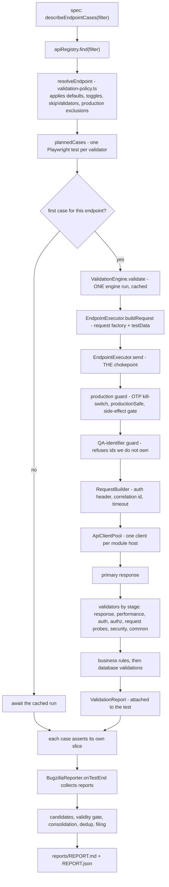
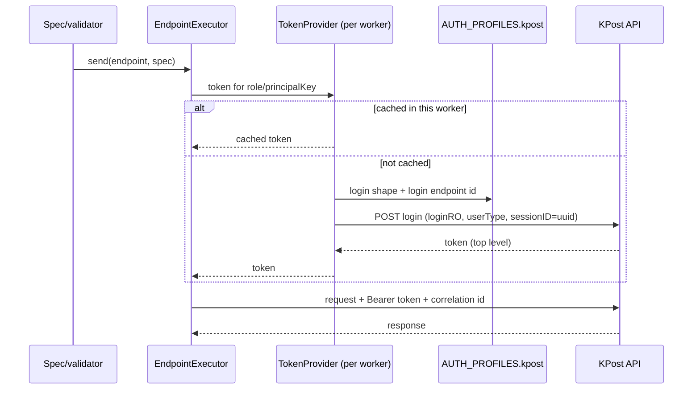
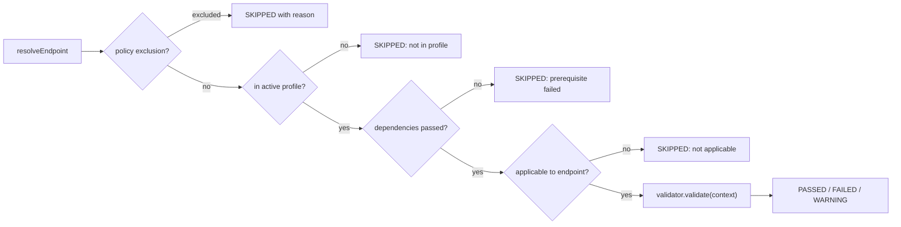
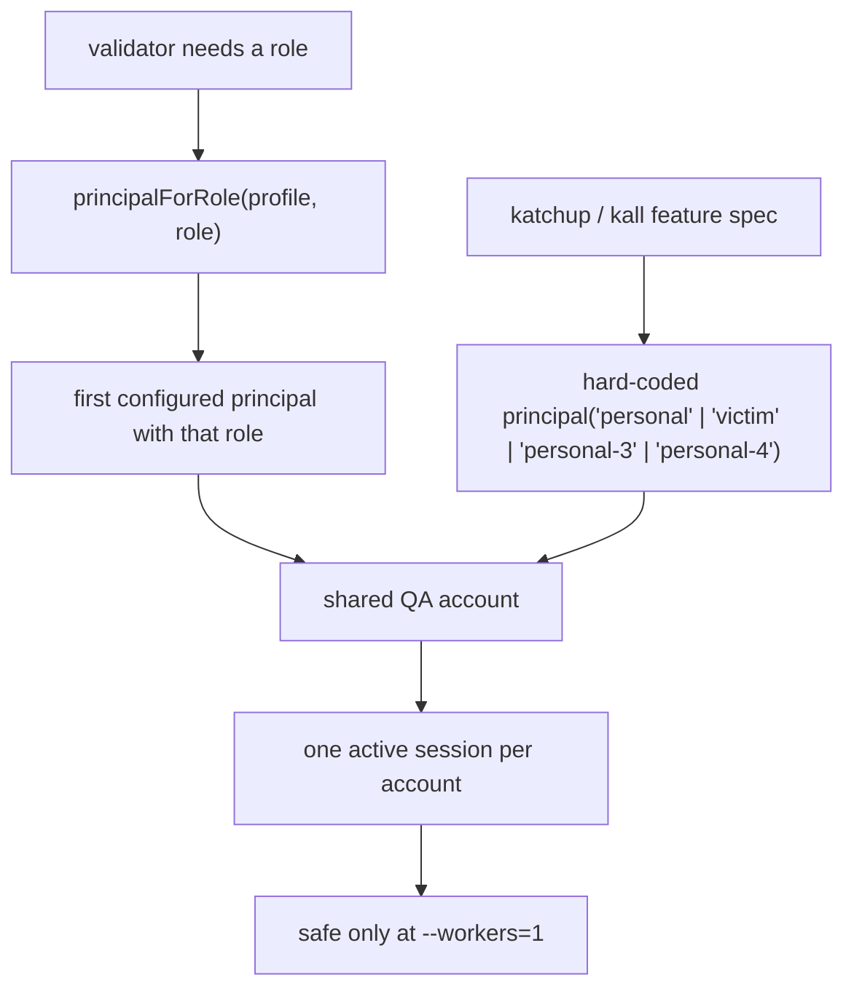
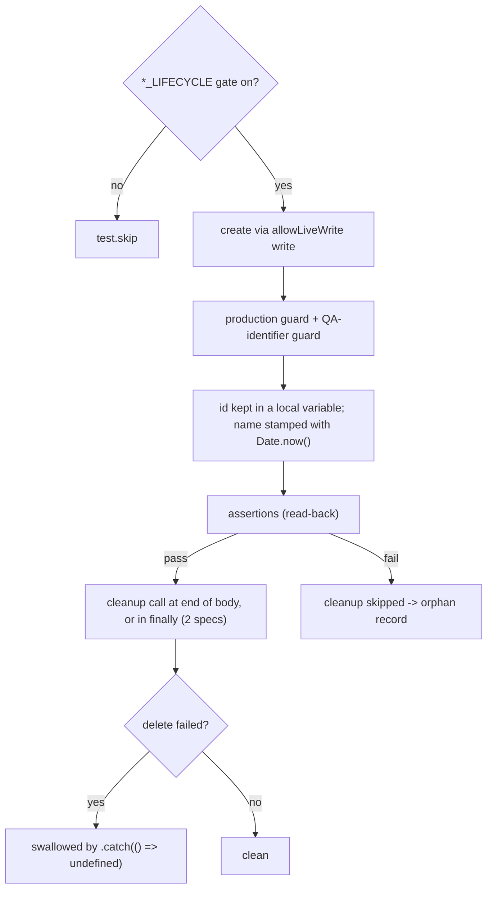
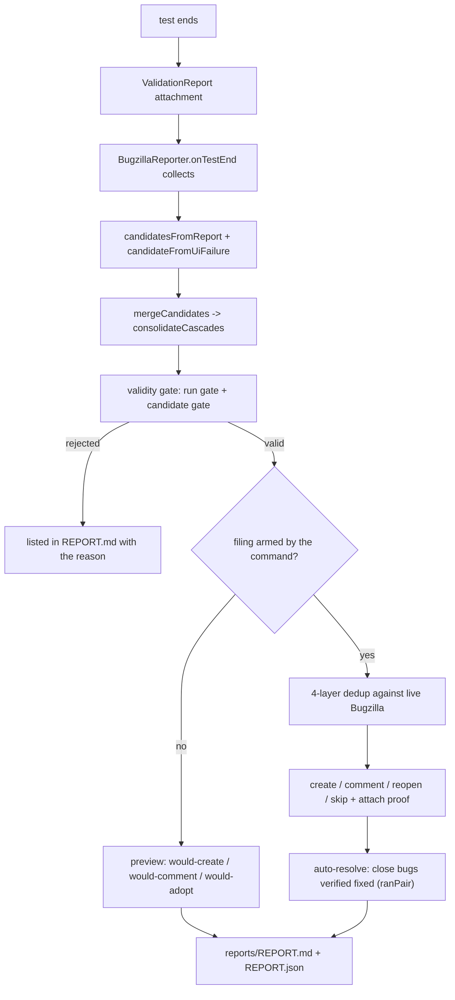

# KPost Test Bench — Architecture & Context (as built)

This describes the bench **as it actually exists** in this repository, not a target design. Every
claim names the file it came from. Where the repository cannot answer a question, it says so instead
of guessing.

Anything that would be a secret (password, token, API key, account id) is shown as
`<configured-secret>` / `<configured-value>`. No credential is reproduced here.

---

## 1. Application under test

### 1.1 Modules

KPOST is a unified-communications suite. The bench treats it as **one product built from separately
deployed modules**, each with its own host and Bugzilla owner (`src/config/ownership.config.ts`).

| Area               | What it is                                               | Bench suite | Evidence                                                            |
| ------------------ | -------------------------------------------------------- | ----------- | ------------------------------------------------------------------- |
| Signup & Login     | registration, activation, login, session                 | `kpost-api` | `src/api/definitions/kpost/signup-login/`                           |
| Katchup            | messaging (subject per message, copies, recall, forward) | `kpost-api` | `src/api/definitions/kpost/katchup/` (read/send/manage/attachments) |
| Group              | group create / membership / admin rights                 | `kpost-api` | `src/api/definitions/kpost/group/`                                  |
| Kall               | scheduled + direct calls, call log                       | `kpost-api` | `src/api/definitions/kpost/kall/`                                   |
| KMail              | mail compose, drafts, read status, settings, translation | `kmail-api` | `src/api/definitions/kmail/`                                        |
| KDiary             | diary schedules/events                                   | `kpost-api` | `src/api/definitions/kpost/kdiary/`                                 |
| Contacts           | address book, blocked contacts, global search            | `kpost-api` | `src/api/definitions/kpost/contacts/`                               |
| Profile            | profile read/write, images, devices, password            | `kpost-api` | `src/api/definitions/kpost/profile/`                                |
| Settings           | personalisation, notification toggles                    | `kpost-api` | `src/api/definitions/kpost/settings/`                               |
| Dashboard          | home recent-message panels                               | `kpost-api` | `src/api/definitions/kpost/dashboard/`                              |
| KOS / KWord / K-AI | documents + AI assist                                    | `kpost-api` | `src/api/definitions/kpost/kos/`                                    |
| AWS/S3             | presigned upload URLs, attachment lifecycle              | `kpost-api` | `src/api/definitions/kpost/aws/`                                    |
| Business admin     | in-app company user management (`/admin/*`)              | `kpost-api` | `src/api/definitions/kpost/admin/user-management.api.ts`            |
| Admin / HR Setup   | separate Admin module (tiers, locations, employees)      | `admin-api` | `src/api/definitions/admin/`                                        |
| KPost UI           | the React SPA                                            | `kpost-ui`  | `src/ui/screens.ts`, `tests/e2e/`                                   |
| Admin UI           | the CoreUI Admin/HR SPA                                  | `kpost-ui`  | `src/ui/admin-screens.ts`, `tests/e2e-admin/`                       |

KDOC is **out of scope** (CLAUDE.md §1, citing BRD §4.2). KDirectory is in scope and is covered
through the contacts/company reads plus a UI screen (`docs/requirements-frd.md`).

### 1.2 Environments and hosts

Hosts are configuration, not code (`src/config/env.ts`, `.env.example`, `src/config/ownership.config.ts`):

| Variable             | Meaning                                            | Default when unset                          |
| -------------------- | -------------------------------------------------- | ------------------------------------------- |
| `KPOST_API_BASE_URL` | KPost core API host                                | falls back to `API_BASE_URL`                |
| `KMAIL_API_BASE_URL` | KMail **origin** (path prefix added separately)    | falls back to `API_BASE_URL`                |
| `ADMIN_API_BASE_URL` | Admin module host                                  | falls back to `API_BASE_URL`                |
| `KMAIL_PATH_PREFIX`  | `/kmail5/v2` (prod) or `/testkmail/v2` (test)      | `/kmail5/v2`                                |
| `BASE_URL`           | KPost SPA                                          | `https://playwright.dev` (template default) |
| `ADMIN_UI_BASE_URL`  | Admin/HR SPA                                       | unset                                       |
| `API_BASE_URL`       | generic fallback; the bundled mock when `MOCK_API` | mock at `127.0.0.1:${MOCK_API_PORT}`        |

`.env.example` documents the current test hosts as reference values (testingapi / testkmail /
on-prem admin / test SPA). The actual values live in a git-ignored `.env`
(`.gitignore` lines 16–18) and are **not** reproduced here.

`TEST_ENV` is one of `local | dev | qa | staging | production` (`src/config/env.ts`). **Caveat
established from the repo:** `production` does not mean "the live product" in current use — it is
the flag that arms the live-safety controls while the hosts point at the disposable test
deployment (CLAUDE.md §5, §8). The bench therefore overloads one word for two ideas.

### 1.3 Authentication and session model

- Login is an API call, not a UI step, for API suites: `src/config/auth-profile.ts` defines an
  **auth profile** per API (`AUTH_PROFILES.kpost`, `AUTH_PROFILES.mock`), stating the login endpoint
  id, the request shape (KPost nests credentials in `loginRO` and sends `userType`), and where the
  token lives in the response (KPost: top level, not under `data`).
- `src/api/client/token-provider.ts` caches tokens **per worker process** and attaches
  `Authorization: Bearer …` via `src/api/client/request-builder.ts`.
- The tier (`PERSONAL`, `BUSINESS_S/M/L`) is part of the credential, so each tier is a separate
  principal rather than a role flag (`src/config/auth-profile.ts`).
- **One active session per account**: a second login displaces the first. This is recorded in
  CLAUDE.md §8 (the UI "session bounced to /login" incident) and is why `tests/e2e/support/session.ts`
  exists and why every run script is `--workers=1`.
- UI suites reuse a saved `storageState` written by `tests/setup/auth*.setup.ts`
  (`.auth/user.json`, `user2.json`, `user3.json`, `business.json`, `admin.json`).
- The Admin SPA is SSO'd by planting the same KPost token in its origin's `localStorage`
  (`tests/setup/auth-admin.setup.ts`).

### 1.4 Integrations the bench knows about

From endpoint definitions and safety code: SMS/OTP gateway (`otpDependent` endpoints,
`src/validation-engine/production-guard.ts` kill-switch), AWS S3 (`src/api/definitions/kpost/aws/`),
KSMACC account provisioning (admin role-posting notes in `tests/api/admin/feature.spec.ts`), an AI
service (`kos` definitions, `KOS_AI_LIVE`), a translation service (`kmail` read definitions), and
Bugzilla (`src/bug-tracker/bugzilla-client.ts`).

### 1.5 Not determinable from this repository

- The server topology (gateway, Eureka registry, service boundaries). CLAUDE.md §3 describes it, but
  no code here verifies it.
- Database schema, table/collection names, and which service owns which table.
- The real role/permission matrix (no RBAC metadata exists on any real endpoint — see §5.4).
- Whether `devapi2` or another host is "production" — the repo records the question as open
  (CLAUDE.md §8, 2026-09-12 entry).

---

## 2. Test-bench architecture

### 2.1 Top level

```
├─ CLAUDE.md                 the living record: product, decisions, plan (4.6k lines)
├─ playwright.config.ts      projects, reporters, safety grep, webServer (mock)
├─ merge.config.ts           CI shard-merge config (html, junit, bugzilla reporters)
├─ package.json              38 scripts: per-suite runs, contracts, checks
├─ contracts/ openapi/       GENERATED API contracts (never hand-edited)
├─ KPOST API (6).xlsx        the API source of truth (workbook)
├─ Admin_module.xlsx / Admin_module - API Services.pdf   admin payload sources
├─ mock-server/              bundled stand-in KPost API (server.ts, seed.json, jwt.ts)
├─ scripts/                  6 contract/audit scripts + run-suites.cjs
├─ src/                      the framework (207 .ts files)
├─ tests/                    the suites (117 spec/setup files)
└─ docs/                     24 docs, several GENERATED by framework tests
```

### 2.2 `src/` components

| Directory (files)                              | Purpose                                         | Key files                                                                                                                                                                                                                                                                                                      | Talks to                          |
| ---------------------------------------------- | ----------------------------------------------- | -------------------------------------------------------------------------------------------------------------------------------------------------------------------------------------------------------------------------------------------------------------------------------------------------------------- | --------------------------------- |
| `config/` (12)                                 | all configuration, typed and validated          | `env.ts` (zod, 64 keys), `test-data.config.ts` (42 `QA_*`), `auth-profile.ts`, `auth.config.ts`, `ownership.config.ts`, `response-contract.ts`, `thresholds.config.ts`, `api.config.ts`, `bugzilla.config.ts`, `constants.ts`, `database.config.ts`, `frd-requirements.ts`                                     | everything                        |
| `api/client/` (5)                              | HTTP layer                                      | `api-client.ts`, `api-client-pool.ts` (one client per module host), `request-builder.ts` (correlation id, auth, multipart), `response-wrapper.ts`, `token-provider.ts`                                                                                                                                         | executor, fixtures                |
| `api/contract/`, `api/schema/`, `api/schemas/` | generated-contract lookup + typed enums         | `workbook-contract.ts`, `contract-schema.ts`, `kpost-types.ts`                                                                                                                                                                                                                                                 | endpoint factories                |
| `api/registry/` (3)                            | the endpoint registry and definition type       | `api-registry.ts`, `endpoint-definition.ts`, `endpoint-loader.ts`                                                                                                                                                                                                                                              | engine, specs                     |
| `api/definitions/` (72)                        | every endpoint, grouped by module               | `endpoint-factory.ts` (shared mapping), `kpost/kpost-endpoint.ts`, `kmail/kmail-endpoint.ts`, `admin/admin-endpoint.ts`                                                                                                                                                                                        | registry                          |
| `validation-engine/` (14)                      | runs an endpoint and grades the response        | `validation-engine.ts`, `endpoint-cases.ts`, `endpoint-executor.ts` (**single send chokepoint**), `validation-policy.ts`, `production-guard.ts`, `qa-identifier-guard.ts`, `production-validators.ts`, `flow-finding.ts`, `validation-context.ts`, `validator.ts`, `validation-result.ts`, `contract-suite.ts` | validators, api client, reporting |
| `validators/` (52 files, **47 registered**)    | the reusable checks                             | `index.ts` (the registry), `authentication/`, `authorization/`, `request/`, `response/`, `security/`, `performance/`, `common/`                                                                                                                                                                                | engine only                       |
| `business-rules/` (6)                          | endpoint-specific rules                         | `index.ts` (4 rules, all on mock fixtures)                                                                                                                                                                                                                                                                     | engine                            |
| `database/` (8)                                | DB client/repository/validation shell           | `database-client.ts`, `repositories/`, `validations/`                                                                                                                                                                                                                                                          | engine (skips when disabled)      |
| `ui/` (6)                                      | UI checks and registries                        | `screens.ts` (13 screens), `ui-checks.ts` (9 checks), `ui-health.ts`, `ui-crawler.ts`, `admin-screens.ts`, `katchup-features.ts`                                                                                                                                                                               | e2e specs                         |
| `pages/` (2)                                   | page objects — **login only**                   | `BasePage.ts`, `LoginPage.ts`                                                                                                                                                                                                                                                                                  | `login*.spec.ts`                  |
| `bug-tracker/` (9)                             | defect pipeline                                 | `bug-candidate.ts`, `bug-fingerprint.ts`, `validity-gate.ts`, `bugzilla-filer.ts`, `bugzilla-client.ts`, `verify-resolve.ts`, `guidance.ts`, `curl.ts`, `bug-builder.ts`                                                                                                                                       | reporter                          |
| `reporting/` (5)                               | one report per run                              | `bugzilla-reporter.ts` (the Playwright reporter), `run-summary.ts`, `bug-report.ts`, `report-attachment.ts`, `report-formatter.ts`                                                                                                                                                                             | engine attachments, bug-tracker   |
| `utils/` (6)                                   | logger (masking), correlation ids, json helpers | `logger.ts`, `masking.ts`, `correlation.ts`, `json.ts`                                                                                                                                                                                                                                                         | everything                        |
| `fixtures/` (1)                                | Playwright fixtures                             | `index.ts` — `log`, `api`, `apiClients`, `endpoints`, `createValidationEngine`, `validationEngine`, `loginPage`                                                                                                                                                                                                | every spec                        |
| `data/` (1)                                    | factories for the mock domain                   | `factories.ts`                                                                                                                                                                                                                                                                                                 | mock-fixture definitions          |

`src/test-data/` **does not exist** — test data lives in `src/config/test-data.config.ts` (static
`QA_*` values) and `src/data/factories.ts` (mock domain only).

### 2.3 Playwright configuration (`playwright.config.ts`)

- `testDir ./tests`, `fullyParallel: true`, `workers: env.WORKERS ?? (CI ? '50%' : undefined)` —
  note the **config default is parallel**; every npm script overrides it with `--workers=1`.
- `grepInvert` drops `@destructive` when `TEST_ENV=production` and destructive tests are not allowed.
- Reporters: local `[list, html, bugzilla]`; CI `[blob, github, list]` (filing happens once from the
  merged report, `merge.config.ts`).
- `webServer` starts the bundled mock when `MOCK_API` is on.
- Projects: `setup` → `chromium` / `firefox` / `webkit` (each `tests/e2e`, `storageState`
  `.auth/user.json`, retries 2), `admin-ui` (own baseURL + storageState + `tests/e2e-admin`),
  `api` (`tests/api`), `integration` (`tests/integration`), `framework` (`tests/framework`).

### 2.4 Scripts and CI

`scripts/`: `excel-to-contract.cjs`, `fetch-admin-contract.cjs`, `apply-admin-pdf-payloads.cjs`,
`contract-coverage.cjs`, `excel-gap-report.cjs`, `otp-dependency-report.cjs`, and (Phase 1)
`run-suites.cjs` — the multi-suite runner behind `npm run all`.

`.github/workflows/playwright.yml`: push/PR to `main`, a nightly cron (FULL profile) and
`workflow_dispatch` (inputs `test_env`, `validation_profile`). Jobs: `quality` (`npm run check`) →
`test` (2 shards, blob reports, `BUGZILLA_DRY_RUN: 'true'`) → merge job (files once, publishes
`reports/REPORT.md` to the step summary, runs a quality gate on `reports/REPORT.json`).
**Evidence-based limitation:** it sets `MOCK_API: ${{ vars.MOCK_API || 'true' }}` and the older
variable names `API_BASE_URL` / `AUTH_PRINCIPALS` / `TEST_COMPANY_ID`; it never sets
`KPOST_API_BASE_URL`, `KMAIL_API_BASE_URL`, `ADMIN_API_BASE_URL`, the `QA_*` accounts or any
lifecycle gate, so **CI cannot reproduce `npm run kpost|kmail|admin|ui`**. It also runs on
`ubuntu-latest`, which cannot reach the on-prem admin host or Bugzilla (both RFC1918 addresses).

---

## 3. Test inventory (measured)

Collected with `npx playwright test --list [--project=…] --reporter=json` on commit `9ea023c`.

| Playwright project |     Tests | Notes                                                                                                                           |
| ------------------ | --------: | ------------------------------------------------------------------------------------------------------------------------------- |
| `api`              | **6 292** | includes every profile-excluded case as a reported skip                                                                         |
| `chromium`         |   **148** | same specs on each browser                                                                                                      |
| `firefox`          |   **148** |                                                                                                                                 |
| `webkit`           |   **148** |                                                                                                                                 |
| `admin-ui`         |     **8** | Admin/HR screen sweep, Chromium only                                                                                            |
| `framework`        |   **120** | the bench's own guards                                                                                                          |
| `setup`            |     **5** | auth setup projects (dependency of the browser projects)                                                                        |
| `integration`      |     **0** | the project exists; its one spec is mock-domain AND tagged `@destructive`, so `grepInvert` drops it while `TEST_ENV=production` |

### 3.1 Where the API tests come from

| Source                                                                             |     Tests |
| ---------------------------------------------------------------------------------- | --------: |
| `src/validation-engine/endpoint-cases.ts` (generated per endpoint × validator)     | **6 110** |
| Hand-written specs under `tests/api/`                                              |   **182** |
| — `*/coverage.spec.ts` (registry/safety guards, no HTTP)                           |        77 |
| — contract-suite entry specs (`kmail.spec.ts`, `admin.spec.ts`, mock-domain specs) |        51 |
| — `*/feature.spec.ts` (gated write lifecycles)                                     |        42 |
| — `katchup/lifecycle.spec.ts`                                                      |         7 |
| — `signup-login/login-flow.spec.ts` + `user-types.spec.ts`                         |         5 |

So **97 %** of API test cases are generated by the engine; the hand-written specs are lifecycles and
guards.

### 3.2 UI tests (per browser, 148)

Largest specs: `screens.spec.ts`, `crawl.spec.ts`, `accessibility-axe.spec.ts`,
`keyboard-nav.spec.ts`, `visual.spec.ts` (13 each — one per screen in
`AUTHENTICATED_SCREENS`), `network-resilience.spec.ts` and `verticals-features.spec.ts` (6),
`interactions.spec.ts` and `navigation.spec.ts` (5). The remaining ~30 specs are module features
(Katchup actions/copies/two-session/continuous, KMail compose, Kall features, contacts, group,
profile, settings, usermanagement, login).

### 3.3 Category view

| Category                        | Where                                                    | Count / state                                                                                        |
| ------------------------------- | -------------------------------------------------------- | ---------------------------------------------------------------------------------------------------- |
| API contract + negative testing | engine cases                                             | 6 110                                                                                                |
| Security testing                | `validators/security/` (7)                               | headers, JWT, sensitive-data, info-disclosure always; injection/XSS/rate-limit only in SECURITY/FULL |
| Authentication testing          | `validators/authentication/` (5)                         | runs everywhere                                                                                      |
| Authorization / RBAC            | `validators/authorization/` (5)                          | **wired only to mock fixtures** — 0 real endpoints (§5.4)                                            |
| Request validation / fuzzing    | `validators/request/` (13 registered)                    | schema-driven negative cases                                                                         |
| Business rules                  | `src/business-rules/` (4) + assertions inside lifecycles | 4 registered rules, all mock-domain; product rules asserted ad hoc in feature specs                  |
| Database validation             | `src/database/validations/` (4)                          | mock-domain only; inactive on every real run (§7)                                                    |
| Integration / workflow          | `tests/api/**/feature.spec.ts`, `lifecycle.spec.ts`      | 49 tests, all gated by `*_LIFECYCLE`                                                                 |
| UI functional / e2e             | `tests/e2e/`                                             | 148 × 3 browsers                                                                                     |
| Framework self-tests            | `tests/framework/` (19 specs)                            | 120                                                                                                  |

---

## 4. API architecture

### 4.1 Endpoint definition

`src/api/registry/endpoint-definition.ts` — only `id`, `method`, `path` are required. Optional
fields include `contractPath` / `contractMethod` (when the workbook disagrees with the live API),
`suite`, `tags`, `requirements` (FR ids), `expectedStatus`, `responseContract`, `authentication`,
`authorization`, `request` (a factory), `requestSchema`, `performance`, `security`, `validations`
(toggles), `skipValidators`, `businessRules`, `database`, `destructive`, `sideEffect`,
`productionSafe`, `otpDependent`, `mockFixture`.

Measured usage across `src/api/definitions/`: `productionSafe: true` on **90** endpoints,
`expectedStatus` on 10, `skipValidators` on 6.

### 4.2 Factories

`src/api/definitions/endpoint-factory.ts` holds `buildDefinition(config, scope)` — the single place a
config field becomes a definition field. The per-suite factories supply only their scope:
`defineKpostEndpoint` (`kpost-api`, public by default), `defineKmailEndpoint` (`kmail-api`,
authenticated, request path prefixed by `KMAIL_PATH_PREFIX` while the contract path stays bare) and
`defineAdminEndpoint` (`admin-api`, authenticated as `business-m`). Each calls `workbookContract()`,
which **throws at import time** if the (method, path) is not in the generated contract.

Registry counts differ between two generated ledgers — `docs/COVERAGE.md` says
**349 registered & tested**, `docs/LIVE-ENDPOINTS.md` says **341 registered** (116 run on live, 225
blocked). Both are generated by framework specs; the discrepancy is unexplained in the repo and is
listed as a gap in §12.

### 4.3 Execution flow

A spec says only _what_: `describeEndpointCases({ tags: ['kall-read'] })`.



Why one engine run per endpoint rather than per case: several endpoints send SMS/e-mail, so a run
per case would send a message per case (`src/validation-engine/endpoint-cases.ts`, header comment).
Each endpoint's cases are pinned to one worker via `test.describe.configure({ mode: 'default' })`.

### 4.4 Validation profiles

`SMOKE | REGRESSION | SECURITY | FULL` (`src/config/constants.ts`); sets in
`src/validation-engine/validation-policy.ts` (`PROFILE_SETS`). Membership as registered:
`security.injection`, `security.xss`, `security.rate-limit` are SECURITY-only; the authorization
family, three authentication probes, `security.jwt`, `request.malformed-json` are
`DEEP_AND_SECURITY`; the rest run in every profile. Since Phase 1 every API npm command sets
`VALIDATION_PROFILE=FULL`, and a validator outside the profile is **reported as SKIPPED** rather than
dropped (`endpoint-cases.ts`, `validation-engine.ts`).

`security.rate-limit` is opt-in per endpoint (`security.rateLimit`); only a mock fixture opts in, so
it never bursts a real host (`src/validators/security/rate-limit.validator.ts`).

### 4.5 Error, retry and timeout behaviour

- Transport errors are classified, never thrown as status failures (`src/api/client/api-client.ts`
  distinguishes timeout vs network).
- Timeouts come from `endpoint.performance.timeoutMs` (`src/config/thresholds.config.ts`), overridable
  per endpoint (KMail translation uses 30 s).
- Retries: **none at the HTTP level**. Playwright retries are per test — 2 for browser/setup/admin-ui
  projects, 0 locally for `api`/`framework` (2 in CI). A retried API test reuses the cached engine run
  within the worker.
- A 429 during a probe is reported **inconclusive**, not a failure (`runProbes`), so bench-caused
  throttling never becomes a bug.
- A 5xx from a gated lifecycle write becomes a `flow.server-error` finding (`flow-finding.ts`).

---

## 5. Authentication and users

### 5.1 Concepts present

`src/config/auth.config.ts` defines roles `SUPER_ADMIN | ADMIN | COMPANY_ADMIN | USER`.
`src/config/auth-profile.ts` defines **10 KPost principals**:

| Key              | Role          | Tier       | Intended use (from comments/specs)                          |
| ---------------- | ------------- | ---------- | ----------------------------------------------------------- |
| `personal`       | USER          | PERSONAL   | primary actor (sender/caller)                               |
| `victim`         | USER          | PERSONAL   | second real account — the "does it check ownership?" target |
| `personal-3..6`  | USER          | PERSONAL   | group, Copy/Confidential-Copy, multi-recipient flows        |
| `business-admin` | COMPANY_ADMIN | configured | company administration                                      |
| `business-s`     | COMPANY_ADMIN | BUSINESS_S | in-app user management                                      |
| `business-m`     | COMPANY_ADMIN | BUSINESS_M | Admin/HR module (default admin-api principal)               |
| `business-l`     | COMPANY_ADMIN | BUSINESS_L | large-tier admin                                            |

Credentials come only from `QA_*` environment variables (**42** mapped in
`src/config/test-data.config.ts`): ids, passwords, tier, mobile numbers, company ids, "absent"
fixtures that must match nothing, a reserved signup identity, and OTP values. All are
`<configured-secret>` / `<configured-value>` here.

A principal whose account id is **not explicitly set** is filtered out when `TEST_ENV=production`
(`KPOST_PRINCIPALS` in `auth-profile.ts`), so an unconfigured role has no principal instead of logging
in with a template default.

### 5.2 Token and session handling

`src/api/client/token-provider.ts` logs in on demand and caches per worker process; the login shape
and token path come from the auth profile. UI suites reuse `storageState` files written by the setup
projects. There is no refresh-token rotation in the bench.

### 5.3 Where accounts are selected — and the problem

| Selection point                           | How                                                                                       |
| ----------------------------------------- | ----------------------------------------------------------------------------------------- |
| Engine / validators                       | by **role**: `context.principal(role)` → `principalForRole`                               |
| `admin-api` definitions                   | pinned `principalKey: 'business-m'` in the factory scope                                  |
| `tests/api/kpost/katchup/feature.spec.ts` | **hard-coded**: local `principal('personal' \| 'victim' \| 'personal-3' \| 'personal-4')` |
| `tests/api/kpost/kall/feature.spec.ts`    | **hard-coded**: `principal('personal' \| 'victim' \| 'personal-3')`                       |
| UI specs                                  | implicitly, through the storageState the setup project saved                              |

Two specs duplicate a private `principal(key)` helper. There is **no pool, no allocation, no release
and no worker awareness anywhere in the repository** (`grep` for `workerIndex` / `parallelIndex` finds
only `ApiClientPool`, which pools HTTP clients per host, not accounts).

### 5.4 Concurrency safety of accounts — evidence

**Accounts are shared and cannot safely be used concurrently today.**

- One active session per account: a second login displaces the first (CLAUDE.md §8; the UI session
  guard `tests/e2e/support/session.ts` exists solely to skip tests when this happens).
- `.env.example` records that four concurrent logins already answer HTTP 500 and that probes trip
  rate limits.
- All 17 test-running scripts pass `--workers=1`.
- `npm run all` deliberately runs API before UI because an API login signs the UI session out.

Authorization coverage, for the record: `authorization.roles` / `tenantScoped` /
`privilegeEscalation` appear **only** on the mock-fixture definitions (`users.api.ts`,
`companies.api.ts`); the five authorization validators therefore skip on every real endpoint, and all
five are additionally in `PRODUCTION_BLOCKED_VALIDATORS`.

---

## 6. Test-data lifecycle

### 6.1 How data is created, read, updated, deleted

- **Create/update/delete** happen only inside gated lifecycle specs (`*_LIFECYCLE`), each call passing
  `allowLiveWrite: true` so the production guard permits that one write.
- **Read** happens everywhere; most endpoints are reads and 90 are `productionSafe`.
- **Identification of test-created records**: by convention inside a spec — e.g.
  `` `QA Feature ${Date.now()}` `` (`tests/api/kpost/katchup/feature.spec.ts:105`), a `stamp` in
  `tests/api/admin/feature.spec.ts:44`, `QA Group <ts>` in the group lifecycle. There is **no shared
  naming helper and no run id in the names**, so a record cannot be attributed to a run after the fact.
- **Factories** (`src/data/factories.ts`) generate unique values with `randomUUID`, but are imported
  only by the mock-domain definitions.

### 6.2 Cleanup mechanisms found

| Mechanism                                                                                                     | Centralized?       | Automatic?                                        | Parallel-safe? | Assessment                                                                  |
| ------------------------------------------------------------------------------------------------------------- | ------------------ | ------------------------------------------------- | -------------- | --------------------------------------------------------------------------- |
| `finally` teardown in `tests/api/kpost/kall/feature.spec.ts` (clears the call log for every party)            | no — spec-specific | yes, on failure too                               | n/a (serial)   | the strongest pattern in the repo                                           |
| `finally` teardown in `tests/api/admin/feature.spec.ts` (reverse dependency order, `.catch(() => undefined)`) | no                 | yes                                               | n/a            | good ordering; **errors swallowed**                                         |
| Cleanup at the end of the test body (Katchup 13 tests / 2 `finally`; Profile 6 tests / 0; AWS 0)              | no                 | **no** — skipped when an assertion above it fails | n/a            | orphans on failure                                                          |
| Restore-after-write (profile/settings specs write then restore original)                                      | no                 | partial                                           | n/a            | depends on reaching the restore line                                        |
| UI spec cleanup via `.catch()` in the body                                                                    | no                 | no                                                | n/a            | best-effort                                                                 |
| Manual DB reset                                                                                               | manual             | no                                                | n/a            | documented instruction after `*:deep` runs and UI crawls (docs/COMMANDS.md) |
| `WRITE_FUZZ` junk                                                                                             | none               | no                                                | n/a            | explicitly persists junk; disposable DB only                                |

There is **no global teardown** (`playwright.config.ts` has no `globalSetup`/`globalTeardown`), no
resource ledger, no orphan sweeper, and **every cleanup failure is swallowed** (`.catch(() =>
undefined)`), so a failed cleanup appears nowhere in the report.

**Potentially dangerous?** No destructive broad query exists — cleanup always deletes ids the test
itself created, and the QA-identifier guard refuses any id outside the QA set. The danger is the
opposite: silent accumulation.

---

## 7. Database architecture

- `src/config/database.config.ts`: `type DatabaseClientKind = 'mock' | 'none'`;
  `enabled: env.DB_ENABLED ?? env.MOCK_API`; `client: env.MOCK_API ? 'mock' : 'none'`.
- `src/database/database-client.ts`: `MockDatabaseClient` issues `GET /__test/db/{table}` against the
  bundled mock (`mock-server/server.ts` serves only `users|companies`); `DisabledDatabaseClient`
  rejects every call with "Database access is disabled". The file's own comment says a real driver
  should implement the interface — nothing does.
- **No database driver is declared** in `package.json` (no `mysql2`, `pg`, `mongodb`).
- `DB_CONNECTION_STRING` is read by the env schema and **never used**.
- Repositories (`user.repository.ts`, `company.repository.ts`) model a generic `users`/`companies`
  schema with camelCase audit columns and soft delete — the mock's shape, not KPost's.
- The 4 named validations (`database/validations/index.ts`) are referenced only by mock-fixture
  endpoints, so **0 database assertions run against any real KPost endpoint**, in any mode.

Access classification:

| Target                   | Access                                                      |
| ------------------------ | ----------------------------------------------------------- |
| Production/live database | **none** — no driver, no connection, no query               |
| Test/staging database    | **none directly**; state is verified through API read-backs |
| Mocked database          | the only working path, via the bundled mock HTTP endpoint   |

The real engines (MySQL for the core, MySQL + MongoDB for KMail, MongoDB for Admin) are **not
recorded in this repository**; that came from the backend repos outside it. The only in-repo hint is
`src/config/response-contract.ts`, which notes admin ids are MongoDB ObjectIds.

---

## 8. Parallel execution — audit of the current state

| Shared resource                          | Current handling                                                                 | Race risk if workers > 1                                        |
| ---------------------------------------- | -------------------------------------------------------------------------------- | --------------------------------------------------------------- |
| QA accounts                              | fixed ids from `.env`; two specs hard-code principals; no pool                   | **High** — same account in two workers                          |
| Login session                            | one active session per account; token cache **per worker** (`token-provider.ts`) | **High** — workers sign each other out                          |
| UI `storageState`                        | one shared `.auth/user.json` (plus user2/user3/business/admin)                   | Medium — read-only at run time, but an API login invalidates it |
| Engine run cache                         | module-level `Map` in `endpoint-cases.ts`, per worker                            | Low — duplicate HTTP work across workers, not corruption        |
| Rate limits / 500s on login              | documented in `.env.example`                                                     | **High** — concurrent logins already fail                       |
| Test records (messages, calls…)          | created with `Date.now()` names, no run scoping                                  | Medium — cross-talk and ambiguous ownership                     |
| `reports/REPORT.*`                       | written once by the reporter in the **main** process                             | Low within a run; **High across runs** (overwrite)              |
| `docs/*.md` generated by framework tests | 7 framework specs write into `docs/` while running                               | Medium — two concurrent runs would interleave writes            |
| Mock server port                         | single `MOCK_API_PORT`, `reuseExistingServer: !CI`                               | Medium — two local runs share one mock                          |
| `test-results/` artifacts                | Playwright partitions per test                                                   | None                                                            |
| Database                                 | no connection                                                                    | None                                                            |

Global setup/teardown: **none**. The only ordering mechanism is the `setup` project dependency and
`test.describe.configure({ mode: 'default' })` (11 uses) plus one `serial` (Katchup lifecycle).

Conclusion supported by the repo: the bench is **correct only at `--workers=1`** against real hosts.
`fullyParallel: true` in the config is safe today solely because every script overrides workers.

---

## 9. Reporting

| Output                      | Written by                                                                 | Contents                                                                                                                                                                                                                          |
| --------------------------- | -------------------------------------------------------------------------- | --------------------------------------------------------------------------------------------------------------------------------------------------------------------------------------------------------------------------------- |
| `reports/REPORT.md`         | `src/reporting/bugzilla-reporter.ts` (+ `run-summary.ts`, `bug-report.ts`) | Part 1 execution health (checks by module/category, top failing validators, worst endpoints, per-browser UI); Part 2 defects (distinct valid defects, filed-by-developer, not-filed reasons with a skip breakdown, auto-resolved) |
| `reports/REPORT.json`       | same                                                                       | `{ meta, api, ui, qualityGate, bugs }` — aggregates, the CI gate, and full bug candidates                                                                                                                                         |
| `reports/<suite>/REPORT.*`  | `scripts/run-suites.cjs` (Phase 1)                                         | per-suite copies for `npm run all`                                                                                                                                                                                                |
| `reports/SUITES.md`         | `scripts/run-suites.cjs`                                                   | index: suite, exit code, gate verdict, report path                                                                                                                                                                                |
| Playwright HTML             | built-in reporter                                                          | per-test detail, traces                                                                                                                                                                                                           |
| JUnit XML                   | `merge.config.ts` (CI merge only)                                          | CI consumers                                                                                                                                                                                                                      |
| Screenshots / video / trace | `playwright.config.ts` `use`                                               | screenshot + video on failure; trace `retain-on-failure` locally, `on-first-retry` in CI                                                                                                                                          |

- **Execution metadata** present: `generatedAt`, environment, build, `TEST_RUN_ID`, run status,
  validation profile (`run-summary.ts`).
- **Test-case IDs: none.** Test titles are deterministic (`<label> [<endpoint.id>]` and
  `<validator> — <description>`), and `validationId` is a random UUID per result
  (`src/validation-engine/validator.ts`), so there is no stable per-case identifier in any report.
- **Bugzilla correlation** works through the `[KP-XXXXXX]` fingerprint tag written into the bug
  summary (`src/bug-tracker/bug-fingerprint.ts`) plus the `(endpoint, validator)` fault index, not
  through test ids.
- **Cleanup status: not reported anywhere.**
- Per-case records (method, request, duration, timestamp per case) exist in `ValidationResult` but
  reach only Playwright attachments and the HTML report, not `REPORT.json`.
- Secrets: masked centrally by `src/utils/masking.ts` (key patterns, JWTs, Bearer/Basic, connection
  strings, e-mail addresses); curl reproductions substitute `$KPOST_TOKEN`. Known gaps: mobile
  numbers and similar PII are not masked, and a string `rawBody` is printed unmasked in `curl.ts`.

---

## 10. Safety controls (where each lives)

| Risk                                 | Control                                                                                                                                                                                               | File                                                                                                |
| ------------------------------------ | ----------------------------------------------------------------------------------------------------------------------------------------------------------------------------------------------------- | --------------------------------------------------------------------------------------------------- |
| Acting on a real user's record       | **QA-identifier guard** — refuses any request naming an id outside the QA allowlist, before send; inspects body, query, path params, multipart fields and JSON raw bodies; applies to every real host | `src/validation-engine/qa-identifier-guard.ts`, armed in `endpoint-executor.ts` (`targetsRealHost`) |
| Sending real SMS/e-mail              | OTP/SMS kill-switch — first check, cannot be unlocked by any flag (only the OTP test gateway on a disposable DB)                                                                                      | `src/validation-engine/production-guard.ts`                                                         |
| Running an unvetted endpoint on live | `productionSafe` allowlist, default deny                                                                                                                                                              | `production-guard.ts`, `endpoint-definition.ts`                                                     |
| Mutating probes on live              | validator allowlist, unknown validators denied                                                                                                                                                        | `src/validation-engine/production-validators.ts`                                                    |
| Destructive writes                   | `sideEffect` (`data` / `external` / `global`) + `allowLiveWrite` per call; `ALLOW_DESTRUCTIVE_TESTS` grants nothing on production                                                                     | `production-guard.ts`, `endpoint-executor.ts`                                                       |
| Accidental Bugzilla filing           | dry run by default; **filing armed only by the command**, a `.env` `false` is overruled and reported                                                                                                  | `src/config/env.ts` (`resolveDryRun`), `bugzilla-reporter.ts`                                       |
| Filing junk from a broken run        | run validity gate (load errors, <50 % executed) + candidate gate (severity floor, environmental, gateway 5xx, bench faults)                                                                           | `src/bug-tracker/validity-gate.ts`                                                                  |
| Duplicate tickets                    | 4-layer dedup (tag → product scope → (endpoint, validator) index → phrase adoption); judged-INVALID never re-filed                                                                                    | `src/bug-tracker/bugzilla-filer.ts`                                                                 |
| Credential leakage                   | masking in logs, reports and tickets; token placeholder in curl                                                                                                                                       | `src/utils/masking.ts`, `src/bug-tracker/curl.ts`                                                   |
| Wrong environment                    | zod env schema fails fast; live preflight asserts hosts are set; `.env.example` documents every key (guarded)                                                                                         | `src/config/env.ts`, `tests/framework/live-safety.spec.ts`, `bench-hardening.spec.ts`               |
| Destructive cleanup                  | no broad delete queries exist; cleanup deletes only ids the test created                                                                                                                              | lifecycle specs                                                                                     |

All of these are pinned by `tests/framework/live-safety.spec.ts` (26 tests) and
`tests/framework/bench-hardening.spec.ts` (8).

---

## 11. What Phase 1 changed (commit `9ea023c`)

| Change                                                                                          | Files                                                                                    | Architectural effect                                                        |
| ----------------------------------------------------------------------------------------------- | ---------------------------------------------------------------------------------------- | --------------------------------------------------------------------------- |
| Systemic auto-resolve now requires the exact (endpoint, validator) pair to have run (`ranPair`) | `src/bug-tracker/verify-resolve.ts`                                                      | a platform-wide ticket can no longer close on an unrelated check            |
| Profile-excluded validators reported as SKIPPED instead of dropped                              | `endpoint-cases.ts`, `validation-engine.ts`, `bug-report.ts`                             | the case list is now profile-independent; only execution differs            |
| Every API command sets `VALIDATION_PROFILE=FULL`                                                | `package.json`                                                                           | injection/XSS actually run on test-DB reads                                 |
| Filing armed only by the command                                                                | `src/config/env.ts` (`resolveDryRun`, `BUGZILLA_DRY_RUN_FORCED`), `bugzilla-reporter.ts` | a `.env` value can no longer arm filing; notice printed                     |
| `npm run all` replaced by a runner                                                              | `scripts/run-suites.cjs`, `package.json`                                                 | suites no longer stop at the first finding; per-suite reports kept          |
| One shared `buildDefinition()`                                                                  | `src/api/definitions/endpoint-factory.ts` + 3 factories                                  | a config field cannot be honoured by one suite and ignored by another       |
| QA guard on every real host + multipart/raw bodies                                              | `qa-identifier-guard.ts`, `endpoint-executor.ts` (`targetsRealHost`)                     | the main safety control no longer depends on `TEST_ENV=production`          |
| 25 run switches moved into the zod schema                                                       | `src/config/env.ts` + ~30 specs                                                          | specs read typed `env.X`; **this is the hook Phase 2's profiles plug into** |
| `.env.example` completed + guarded; CLAUDE.md §5/§8/§9, COMMANDS, requirements-frd updated      | docs                                                                                     | configuration is discoverable                                               |

Phase 1 added `tests/framework/bench-hardening.spec.ts` (8 guards) and one guard in
`verify-resolve.spec.ts`. It changed **no product behaviour** of the bench beyond the above.

---

## 12. Known gaps (repository-evidenced only)

| Area                 | Current implementation                                                                                                                         | Gap                                                                      | Risk                               | Recommended phase           |
| -------------------- | ---------------------------------------------------------------------------------------------------------------------------------------------- | ------------------------------------------------------------------------ | ---------------------------------- | --------------------------- |
| Account allocation   | fixed ids; 2 specs hard-code principals; no pool (`auth-profile.ts`, katchup/kall `feature.spec.ts`)                                           | no allocation, release or worker awareness                               | High — blocks all parallelism      | **Phase 2**                 |
| Parallel execution   | `--workers=1` in all 17 test-running scripts; `fullyParallel: true` in config                                                                  | config default contradicts every script; no proof of isolation           | Medium                             | **Phase 2**                 |
| Test-case IDs        | deterministic titles only; `validationId` is a random UUID (`validator.ts`)                                                                    | no stable id in reports or tickets                                       | Medium — weak traceability         | **Phase 2**                 |
| Cleanup              | per-spec; 2 specs use `finally`, others clean after hard asserts; all errors swallowed                                                         | no ledger, no teardown, failures invisible                               | High — orphans accumulate silently | **Phase 2**                 |
| Run configuration    | 38 npm scripts, up to 14 `cross-env` flags each                                                                                                | no named profiles; modes are command lines                               | Medium — onboarding + drift        | **Phase 2**                 |
| Reporting depth      | aggregates + bugs (`run-summary.ts`)                                                                                                           | no per-case records, no history, no FR ids, no cleanup status            | Medium                             | Phase 2 (partial) / Phase 8 |
| Database validation  | mock/none client, fictional schema, no driver (`database.config.ts`)                                                                           | 0 assertions on real endpoints                                           | High — persistence unverified      | Phase 6                     |
| Authorization/RBAC   | 5 validators wired only to mock fixtures                                                                                                       | no real IDOR/role coverage                                               | High — security surface untested   | Phase 3                     |
| Business rules       | 4 mock rules; product rules asserted ad hoc, often `status < 300`                                                                              | rules not registered or measured                                         | Medium                             | Phase 3/4                   |
| CI                   | mock-only, stale variable names, hosted runner (`playwright.yml`)                                                                              | cannot run the real suites or reach the hosts                            | High — no automated regression     | Phase 9                     |
| Registry count       | `COVERAGE.md` 349 vs `LIVE-ENDPOINTS.md` 341                                                                                                   | two generated ledgers disagree                                           | Low — reporting accuracy           | Phase 2/8                   |
| Mock-domain residue  | `tests/api/{users,companies,health,auth,dictionary}.spec.ts`, `tests/integration/user-lifecycle.spec.ts`, mock business rules and repositories | self-test fixtures look like product coverage                            | Low                                | Phase 2/10                  |
| Lifecycle uploads    | `endpoints.sendTo(id, {})` sends the literal spec, never the request factory                                                                   | "multipart upload" steps send an empty body                              | Medium — false confidence          | Phase 4                     |
| PII masking          | keys/JWT/Bearer/e-mail masked (`masking.ts`)                                                                                                   | mobile numbers, Aadhaar/PAN not masked; raw string body unmasked in curl | Medium                             | Phase 3                     |
| `TEST_ENV` semantics | `production` means "arm the guards" while hosts are test hosts                                                                                 | one word, two meanings                                                   | Low                                | Phase 2/10                  |

---

## 13. Phase 2 readiness

| Objective            | Compatible?      | Prerequisites / dependencies                                                                                                                           | Reuse (do NOT replace)                                                                                                              |
| -------------------- | ---------------- | ------------------------------------------------------------------------------------------------------------------------------------------------------ | ----------------------------------------------------------------------------------------------------------------------------------- |
| Unified run command  | Yes              | must reproduce today's flag sets exactly; `scripts/run-suites.cjs` already handles multi-suite                                                         | `run-suites.cjs`; the `:file` naming convention; `docs/COMMANDS.md` as the doc surface                                              |
| Named profiles       | Yes              | Phase 1 put every switch in the zod schema — profiles can resolve into it; must preserve precedence _command > profile > .env_                         | `src/config/env.ts` resolution order and `resolveDryRun`'s command-vs-file rule                                                     |
| Stable test-case IDs | Yes              | must be derived from identity (endpoint + validator, spec + title), never order/time/random; **must not alter bug summaries**                          | `bug-fingerprint.ts` tags — changing them would orphan/duplicate every open ticket                                                  |
| Account pool         | Yes, with limits | needs the two hard-coding specs to consume it; pool size caps worker count; more QA accounts needed for real parallelism                               | `auth-profile.ts` principals and the explicitly-set-only filter; `PERSONAL_ACCOUNTS` ordering (worker 0 must keep today's accounts) |
| Parallel execution   | **Partially**    | cannot be proven against live hosts (single session, 500s on concurrent login, rate limits). Framework-level proof + a low ceiling is the honest scope | `--workers=1` as the default for live profiles; the `setup` project dependency                                                      |
| Automatic cleanup    | Yes              | a ledger + fixture teardown; migrating each live lifecycle spec needs a live run to verify, so it belongs to Phase 4                                   | the `finally` pattern already in the Kall/Admin lifecycles; `allowLiveWrite` + QA guard for every delete                            |
| Failure recovery     | Yes              | teardown must run on failure and report errors instead of swallowing them                                                                              | Playwright fixture teardown; `flow-finding.ts` for surfacing findings                                                               |
| Reporting additions  | Yes              | per-case records, profile, worker, account keys (never credentials), cleanup status                                                                    | `run-summary.ts` / `bug-report.ts` structure; `masking.ts` for anything printed                                                     |

**Risks to manage in Phase 2**

1. Changing which accounts a live lifecycle uses cannot be verified without a live run — keep worker 0
   mapped to today's accounts.
2. Any change to bug summaries breaks Bugzilla dedup; test-case IDs must stay out of the summary.
3. Enabling parallelism beyond proven capacity would corrupt runs rather than slow them — the ceiling
   must be refused, not clamped.
4. Rewriting the 12 lifecycle specs' cleanup without live verification risks breaking working flows.

---

## 14. Architectural flows

### Authentication



### Validation pipeline



### Account selection (today)



### Test-data lifecycle (today)



### Reporting and Bugzilla



---

## 15. Source-of-truth rule

Every conclusion above names its file. The load-bearing ones:

| Conclusion                                   | Source                                                                                 |
| -------------------------------------------- | -------------------------------------------------------------------------------------- |
| Endpoint model and per-endpoint overrides    | `src/api/registry/endpoint-definition.ts`, `src/api/definitions/endpoint-factory.ts`   |
| One engine run per endpoint; case generation | `src/validation-engine/endpoint-cases.ts`                                              |
| Single send chokepoint and its guards        | `src/validation-engine/endpoint-executor.ts`                                           |
| Live-safety controls                         | `production-guard.ts`, `production-validators.ts`, `qa-identifier-guard.ts`            |
| Validator inventory (47)                     | `src/validators/index.ts`                                                              |
| Profiles                                     | `src/config/constants.ts`, `src/validation-engine/validation-policy.ts`                |
| Principals and login shape                   | `src/config/auth-profile.ts`, `src/config/auth.config.ts`                              |
| Test data / QA allowlist                     | `src/config/test-data.config.ts`                                                       |
| Environment schema and precedence            | `src/config/env.ts`, `.env.example`                                                    |
| DB reality                                   | `src/config/database.config.ts`, `src/database/database-client.ts`, `package.json`     |
| Reporting                                    | `src/reporting/*`                                                                      |
| Bug pipeline                                 | `src/bug-tracker/*`                                                                    |
| Parallelism decisions                        | `playwright.config.ts`, `package.json`, `.env.example`, `tests/e2e/support/session.ts` |
| Coverage ledgers                             | `docs/COVERAGE.md`, `docs/LIVE-ENDPOINTS.md` (generated by `tests/framework/*`)        |

---

`docs/TEST-BENCH-CONTEXT.md` is an analysis of the repository as of commit
**`9ea023c6da7a126b82516b226da77f5c683a6324`**.

- **Branch:** `19-09-2026`
- **Commit date:** 2026-09-20 07:56 +0530
- **Analysis performed:** 2026-09-20 (UTC)
- **Test count at this commit:** 6 292 API · 148 × 3 browsers · 8 admin-UI · 120 framework · 5 setup
  · 0 integration
- **Source files:** 207 under `src/`, 117 spec/setup files under `tests/`

Commands used to inspect the repository (all read-only; nothing was run against any KPost host):

```bash
git rev-parse HEAD && git branch --show-current
npx playwright test --list                                  # totals per project
npx playwright test --list --project=api --reporter=json    # per-file case counts
npx playwright test --list --project=chromium --reporter=json
find src -name '*.ts' | wc -l ; find tests -name '*.spec.ts' -o -name '*.setup.ts' | wc -l
grep -c … src/validators/index.ts                           # 47 registered validators
grep -cE "^  [A-Z][A-Z0-9_]*:" src/config/env.ts            # 64 schema keys
grep -cE "^  [a-zA-Z0-9]+: 'QA_" src/config/test-data.config.ts   # 42 QA_* variables
grep -rho 'productionSafe: true' src/api/definitions | wc -l      # 90
git show --stat 9ea023c                                     # Phase 1 change set
```
